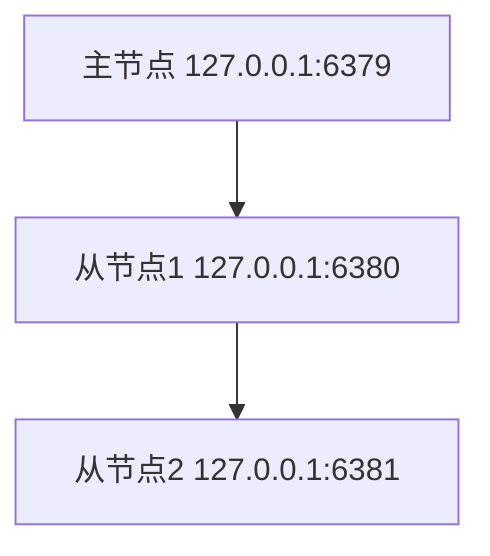

# Redis 复制链

Redis复制链是Redis高可用性架构中的一个重要概念。它允许数据在多个Redis实例之间进行复制，从而确保在主节点发生故障时，从节点可以接管服务，保证系统的持续可用性。本文将详细介绍Redis复制链的工作原理、配置方法以及实际应用场景。

## 什么是Redis复制链？

Redis复制链是指多个Redis实例之间通过复制关系连接起来的一种拓扑结构。在这种结构中，一个Redis实例（主节点）将其数据复制到一个或多个从节点，而这些从节点又可以进一步将数据复制到其他从节点，形成一个链式结构。

### 复制链的基本概念

- **主节点（Master）**：负责处理写操作，并将数据同步到从节点。
- **从节点（Slave）**：接收主节点的数据复制，并可以处理读操作。
- **复制链**：从节点可以进一步将数据复制到其他从节点，形成一个链式结构。

## Redis 复制链的工作原理

Redis复制链的工作原理基于Redis的复制机制。当一个从节点连接到主节点时，它会发送一个`SYNC`命令，请求主节点发送其数据的快照。主节点会生成一个RDB文件并将其发送给从节点，从节点加载这个RDB文件后，主节点会继续发送所有新的写命令给从节点，以保持数据的同步。

### 复制链的配置

在Redis中，可以通过配置文件或命令行来设置复制链。以下是一个简单的配置示例：

```bash
# 主节点配置
port 6379
daemonize yes

# 从节点1配置
port 6380
daemonize yes
slaveof 127.0.0.1 6379

# 从节点2配置
port 6381
daemonize yes
slaveof 127.0.0.1 6380
```

在这个配置中，`127.0.0.1:6379`是主节点，`127.0.0.1:6380`是从节点1，`127.0.0.1:6381`是从节点2。从节点1连接到主节点，从节点2连接到从节点1，形成了一个复制链。

### 复制链的拓扑结构

以下是一个简单的复制链拓扑结构图：



在这个结构中，主节点的数据会依次复制到从节点1和从节点2。

## 实际应用场景

### 高可用性

复制链的一个重要应用场景是实现高可用性。当主节点发生故障时，可以从复制链中选择一个从节点作为新的主节点，继续提供服务。例如，如果主节点`127.0.0.1:6379`发生故障，可以将从节点1`127.0.0.1:6380`提升为新的主节点。

### 读写分离

复制链还可以用于实现读写分离。主节点处理写操作，而从节点处理读操作，从而分担主节点的负载。例如，可以将读请求分发到从节点1和从节点2，而写请求仍然由主节点处理。

## 总结

Redis复制链是Redis高可用性架构中的一个重要组成部分。通过复制链，可以实现数据的多级复制，确保在主节点发生故障时，系统仍然可以继续运行。本文介绍了Redis复制链的基本概念、工作原理、配置方法以及实际应用场景，希望对初学者有所帮助。

## 附加资源与练习

- **练习**：尝试在本地环境中配置一个Redis复制链，并测试主节点故障时的切换过程。
- **资源**：阅读Redis官方文档中关于复制的部分，了解更多高级配置和优化技巧。

:::tip
在实际生产环境中，建议使用Redis Sentinel或Redis Cluster来管理复制链，以实现更高级的高可用性和自动故障转移功能。
:::