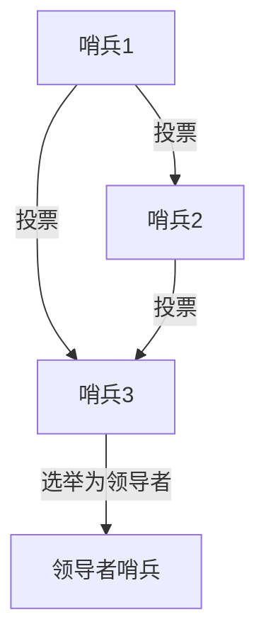

# Redis 哨兵选举

Redis哨兵（Sentinel）是Redis实现高可用性（High Availability, HA）的核心组件之一。它负责监控Redis主从实例的健康状态，并在主节点发生故障时自动选举新的主节点。本文将详细介绍Redis哨兵选举的工作原理、流程及其在实际中的应用。

## 什么是Redis哨兵选举？

Redis哨兵选举是指在主节点（Master）发生故障时，哨兵系统通过一系列规则和算法，从多个从节点（Slave）中选出一个新的主节点的过程。这一过程确保了Redis集群的高可用性，即使主节点宕机，系统也能继续正常运行。

### 哨兵的核心功能
1. **监控**：哨兵会定期检查主节点和从节点的健康状态。
2. **通知**：当检测到节点故障时，哨兵会通知管理员或其他应用程序。
3. **自动故障转移**：在主节点故障时，哨兵会自动选举新的主节点。
4. **配置提供者**：客户端可以通过哨兵获取当前的主节点地址。

## 哨兵选举的工作原理

哨兵选举的过程可以分为以下几个步骤：

### 1. 检测主节点故障
哨兵会定期向主节点发送`PING`命令。如果主节点在指定时间内没有响应，哨兵会将其标记为“主观下线”（Subjectively Down, SDOWN）。<br />
当多个哨兵都检测到主节点不可用时，主节点会被标记为“客观下线”（Objectively Down, ODOWN）。

### 2. 选举领导者哨兵
在确认主节点客观下线后，哨兵系统会通过Raft算法选举出一个领导者哨兵（Leader Sentinel）。这个领导者哨兵负责执行故障转移操作。



### 3. 选择新的主节点
领导者哨兵会从所有从节点中选择一个最适合的节点作为新的主节点。选择标准包括：
- 从节点的优先级（`slave-priority`配置）。
- 从节点的复制偏移量（数据最新程度）。
- 从节点的运行ID（较小的ID优先）。

### 4. 故障转移
领导者哨兵会将选定的从节点提升为主节点，并通知其他从节点复制新的主节点。同时，哨兵会更新客户端的配置，使其连接到新的主节点。

## 代码示例

以下是一个简单的Redis哨兵配置示例：

```bash
# sentinel.conf
sentinel monitor mymaster 127.0.0.1 6379 2
sentinel down-after-milliseconds mymaster 5000
sentinel failover-timeout mymaster 10000
```

- `sentinel monitor mymaster 127.0.0.1 6379 2`：监控名为`mymaster`的主节点，地址为`127.0.0.1:6379`，至少需要2个哨兵确认主节点下线。
- `sentinel down-after-milliseconds mymaster 5000`：如果主节点在5000毫秒内没有响应，哨兵会将其标记为下线。
- `sentinel failover-timeout mymaster 10000`：故障转移的超时时间为10000毫秒。

## 实际应用场景

假设你有一个电商网站，使用Redis作为购物车数据的存储。如果主节点突然宕机，哨兵系统会自动选举新的主节点，确保购物车功能不受影响。这种高可用性机制对于关键业务系统至关重要。

:::tip
在实际生产环境中，建议部署至少3个哨兵实例，以确保系统的健壮性。
:::

## 总结

Redis哨兵选举是实现Redis高可用性的关键机制。通过监控、故障检测和自动故障转移，哨兵系统能够确保Redis集群在主节点故障时继续正常运行。理解哨兵选举的工作原理，对于构建可靠的分布式系统至关重要。

## 附加资源与练习

- **练习**：尝试在本地部署一个Redis哨兵集群，并模拟主节点故障，观察哨兵如何选举新的主节点。
- **资源**：
  - [Redis官方文档 - Sentinel](https://redis.io/topics/sentinel)
  - 《Redis设计与实现》 - 深入理解Redis内部机制。

通过本文的学习，你应该对Redis哨兵选举有了全面的了解。接下来，可以尝试在实际项目中应用这些知识，进一步提升你的Redis技能！