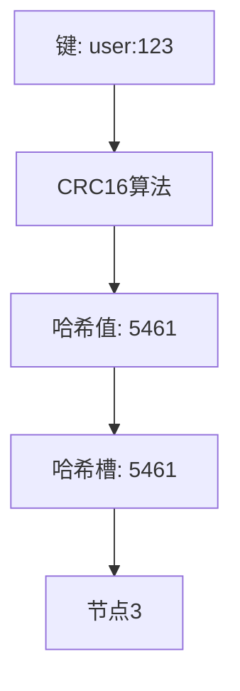
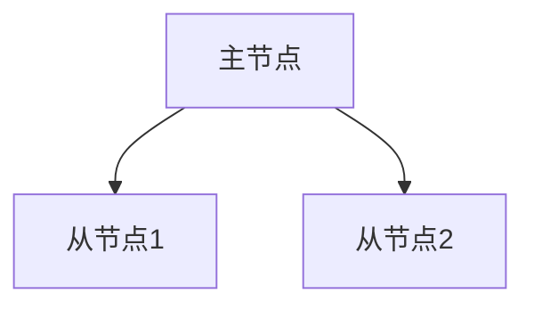

## 什么是Redis集群？

Redis集群是Redis提供的一种分布式解决方案，允许你将数据分布在多个Redis节点上，从而实现高可用性和横向扩展。通过集群，Redis可以处理更大的数据集和更高的并发请求，同时避免单点故障。

:::note
Redis集群是Redis 3.0版本引入的功能，旨在解决单机Redis的性能瓶颈和可用性问题。
:::

## Redis 集群的核心概念

### 1. 数据分片（Sharding）

Redis集群通过数据分片将数据分布到多个节点上。每个节点负责存储一部分数据，这些数据通过哈希槽（Hash Slot）进行管理。Redis集群中共有16384个哈希槽，每个键通过CRC16算法计算出一个哈希值，然后映射到对应的哈希槽中。



### 2. 主从复制（Master-Slave Replication）

每个主节点（Master）可以有一个或多个从节点（Slave）。从节点会复制主节点的数据，并在主节点故障时接管其工作，确保数据的高可用性。



### 3. 故障转移（Failover）

当主节点发生故障时，集群会自动将从节点提升为新的主节点，确保服务的连续性。这个过程称为故障转移。

## Redis 集群的工作原理

### 1. 集群搭建

要搭建一个Redis集群，至少需要3个主节点和3个从节点。每个主节点负责一部分哈希槽，而从节点则作为备份。

```bash
redis-cli --cluster create 127.0.0.1:7001 127.0.0.1:7002 127.0.0.1:7003 127.0.0.1:7004 127.0.0.1:7005 127.0.0.1:7006 --cluster-replicas 1
```

### 2. 数据读写

客户端可以通过任意节点访问集群。如果请求的键不在当前节点上，节点会返回一个重定向消息，告诉客户端正确的节点地址。

```bash
127.0.0.1:7001> SET user:123 "John Doe"
-> Redirected to slot [5461] located at 127.0.0.1:7003
OK
```

### 3. 集群状态检查

你可以使用以下命令检查集群的状态：

```bash
redis-cli --cluster check 127.0.0.1:7001
```

## 实际应用场景

### 1. 高并发网站

对于高并发网站，Redis集群可以有效地分担数据库的压力，提高响应速度。例如，用户会话数据可以存储在Redis集群中，避免频繁访问数据库。

### 2. 分布式缓存

在分布式系统中，Redis集群可以作为分布式缓存，存储热点数据，减少后端服务的负载。

### 3. 实时数据分析

Redis集群可以用于实时数据分析场景，例如存储和计算用户行为数据，支持快速查询和聚合操作。

## 总结

Redis集群是一种强大的分布式解决方案，能够有效提升Redis的性能和可用性。通过数据分片、主从复制和故障转移等机制，Redis集群可以应对大规模数据和高并发请求的挑战。

:::tip
如果你对Redis集群感兴趣，可以尝试搭建一个简单的集群环境，并测试其性能和故障恢复能力。
:::

## 附加资源

- [Redis官方文档](https://redis.io/documentation)
- [Redis集群教程](https://redis.io/topics/cluster-tutorial)
- [Redis命令参考](https://redis.io/commands)

## 练习

1. 尝试在本地搭建一个包含3个主节点和3个从节点的Redis集群。
2. 使用`redis-cli`命令向集群中写入数据，并观察数据分布情况。
3. 模拟主节点故障，观察集群的故障转移过程。
