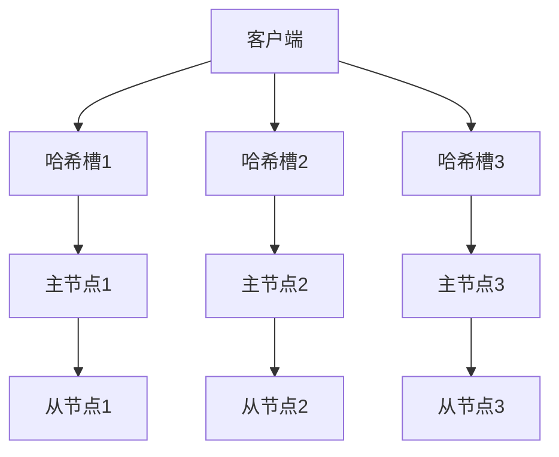

# Redis 集群架构

Redis是一个高性能的键值存储系统，广泛应用于缓存、消息队列和实时数据处理等场景。随着数据量和访问量的增加，单机Redis可能无法满足需求，这时就需要使用**Redis集群**来扩展性能和存储容量。本文将详细介绍Redis集群的架构、工作原理以及实际应用场景。

## 什么是Redis集群？

Redis集群是Redis提供的一种分布式解决方案，它通过将数据分片（sharding）存储在多个节点上，从而实现高可用性和横向扩展。Redis集群的主要特点包括：

- **数据分片**：数据被分散存储在多个节点上，每个节点只负责一部分数据。
- **高可用性**：通过主从复制和故障转移机制，确保集群在节点故障时仍能正常运行。
- **自动故障检测与恢复**：集群能够自动检测节点故障并进行故障转移。

## Redis 集群架构

Redis集群由多个节点组成，每个节点可以是一个主节点（master）或从节点（slave）。主节点负责存储数据和处理写请求，而从节点则通过复制主节点的数据来提供读请求和故障转移支持。

### 数据分片

Redis集群使用**哈希槽（hash slot）**来实现数据分片。集群中共有16384个哈希槽，每个键通过CRC16算法计算出一个哈希值，然后对16384取模，确定该键属于哪个哈希槽。每个主节点负责一部分哈希槽，数据根据哈希槽的分配存储在不同的节点上。



### 主从复制

每个主节点可以有多个从节点，从节点通过异步复制主节点的数据。当主节点发生故障时，集群会自动将一个从节点提升为新的主节点，确保数据的可用性。

### 故障检测与恢复

Redis集群通过**Gossip协议**进行节点间的通信，每个节点定期向其他节点发送心跳消息。如果某个节点在一定时间内没有响应，集群会将其标记为故障，并触发故障转移过程。

## 实际应用场景

### 1. 高并发缓存

在高并发场景下，单机Redis可能无法处理大量的请求。通过使用Redis集群，可以将请求分散到多个节点上，从而提高系统的吞吐量和响应速度。

### 2. 大规模数据存储

当数据量超过单机Redis的存储容量时，可以使用Redis集群将数据分散存储在多个节点上，从而实现横向扩展。

### 3. 高可用性系统

Redis集群通过主从复制和故障转移机制，确保在节点故障时系统仍能正常运行，适用于对可用性要求较高的场景。

## 代码示例

以下是一个简单的Redis集群配置示例：

```bash
# 启动Redis集群节点
redis-server --port 7000 --cluster-enabled yes --cluster-config-file nodes-7000.conf --cluster-node-timeout 5000
redis-server --port 7001 --cluster-enabled yes --cluster-config-file nodes-7001.conf --cluster-node-timeout 5000
redis-server --port 7002 --cluster-enabled yes --cluster-config-file nodes-7002.conf --cluster-node-timeout 5000

# 创建集群
redis-cli --cluster create 127.0.0.1:7000 127.0.0.1:7001 127.0.0.1:7002 --cluster-replicas 1
```

:::note
在实际生产环境中，建议使用至少6个节点（3个主节点和3个从节点）来确保高可用性。
:::

## 总结

Redis集群通过数据分片、主从复制和故障转移机制，提供了高性能、高可用性和横向扩展能力。它适用于高并发缓存、大规模数据存储和高可用性系统等场景。通过本文的介绍，你应该对Redis集群的架构和工作原理有了初步的了解。

## 附加资源与练习

- **官方文档**：[Redis Cluster Specification](https://redis.io/topics/cluster-spec)
- **练习**：尝试在本地搭建一个Redis集群，并使用`redis-cli`进行数据操作和故障转移测试。

:::tip
如果你对Redis集群的配置和管理有更多兴趣，可以进一步学习Redis的集群管理工具和监控方法。
:::