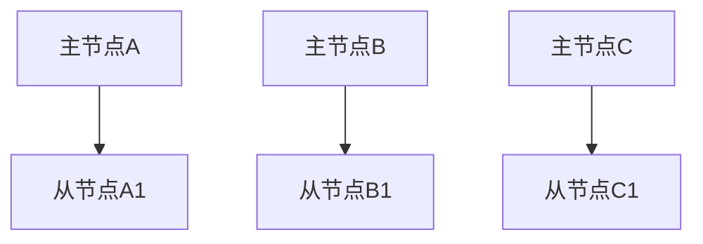
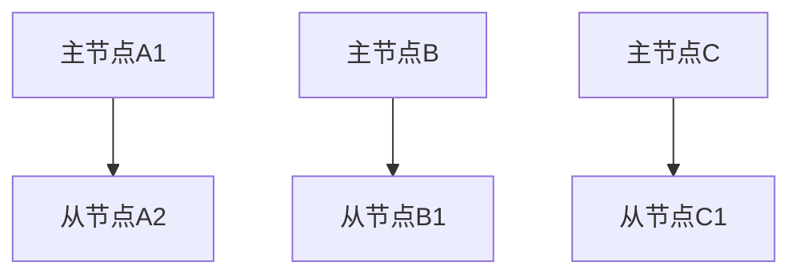

# Redis 集群故障转移

Redis集群是一个分布式数据库系统，旨在提供高可用性和数据冗余。在Redis集群中，数据被分片存储在多个节点上，每个分片由一个主节点和多个从节点组成。当主节点发生故障时，Redis集群会自动进行故障转移，以确保服务的连续性和数据的完整性。

## 什么是故障转移？

故障转移是指在主节点发生故障时，系统自动将一个从节点提升为新的主节点，以继续提供服务的过程。Redis集群通过内置的故障检测和选举机制来实现这一过程。

## Redis 集群的故障检测

Redis集群中的每个节点都会定期向其他节点发送心跳消息。如果一个主节点在一定时间内没有响应，其他节点会将其标记为疑似下线（PFAIL）。如果大多数主节点都认为该主节点下线，那么它将被标记为已下线（FAIL），并触发故障转移。

## 故障转移的过程

1. **故障检测**：当主节点被标记为已下线（FAIL）时，集群会开始选举新的主节点。
2. **选举新主节点**：从节点会发起选举，选择一个从节点作为新的主节点。选举过程基于从节点的优先级和复制偏移量。
3. **提升新主节点**：被选中的从节点会被提升为新的主节点，并开始处理写请求。
4. **更新集群配置**：集群会更新配置，将新的主节点信息广播给所有节点。

## 实际案例

假设我们有一个包含三个主节点和三个从节点的Redis集群。每个主节点负责一部分数据，并且每个主节点都有一个从节点作为备份。



如果主节点A发生故障，集群会检测到这一情况，并开始选举新的主节点。假设从节点A1被选为新的主节点，集群会更新配置，并将从节点A1提升为新的主节点。



## 代码示例

以下是一个简单的Redis集群配置示例，展示了如何设置主节点和从节点：

```bash
# 启动主节点A
redis-server --port 6379 --cluster-enabled yes --cluster-config-file nodes-6379.conf --cluster-node-timeout 5000

# 启动从节点A1
redis-server --port 6380 --cluster-enabled yes --cluster-config-file nodes-6380.conf --cluster-node-timeout 5000 --slaveof 127.0.0.1 6379
```

## 总结

Redis集群的故障转移机制确保了系统的高可用性和数据的完整性。通过自动检测故障、选举新的主节点并更新集群配置，Redis集群能够在主节点发生故障时继续提供服务。

## 附加资源

- [Redis官方文档](https://redis.io/documentation)
- [Redis集群教程](https://redis.io/topics/cluster-tutorial)
- [Redis高可用性配置指南](https://redis.io/topics/sentinel)

## 练习

1. 尝试在一个本地Redis集群中模拟主节点故障，并观察故障转移的过程。
2. 修改Redis集群配置，增加更多的从节点，并测试故障转移的可靠性。
3. 阅读Redis官方文档，了解更多关于集群配置和故障转移的细节。
