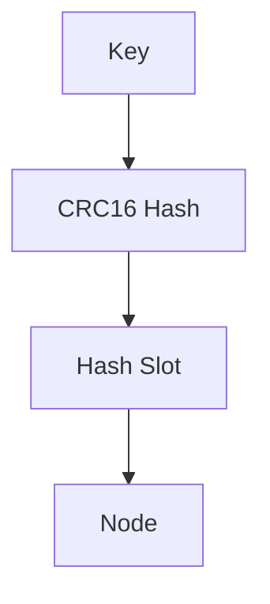
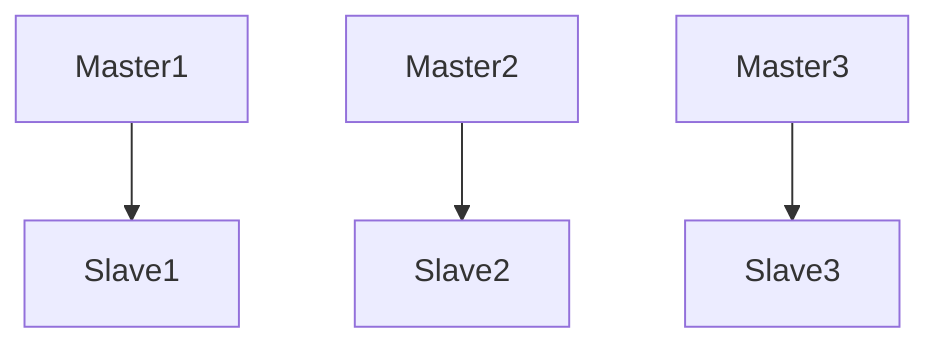

# Redis 集群管理

Redis集群是Redis提供的一种分布式解决方案，允许将数据分布在多个节点上，以提高性能和容错能力。对于初学者来说，理解如何管理Redis集群是掌握Redis高级功能的重要一步。本文将逐步介绍Redis集群管理的核心概念和实际操作。

## 什么是Redis集群？

Redis集群是一个由多个Redis节点组成的分布式系统，这些节点共同工作以提供高可用性和数据分片功能。每个节点负责存储一部分数据，并通过Gossip协议与其他节点通信，确保数据的一致性和可用性。

## Redis 集群的核心概念

### 1. 节点管理

在Redis集群中，节点分为主节点（Master）和从节点（Slave）。主节点负责处理写操作和部分读操作，而从节点则用于复制主节点的数据，并在主节点故障时接管其职责。

#### 添加节点

要添加一个新节点到集群中，可以使用以下命令：

```bash
redis-cli --cluster add-node <new_node_ip:port> <existing_node_ip:port>
```

#### 删除节点

删除节点的命令如下：

```bash
redis-cli --cluster del-node <existing_node_ip:port> <node_id>
```

### 2. 数据分片

Redis集群通过哈希槽（Hash Slot）将数据分布在不同的节点上。总共有16384个哈希槽，每个键通过CRC16算法计算出一个哈希值，然后映射到相应的哈希槽。



### 3. 故障恢复

Redis集群具有自动故障检测和恢复功能。当某个主节点不可用时，集群会自动将其从节点提升为新的主节点，确保数据的可用性。

#### 手动故障转移

在某些情况下，你可能需要手动触发故障转移：

```bash
redis-cli --cluster failover --cluster-master-id <node_id>
```

## 实际案例

假设我们有一个由三个主节点和三个从节点组成的Redis集群。每个主节点负责5461个哈希槽，从节点用于复制主节点的数据。



### 场景：主节点故障

当`Master1`发生故障时，`Slave1`会自动提升为新的主节点，接管`Master1`的职责。集群会继续正常运行，数据不会丢失。

## 总结

Redis集群管理涉及节点管理、数据分片和故障恢复等多个方面。通过合理配置和管理，可以确保Redis集群的高可用性和高性能。对于初学者来说，理解这些核心概念是掌握Redis集群管理的关键。

## 附加资源

- [Redis官方文档](https://redis.io/documentation)
- [Redis集群教程](https://redis.io/topics/cluster-tutorial)
- [Redis命令参考](https://redis.io/commands)

## 练习

1. 尝试在一个本地环境中搭建一个简单的Redis集群，包含两个主节点和两个从节点。
2. 模拟一个主节点故障，观察集群的自动恢复过程。
3. 使用`redis-cli`命令手动添加和删除节点，熟悉节点管理操作。

通过以上步骤，你将能够更好地理解和掌握Redis集群管理的核心概念和实际操作。