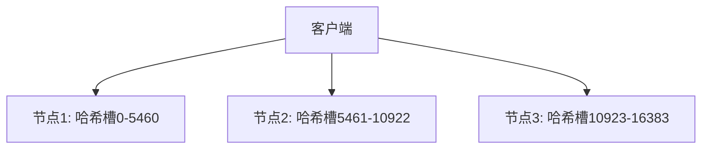
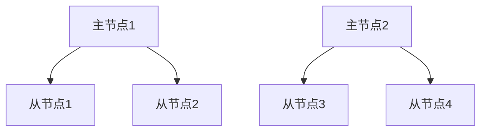

# Redis 集群最佳实践

Redis集群是Redis提供的一种分布式解决方案，旨在通过分片（sharding）和复制（replication）来实现高可用性和高性能。对于初学者来说，理解Redis集群的最佳实践是确保系统稳定性和性能的关键。本文将逐步介绍Redis集群的设计、部署和管理的最佳实践。

## 什么是Redis集群？

Redis集群是一个分布式的Redis实现，它将数据分布在多个节点上，每个节点负责一部分数据。通过这种方式，Redis集群可以实现水平扩展，从而支持更大的数据集和更高的吞吐量。此外，Redis集群还提供了自动故障转移和复制功能，以确保数据的高可用性。

## Redis 集群的设计

### 1. 分片（Sharding）

Redis集群通过分片将数据分布在多个节点上。每个节点负责一部分哈希槽（hash slot），总共有16384个哈希槽。数据根据键的哈希值分配到相应的哈希槽中。



### 2. 复制（Replication）

为了提高数据的可用性，Redis集群中的每个主节点都可以有一个或多个从节点。主节点负责处理写操作，而从节点则复制主节点的数据，并在主节点故障时接管其职责。



## Redis 集群的部署

### 1. 节点配置

在部署Redis集群时，首先需要配置每个节点的`redis.conf`文件。以下是一个简单的配置示例：

```bash
port 6379
cluster-enabled yes
cluster-config-file nodes.conf
cluster-node-timeout 5000
appendonly yes
```

### 2. 创建集群

使用`redis-cli`工具可以轻松创建Redis集群。以下命令将创建一个包含3个主节点和3个从节点的集群：

```bash
redis-cli --cluster create 127.0.0.1:6379 127.0.0.1:6380 127.0.0.1:6381 \
127.0.0.1:6382 127.0.0.1:6383 127.0.0.1:6384 --cluster-replicas 1
```

### 3. 验证集群状态

创建集群后，可以使用以下命令验证集群状态：

```bash
redis-cli --cluster check 127.0.0.1:6379
```

## Redis 集群的管理

### 1. 添加节点

在集群运行过程中，可能需要添加新的节点以扩展集群的容量。以下命令将添加一个新的主节点：

```bash
redis-cli --cluster add-node 127.0.0.1:6385 127.0.0.1:6379
```

### 2. 删除节点

如果需要删除一个节点，可以使用以下命令：

```bash
redis-cli --cluster del-node 127.0.0.1:6379 <node-id>
```

### 3. 重新分片

当集群中的数据分布不均匀时，可以重新分片以平衡负载。以下命令将启动重新分片过程：

```bash
redis-cli --cluster reshard 127.0.0.1:6379
```

## 实际案例

假设你正在为一个电商网站设计一个购物车系统。为了提高系统的性能和可用性，你决定使用Redis集群来存储用户的购物车数据。通过分片和复制，你可以确保即使某个节点发生故障，用户的购物车数据仍然可用。

:::note
在实际应用中，建议定期备份Redis数据，并监控集群的健康状态，以便及时发现和解决问题。
:::

## 总结

Redis集群是一个强大的工具，可以帮助你构建高可用性和高性能的分布式系统。通过遵循本文介绍的最佳实践，你可以确保Redis集群的稳定性和性能。

## 附加资源

- [Redis官方文档](https://redis.io/documentation)
- [Redis集群教程](https://redis.io/topics/cluster-tutorial)
- [Redis命令参考](https://redis.io/commands)

## 练习

1. 尝试在本地环境中部署一个包含3个主节点和3个从节点的Redis集群。
2. 使用`redis-cli`工具验证集群状态，并尝试添加和删除节点。
3. 设计一个简单的应用程序，使用Redis集群存储和检索数据。

:::tip
在练习过程中，如果遇到问题，可以参考Redis官方文档或社区论坛寻求帮助。
:::