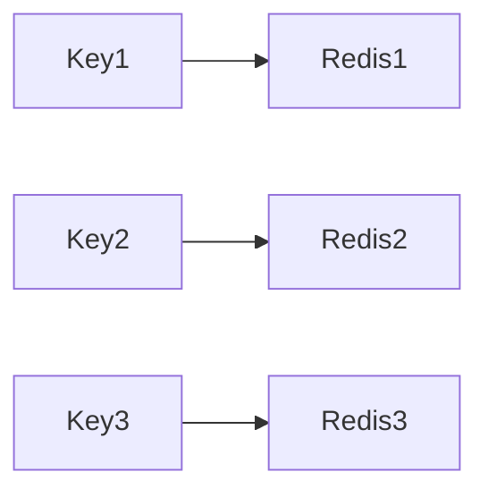

# Redis 分片策略

Redis分片（Sharding）是一种将数据分布到多个Redis实例中的技术，目的是通过水平扩展来提高系统的性能和容量。分片策略是决定如何将数据分配到不同Redis实例的关键。本文将详细介绍Redis分片策略的基本概念、实现方式以及实际应用场景。

## 什么是Redis分片？

Redis分片是一种将数据分布到多个Redis实例中的技术。通过分片，可以将数据分散到多个节点上，从而提高系统的性能和容量。分片策略决定了如何将数据分配到不同的Redis实例中。

## 分片策略的类型

### 1. 哈希分片（Hash-based Sharding）

哈希分片是最常见的分片策略之一。它通过将键（key）进行哈希计算，然后将哈希值映射到不同的Redis实例上。常见的哈希函数包括CRC32、MD5等。

```python
import hashlib

def hash_key(key):
    return int(hashlib.md5(key.encode()).hexdigest(), 16) % 3

keys = ["user:1", "user:2", "user:3"]
for key in keys:
    print(f"Key: {key} -> Shard: {hash_key(key)}")
```

**输出：**
```
Key: user:1 -> Shard: 1
Key: user:2 -> Shard: 2
Key: user:3 -> Shard: 0
```

### 2. 范围分片（Range-based Sharding）

范围分片是根据键的范围将数据分配到不同的Redis实例中。例如，可以将键的范围划分为多个区间，每个区间对应一个Redis实例。

```python
def range_shard(key):
    if key < 1000:
        return 0
    elif key < 2000:
        return 1
    else:
        return 2

keys = [500, 1500, 2500]
for key in keys:
    print(f"Key: {key} -> Shard: {range_shard(key)}")
```

**输出：**
```
Key: 500 -> Shard: 0
Key: 1500 -> Shard: 1
Key: 2500 -> Shard: 2
```

### 3. 一致性哈希（Consistent Hashing）

一致性哈希是一种更高级的分片策略，它通过将键和Redis实例映射到一个虚拟的环上，从而在节点增减时最小化数据的迁移。



:::note
一致性哈希在节点增减时，只会影响相邻节点的数据，从而减少了数据迁移的开销。
:::

## 实际应用场景

### 1. 分布式缓存

在分布式缓存系统中，Redis分片可以有效地将缓存数据分布到多个节点上，从而提高缓存的命中率和系统的吞吐量。

### 2. 分布式会话存储

在分布式Web应用中，Redis分片可以用于存储用户的会话数据。通过分片，可以将不同用户的会话数据分布到不同的Redis实例中，从而提高系统的并发处理能力。

### 3. 分布式消息队列

在分布式消息队列系统中，Redis分片可以用于存储消息数据。通过分片，可以将消息分布到多个Redis实例中，从而提高消息的处理速度和系统的可靠性。

## 总结

Redis分片策略是提高Redis性能和容量的关键技术之一。通过哈希分片、范围分片和一致性哈希等策略，可以有效地将数据分布到多个Redis实例中。在实际应用中，Redis分片可以用于分布式缓存、分布式会话存储和分布式消息队列等场景。

## 附加资源

- [Redis官方文档](https://redis.io/documentation)
- [一致性哈希算法详解](https://en.wikipedia.org/wiki/Consistent_hashing)
- [Redis分片实战](https://www.example.com/redis-sharding-practice)

## 练习

1. 实现一个简单的哈希分片函数，将一组键分配到3个Redis实例中。
2. 使用一致性哈希算法，模拟节点增减时数据的迁移情况。
3. 设计一个范围分片策略，将键的范围划分为多个区间，并分配到不同的Redis实例中。

:::tip
在实际应用中，选择合适的分片策略需要根据具体的业务场景和需求来决定。
:::