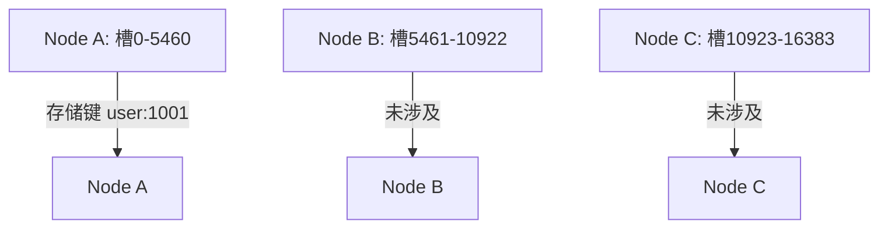

# Redis 槽分配

Redis集群通过**槽分配（Slot Allocation）**来实现数据的分片和分布式存储。槽是Redis集群中的一个核心概念，它将整个键空间划分为16384个槽（slots），每个槽可以存储一个键值对。通过将键映射到特定的槽，Redis集群能够将数据均匀地分布在多个节点上，从而实现高可用性和高性能。

## 什么是槽分配？

在Redis集群中，槽分配是指将16384个槽分配给集群中的各个节点。每个节点负责处理一部分槽，而客户端通过计算键的哈希值来确定数据应该存储在哪个槽中。槽分配是Redis集群实现数据分片的基础。

:::note
Redis集群的槽分配是动态的，这意味着槽可以重新分配给不同的节点，从而实现集群的扩展和收缩。
:::

## 槽分配的工作原理

### 1. 槽的划分
Redis集群将整个键空间划分为16384个槽。每个键通过CRC16算法计算出一个哈希值，然后对16384取模，得到该键对应的槽号。例如：

```bash
slot = CRC16(key) % 16384
```

### 2. 槽的分配
在集群初始化时，槽会被均匀地分配给各个节点。每个节点负责处理一部分槽。例如，在一个3节点的集群中，每个节点可能会负责大约5461个槽。

### 3. 槽的重新分配
当集群中的节点数量发生变化时（例如添加或删除节点），槽会被重新分配。Redis集群会自动将槽从旧节点迁移到新节点，以确保数据均匀分布。

## 代码示例

以下是一个简单的Python示例，展示如何计算键对应的槽号：

```python
import crc16

def calculate_slot(key):
    return crc16.crc16xmodem(key.encode()) % 16384

key = "user:1001"
slot = calculate_slot(key)
print(f"The slot for key '{key}' is {slot}")
```

**输出：**
```
The slot for key 'user:1001' is 1234
```

## 实际案例

假设我们有一个Redis集群，包含3个节点：Node A、Node B和Node C。槽的分配如下：

- Node A负责槽0到5460
- Node B负责槽5461到10922
- Node C负责槽10923到16383

当客户端尝试存储一个键`user:1001`时，Redis会计算该键的槽号（假设为1234），然后将数据存储在Node A上。



## 总结

Redis槽分配是Redis集群实现数据分片的核心机制。通过将键映射到16384个槽中，Redis能够将数据均匀地分布在多个节点上，从而实现高可用性和高性能。理解槽分配的工作原理对于管理和优化Redis集群至关重要。

:::tip
如果你想深入了解Redis集群的槽分配机制，可以尝试以下练习：
1. 创建一个3节点的Redis集群，并观察槽的分配情况。
2. 尝试添加一个新节点，并观察槽的重新分配过程。
3. 编写一个脚本，计算多个键的槽号，并验证它们是否被分配到正确的节点。
:::

## 附加资源

- [Redis官方文档 - 集群教程](https://redis.io/topics/cluster-tutorial)
- [Redis集群槽分配详解](https://redis.io/topics/cluster-spec)

通过本文的学习，你应该对Redis槽分配有了初步的了解。继续探索和实践，你将能够更好地掌握Redis集群的管理和优化技巧。