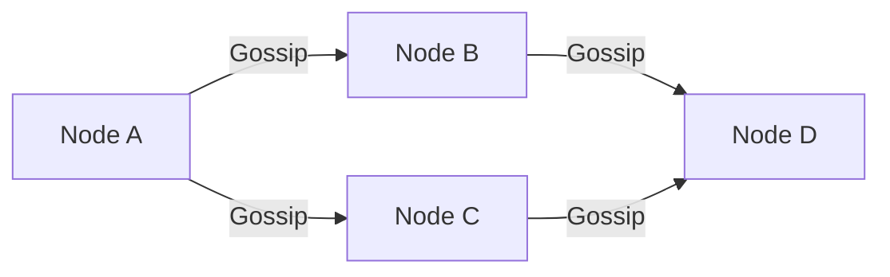
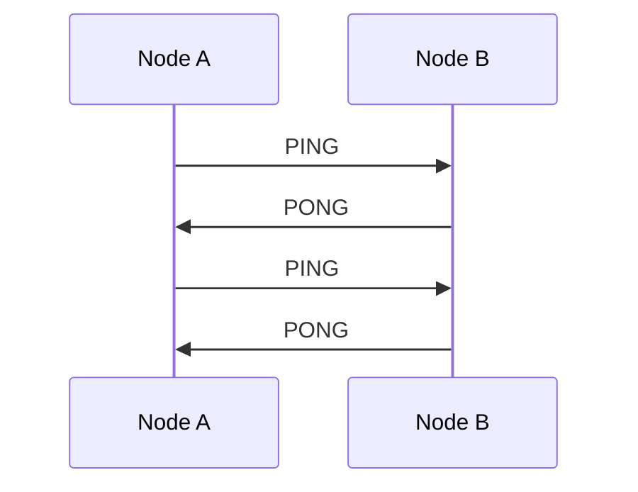
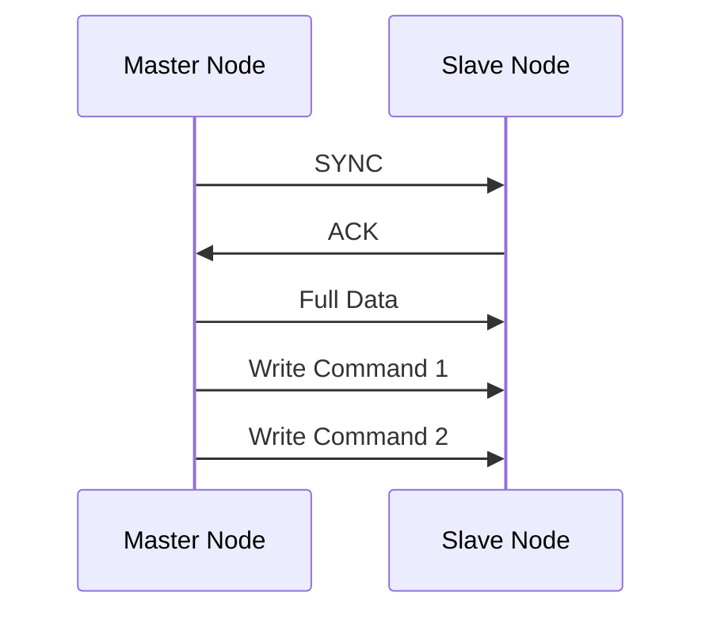
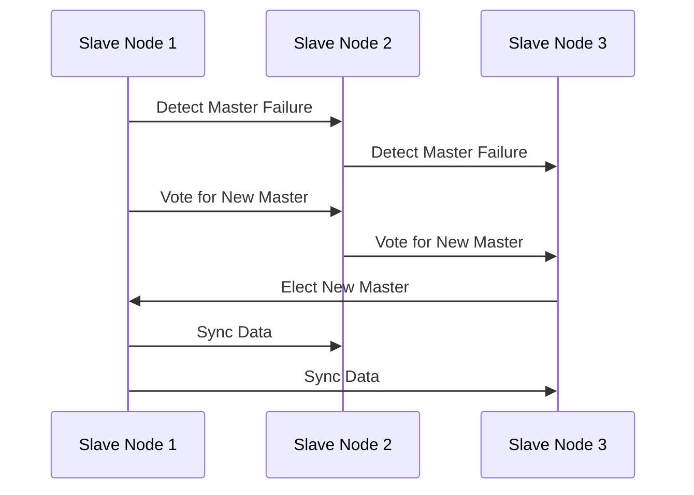

# Redis 集群节点通信

Redis集群是一个分布式系统，由多个节点组成，这些节点通过特定的通信机制协同工作，以实现高可用性和数据一致性。本文将详细介绍Redis集群中节点之间的通信方式，帮助你理解其工作原理。

## 1. 什么是Redis集群节点通信？

Redis集群中的节点通信是指集群中的各个节点之间通过特定的协议和机制进行信息交换，以确保数据的一致性和集群的高可用性。节点通信主要包括以下几个方面：

- **节点发现**：新节点加入集群时，如何被其他节点发现。
- **心跳检测**：节点之间定期发送心跳包，以检测节点的健康状态。
- **数据同步**：主节点和从节点之间的数据同步机制。
- **故障转移**：当主节点失效时，如何选举新的主节点。

## 2. 节点发现

当一个新节点加入Redis集群时，它需要被集群中的其他节点发现。Redis集群使用**Gossip协议**来实现节点发现。Gossip协议是一种去中心化的通信协议，节点之间通过随机交换信息来传播集群的状态。

### 2.1 Gossip协议的工作原理

Gossip协议的核心思想是每个节点定期随机选择其他节点发送自己的状态信息。通过这种方式，信息会在整个集群中迅速传播。

在上图中，Node A通过Gossip协议将信息传播给Node B和Node C，然后Node B和Node C再将信息传播给Node D。

## 3. 心跳检测

为了确保集群中所有节点的健康状态，Redis集群中的节点会定期发送心跳包（PING/PONG消息）给其他节点。如果某个节点在一定时间内没有收到另一个节点的心跳包，就会认为该节点已经失效。

### 3.1 心跳检测的实现

每个节点会维护一个心跳计数器，记录与其他节点的最后一次通信时间。如果计数器超过一定阈值，节点会标记该节点为失效。

在上图中，Node A和Node B通过PING/PONG消息进行心跳检测。

## 4. 数据同步

在Redis集群中，数据同步主要通过主从复制来实现。每个主节点可以有多个从节点，从节点会定期从主节点同步数据。

### 4.1 主从复制的流程

1. **全量同步**：当从节点第一次连接到主节点时，主节点会将所有数据发送给从节点。
2. **增量同步**：之后，主节点会将每次写操作的命令发送给从节点，从节点执行相同的命令以保持数据一致。

在上图中，主节点首先进行全量同步，然后通过增量同步保持数据一致。

## 5. 故障转移

当主节点失效时，Redis集群会自动进行故障转移，选举新的主节点。故障转移的过程如下：

1. **检测失效**：从节点检测到主节点失效。
2. **选举新主**：从节点之间通过投票选举新的主节点。
3. **数据同步**：新的主节点从其他从节点同步数据。

### 5.1 故障转移的流程

在上图中，Slave Node 1被选举为新的主节点，并从其他从节点同步数据。

## 6. 实际案例

假设我们有一个由3个主节点和3个从节点组成的Redis集群。当其中一个主节点失效时，集群会自动进行故障转移，确保数据的高可用性。

:::note
在实际生产环境中，Redis集群的节点通信机制能够有效应对节点故障，确保系统的稳定性和数据的可靠性。
:::

## 7. 总结

Redis集群中的节点通信是确保集群高可用性和数据一致性的关键机制。通过Gossip协议、心跳检测、数据同步和故障转移，Redis集群能够在节点故障时自动恢复，保证系统的稳定运行。

## 8. 附加资源与练习

- **练习**：尝试搭建一个简单的Redis集群，观察节点之间的通信行为。
- **资源**：阅读Redis官方文档中关于集群通信的详细说明。

通过本文的学习，你应该对Redis集群节点通信有了初步的了解。继续深入学习Redis集群的其他机制，将有助于你更好地掌握分布式系统的设计与实现。