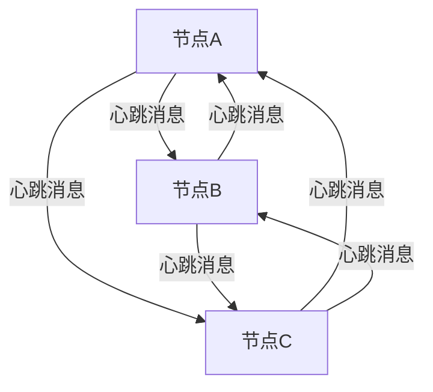
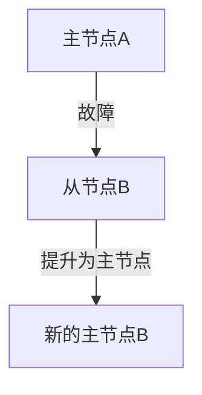

## 介绍

Redis集群是一个分布式系统，旨在通过将数据分布在多个节点上来提供高可用性和扩展性。然而，在分布式系统中，节点故障是不可避免的。为了确保集群的稳定运行，Redis实现了一套故障检测机制，用于及时发现和处理节点故障。

在本篇文章中，我们将深入探讨Redis集群的故障检测机制，包括其工作原理、如何识别故障节点以及如何处理这些故障。

## Redis 集群故障检测机制

Redis集群的故障检测机制主要依赖于**心跳机制**和**故障转移**。每个节点会定期向其他节点发送心跳消息，以确认它们的存活状态。如果某个节点在一定时间内没有响应，它将被标记为故障节点。

### 心跳机制

Redis集群中的每个节点都会定期向其他节点发送心跳消息。这些消息包含节点的状态信息，如当前的角色（主节点或从节点）、槽位分配情况等。通过心跳消息，节点可以相互确认彼此的存活状态。

### 故障检测

当一个节点在一定时间内没有收到另一个节点的心跳消息时，它会将该节点标记为**疑似故障**。如果多个节点都报告同一个节点为疑似故障，那么该节点将被确认为**故障节点**。

:::note
**注意**：Redis集群使用**多数派原则**来确认故障节点。这意味着只有当大多数节点都认为某个节点故障时，该节点才会被确认为故障节点。
:::

### 故障转移

一旦某个节点被确认为故障节点，Redis集群将启动故障转移过程。故障转移的目标是将故障节点的槽位重新分配给其他健康的节点，以确保数据的可用性。

## 实际案例

假设我们有一个包含三个节点的Redis集群：节点A、节点B和节点C。节点A是主节点，节点B和节点C是从节点。

1. **节点A故障**：节点A突然停止响应心跳消息。
2. **故障检测**：节点B和节点C在多次尝试后仍未收到节点A的心跳消息，它们将节点A标记为疑似故障。
3. **故障确认**：由于大多数节点（节点B和节点C）都认为节点A故障，节点A被确认为故障节点。
4. **故障转移**：节点B被提升为新的主节点，接管节点A的槽位。

:::tip
**提示**：在实际生产环境中，建议配置多个从节点，以确保在主节点故障时能够快速进行故障转移。
:::

## 总结

Redis集群的故障检测机制是确保集群高可用性的关键。通过心跳机制和故障转移，Redis能够及时发现和处理节点故障，确保数据的持续可用性。

## 附加资源

- [Redis官方文档 - 集群教程](https://redis.io/topics/cluster-tutorial)
- [Redis集群故障转移详解](https://redis.io/topics/cluster-spec)

## 练习

1. 尝试在一个本地Redis集群中模拟节点故障，观察故障检测和故障转移的过程。
2. 配置多个从节点，测试在主节点故障时，故障转移的速度和可靠性。

通过以上内容，你应该对Redis集群的故障检测机制有了更深入的理解。希望这些知识能帮助你在实际应用中更好地管理和维护Redis集群。