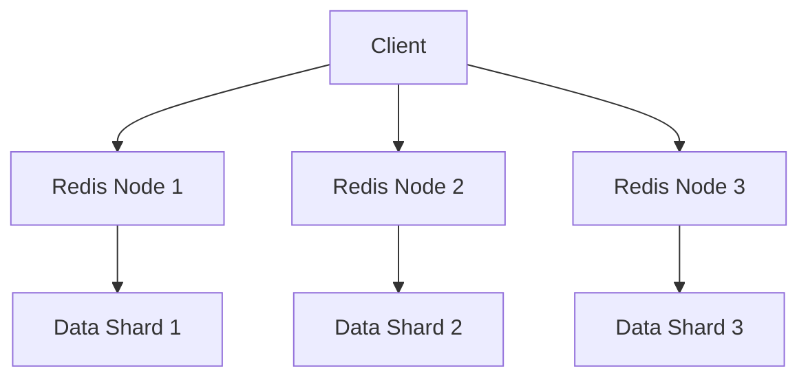

## 介绍

Redis（Remote Dictionary Server）是一个开源的内存数据结构存储系统，广泛用于缓存、消息队列和实时数据处理等场景。由于其基于内存的特性，Redis通常具有极高的读写性能。然而，随着数据量和并发请求的增加，Redis的性能可能会受到限制。因此，了解Redis的性能特点以及如何优化其性能至关重要。

## Redis 的性能特点

### 1. 内存存储

Redis的所有数据都存储在内存中，这使得其读写速度非常快。内存的访问速度远高于磁盘，因此Redis能够处理大量的并发请求。

### 2. 单线程模型

Redis采用单线程模型来处理命令，这意味着它不会因为多线程的上下文切换而消耗额外的资源。然而，这也意味着Redis的性能受限于单个CPU核心的计算能力。

### 3. 持久化机制

Redis提供了两种持久化机制：RDB（Redis Database）和AOF（Append-Only File）。RDB通过定期生成数据快照来保存数据，而AOF则通过记录每个写操作来保证数据的持久性。持久化操作可能会影响Redis的性能，尤其是在数据量较大时。

### 4. 数据结构

Redis支持多种数据结构，如字符串、哈希、列表、集合和有序集合等。不同的数据结构在不同的应用场景下具有不同的性能表现。

## Redis 性能优化策略

### 1. 合理使用数据结构

选择合适的数据结构可以显著提升Redis的性能。例如，如果需要频繁地进行范围查询，使用有序集合（Sorted Set）会比使用列表（List）更高效。

```python
# 示例：使用有序集合进行范围查询
import redis

r = redis.Redis(host='localhost', port=6379, db=0)
r.zadd('scores', {'Alice': 100, 'Bob': 200, 'Charlie': 300})
result = r.zrangebyscore('scores', 150, 250)
print(result)  # 输出: [b'Bob']
```

### 2. 使用Pipeline减少网络开销

Redis的Pipeline机制允许客户端一次性发送多个命令，从而减少网络往返时间（RTT）。这在需要执行多个命令的场景下非常有用。

```python
# 示例：使用Pipeline执行多个命令
import redis

r = redis.Redis(host='localhost', port=6379, db=0)
pipe = r.pipeline()
pipe.set('foo', 'bar')
pipe.get('foo')
result = pipe.execute()
print(result)  # 输出: [True, b'bar']
```

### 3. 配置合理的持久化策略

根据应用场景选择合适的持久化策略。如果对数据丢失的容忍度较高，可以仅使用RDB持久化；如果需要更高的数据安全性，可以启用AOF持久化。

```bash
# 示例：配置RDB和AOF持久化
save 900 1  # 900秒内至少有1个键被修改时，生成RDB快照
appendonly yes  # 启用AOF持久化
```

### 4. 使用集群模式

当单个Redis实例无法满足性能需求时，可以使用Redis集群模式。Redis集群通过分片（Sharding）将数据分布到多个节点上，从而提升整体的处理能力。



## 实际案例

### 案例1：缓存系统

在一个电商网站中，商品信息通常会被频繁访问。为了减少数据库的压力，可以将商品信息缓存到Redis中。通过合理设置缓存过期时间，可以确保缓存数据的及时更新。

```python
# 示例：缓存商品信息
import redis

r = redis.Redis(host='localhost', port=6379, db=0)
product_id = '12345'
product_info = r.get(f'product:{product_id}')
if not product_info:
    # 从数据库获取商品信息
    product_info = fetch_product_from_db(product_id)
    r.setex(f'product:{product_id}', 3600, product_info)  # 缓存1小时
print(product_info)
```

### 案例2：排行榜系统

在一个游戏应用中，玩家的得分需要实时更新并展示在排行榜上。使用Redis的有序集合可以高效地实现这一功能。

```python
# 示例：更新和查询排行榜
import redis

r = redis.Redis(host='localhost', port=6379, db=0)
player_id = 'player1'
score = 1000
r.zadd('leaderboard', {player_id: score})
top_players = r.zrevrange('leaderboard', 0, 9, withscores=True)
print(top_players)  # 输出前10名玩家及其得分
```

## 总结

Redis是一个高性能的内存数据存储系统，但在实际应用中，合理的优化策略可以进一步提升其性能。通过选择合适的数据结构、使用Pipeline、配置持久化策略以及使用集群模式，可以有效地提升Redis的性能。

## 附加资源

- [Redis官方文档](https://redis.io/documentation)
- [Redis性能优化指南](https://redis.io/topics/performance)
- [Redis集群教程](https://redis.io/topics/cluster-tutorial)

## 练习

1. 尝试使用Redis的有序集合实现一个简单的排行榜系统。
2. 配置Redis的RDB和AOF持久化策略，并观察其对性能的影响。
3. 使用Pipeline机制批量执行多个命令，比较其与单条命令执行的性能差异。