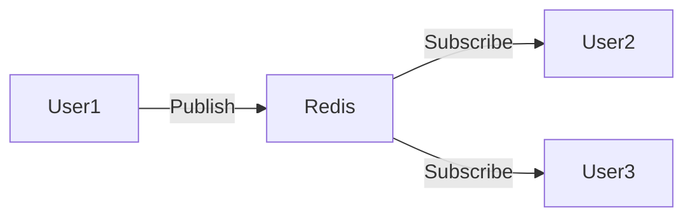
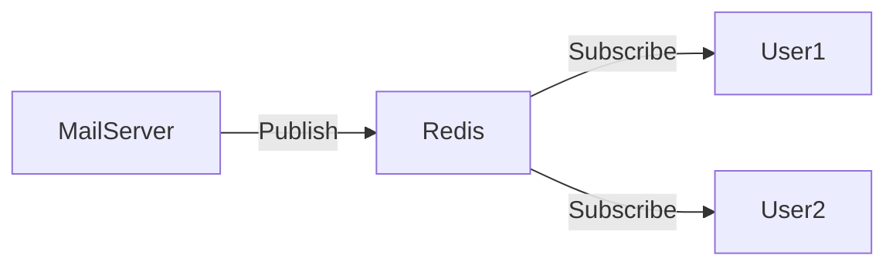

# Redis 实时通讯

实时通讯是现代应用程序中常见的功能，例如聊天应用、实时通知和在线协作工具。Redis作为一个高性能的内存数据库，非常适合用于实现实时通讯功能。本文将介绍如何使用Redis实现实时通讯，并提供代码示例和实际应用场景。

## 什么是实时通讯？

实时通讯是指两个或多个用户之间能够即时传递消息的技术。与传统的请求-响应模式不同，实时通讯允许消息在发送后立即被接收方接收，而不需要等待接收方主动请求。

Redis通过其发布/订阅（Pub/Sub）模式，能够轻松实现实时通讯功能。发布/订阅模式允许客户端订阅一个或多个频道，并在消息发布到这些频道时立即接收消息。

## Redis 发布/订阅模式

Redis的发布/订阅模式由三个主要操作组成：

1. **发布（Publish）**：将消息发送到指定的频道。
2. **订阅（Subscribe）**：订阅一个或多个频道，以接收发布到这些频道的消息。
3. **退订（Unsubscribe）**：停止接收指定频道的消息。

### 代码示例

以下是一个简单的Python示例，展示如何使用Redis的发布/订阅模式实现实时通讯。

```python
import redis
import threading

# 创建Redis连接
r = redis.Redis(host='localhost', port=6379, db=0)

# 发布消息的函数
def publish_message(channel, message):
    r.publish(channel, message)
    print(f"Published message '{message}' to channel '{channel}'")

# 订阅消息的函数
def subscribe_to_channel(channel):
    pubsub = r.pubsub()
    pubsub.subscribe(channel)
    print(f"Subscribed to channel '{channel}'")
    for message in pubsub.listen():
        if message['type'] == 'message':
            print(f"Received message: {message['data'].decode('utf-8')}")

# 创建两个线程，一个用于发布消息，一个用于订阅消息
publisher_thread = threading.Thread(target=publish_message, args=('chat', 'Hello, World!'))
subscriber_thread = threading.Thread(target=subscribe_to_channel, args=('chat',))

# 启动线程
subscriber_thread.start()
publisher_thread.start()

# 等待线程完成
publisher_thread.join()
subscriber_thread.join()
```

### 输入和输出

- **输入**：发布消息 `'Hello, World!'` 到频道 `'chat'`。
- **输出**：订阅频道 `'chat'` 的客户端将立即接收到消息 `'Hello, World!'`。

## 实际应用场景

### 聊天应用

在聊天应用中，用户可以通过订阅一个公共频道或私人频道来接收消息。当用户发送消息时，消息会被发布到相应的频道，所有订阅该频道的用户都会立即收到消息。



### 实时通知

在实时通知系统中，用户可以通过订阅特定的事件频道来接收通知。例如，当有新邮件到达时，系统会发布一条消息到邮件通知频道，所有订阅该频道的用户都会立即收到通知。



## 总结

Redis的发布/订阅模式是实现实时通讯的强大工具。通过简单的发布和订阅操作，您可以轻松构建实时聊天应用、通知系统等。Redis的高性能和低延迟使其成为实时通讯的理想选择。

## 附加资源

- [Redis官方文档](https://redis.io/documentation)
- [Redis Pub/Sub模式详解](https://redis.io/topics/pubsub)
- [Python Redis库文档](https://redis-py.readthedocs.io/en/stable/)

## 练习

1. 修改上述代码示例，使其支持多个频道订阅。
2. 尝试使用Redis的发布/订阅模式实现一个简单的聊天室应用。
3. 探索Redis的其他功能，如列表、集合和有序集合，看看它们如何与发布/订阅模式结合使用。

:::tip
在实际生产环境中，建议结合其他技术（如WebSocket）来实现更复杂的实时通讯功能。
:::