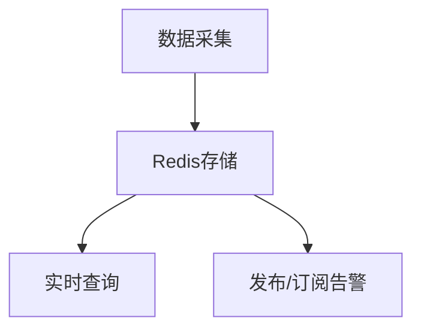

# Redis 实时分析

Redis（Remote Dictionary Server）是一个高性能的键值存储系统，广泛用于缓存、消息队列和实时数据分析等场景。实时分析是指对数据进行即时处理和分析，以便快速做出决策或响应。Redis凭借其高速读写能力和丰富的数据结构，成为实时分析的理想选择。

## 为什么选择Redis进行实时分析？

1. **高性能**：Redis基于内存操作，读写速度极快，适合处理实时数据流。
2. **丰富的数据结构**：Redis支持字符串、哈希、列表、集合、有序集合等数据结构，便于处理复杂的数据分析任务。
3. **持久化支持**：Redis提供RDB和AOF两种持久化机制，确保数据安全。
4. **分布式支持**：通过Redis Cluster，可以轻松扩展系统以处理大规模数据。

## Redis 实时分析的核心概念

### 1. 数据流处理
实时分析通常涉及处理连续的数据流。Redis的列表（List）和流（Stream）数据结构非常适合处理这种场景。

#### 示例：使用Redis列表处理实时日志
假设我们有一个实时日志系统，需要记录用户行为并进行分析。

```bash
# 将日志数据推入Redis列表
LPUSH logs "User clicked button at 2023-10-01 12:00:00"
LPUSH logs "User logged in at 2023-10-01 12:01:00"

# 从列表尾部获取最新日志
LRANGE logs 0 -1
```

**输出：**
```
1) "User logged in at 2023-10-01 12:01:00"
2) "User clicked button at 2023-10-01 12:00:00"
```

### 2. 计数器与统计
Redis的字符串和哈希结构可以用于实现计数器，统计实时数据的变化。

#### 示例：统计网站实时访问量
```bash
# 每次访问时递增计数器
INCR page_views

# 获取当前访问量
GET page_views
```

**输出：**
```
"12345"
```

### 3. 实时排名
Redis的有序集合（Sorted Set）非常适合实现实时排名功能。

#### 示例：实时游戏排行榜
```bash
# 添加玩家得分
ZADD leaderboard 1000 "player1"
ZADD leaderboard 800 "player2"
ZADD leaderboard 1200 "player3"

# 获取排行榜前3名
ZREVRANGE leaderboard 0 2 WITHSCORES
```

**输出：**
```
1) "player3"
2) "1200"
3) "player1"
4) "1000"
5) "player2"
6) "800"
```

## 实际应用场景

### 1. 实时监控系统
在实时监控系统中，Redis可以用于存储和查询系统指标（如CPU使用率、内存占用等）。通过Redis的发布/订阅功能，可以实现实时告警。



### 2. 电商实时推荐
在电商平台中，Redis可以用于存储用户行为数据（如浏览、购买记录），并通过实时分析生成个性化推荐。

```bash
# 记录用户浏览商品
SADD user:1:viewed_items "item123"
SADD user:1:viewed_items "item456"

# 获取用户最近浏览的商品
SMEMBERS user:1:viewed_items
```

**输出：**
```
1) "item123"
2) "item456"
```

### 3. 社交媒体实时分析
在社交媒体平台中，Redis可以用于统计帖子的点赞数、评论数，并实时更新热门帖子列表。

```bash
# 记录帖子点赞
ZINCRBY post_likes 1 "post123"

# 获取热门帖子
ZREVRANGE post_likes 0 2 WITHSCORES
```

**输出：**
```
1) "post123"
2) "100"
```

## 总结

Redis凭借其高性能和丰富的数据结构，在实时分析领域表现出色。无论是数据流处理、计数器统计，还是实时排名，Redis都能提供高效的解决方案。通过实际案例，我们可以看到Redis在实时监控、电商推荐和社交媒体分析中的广泛应用。

:::tip
**练习：**
1. 使用Redis实现一个实时访问量统计系统。
2. 尝试用Redis的有序集合实现一个实时热搜榜。
:::

**附加资源：**
- [Redis官方文档](https://redis.io/documentation)
- 《Redis设计与实现》——黄健宏