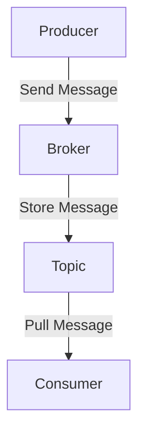

# RocketMQ 简介

RocketMQ 是一款开源的分布式消息中间件，由阿里巴巴集团开发并贡献给 Apache 基金会。它被设计用于处理高吞吐量、低延迟的消息传递场景，广泛应用于电商、金融、物流等领域。RocketMQ 提供了可靠的消息传递机制，支持事务消息、顺序消息、定时消息等功能，是构建分布式系统的核心组件之一。

## 什么是消息中间件？

消息中间件是一种用于在分布式系统中传递消息的软件组件。它允许应用程序通过异步通信的方式解耦，从而提高系统的可扩展性和可靠性。消息中间件通常由生产者（Producer）、消费者（Consumer）和消息队列（Queue）组成。

- **生产者**：负责生成消息并将其发送到消息队列。
- **消费者**：从消息队列中获取消息并进行处理。
- **消息队列**：存储消息的缓冲区，确保消息在传递过程中不会丢失。

## RocketMQ 的核心组件

RocketMQ 的核心组件包括以下几个部分：

1. **NameServer**：NameServer 是 RocketMQ 的服务发现组件，负责管理 Broker 的地址信息。生产者和消费者通过 NameServer 获取 Broker 的地址，从而实现消息的发送和接收。

2. **Broker**：Broker 是 RocketMQ 的消息存储和转发组件。它负责接收生产者发送的消息，并将其存储在磁盘上。同时，Broker 还负责将消息推送给消费者。

3. **Producer**：生产者是消息的发送方，负责将消息发送到指定的 Topic。

4. **Consumer**：消费者是消息的接收方，负责从指定的 Topic 中获取消息并进行处理。

5. **Topic**：Topic 是消息的逻辑分类，生产者将消息发送到特定的 Topic，消费者从特定的 Topic 中获取消息。

## RocketMQ 的工作流程

RocketMQ 的工作流程可以简单描述为以下几个步骤：

1. 生产者将消息发送到指定的 Topic。
2. Broker 接收到消息后，将其存储在磁盘上。
3. 消费者从 Broker 中拉取消息并进行处理。



## 实际应用场景

RocketMQ 在以下场景中得到了广泛应用：

1. **电商订单系统**：在电商平台中，订单的创建、支付、发货等操作需要异步处理。RocketMQ 可以确保订单消息的可靠传递，避免订单丢失或重复处理。

2. **日志收集**：在大规模分布式系统中，日志的收集和分析是一个重要的任务。RocketMQ 可以将日志消息异步发送到日志处理系统，从而提高系统的性能。

3. **金融交易系统**：在金融交易系统中，交易的实时性和可靠性至关重要。RocketMQ 可以确保交易消息的快速传递和可靠存储。

## 代码示例

以下是一个简单的 RocketMQ 生产者示例，展示了如何发送消息到指定的 Topic：

```java
import org.apache.rocketmq.client.producer.DefaultMQProducer;
import org.apache.rocketmq.common.message.Message;

public class ProducerExample {
    public static void main(String[] args) throws Exception {
        // 创建生产者实例
        DefaultMQProducer producer = new DefaultMQProducer("ProducerGroup");
        // 设置 NameServer 地址
        producer.setNamesrvAddr("localhost:9876");
        // 启动生产者
        producer.start();

        // 创建消息
        Message msg = new Message("TopicTest", "TagA", "Hello RocketMQ".getBytes());
        // 发送消息
        producer.send(msg);

        // 关闭生产者
        producer.shutdown();
    }
}
```

以下是一个简单的 RocketMQ 消费者示例，展示了如何从指定的 Topic 中获取消息：

```java
import org.apache.rocketmq.client.consumer.DefaultMQPushConsumer;
import org.apache.rocketmq.client.consumer.listener.ConsumeConcurrentlyContext;
import org.apache.rocketmq.client.consumer.listener.ConsumeConcurrentlyStatus;
import org.apache.rocketmq.client.consumer.listener.MessageListenerConcurrently;
import org.apache.rocketmq.common.message.MessageExt;

import java.util.List;

public class ConsumerExample {
    public static void main(String[] args) throws Exception {
        // 创建消费者实例
        DefaultMQPushConsumer consumer = new DefaultMQPushConsumer("ConsumerGroup");
        // 设置 NameServer 地址
        consumer.setNamesrvAddr("localhost:9876");
        // 订阅 Topic
        consumer.subscribe("TopicTest", "*");
        // 注册消息监听器
        consumer.registerMessageListener(new MessageListenerConcurrently() {
            @Override
            public ConsumeConcurrentlyStatus consumeMessage(List<MessageExt> msgs, ConsumeConcurrentlyContext context) {
                for (MessageExt msg : msgs) {
                    System.out.println("Received message: " + new String(msg.getBody()));
                }
                return ConsumeConcurrentlyStatus.CONSUME_SUCCESS;
            }
        });
        // 启动消费者
        consumer.start();
    }
}
```

## 总结

RocketMQ 是一款功能强大的分布式消息中间件，适用于高吞吐量、低延迟的消息传递场景。通过本文的介绍，您应该对 RocketMQ 的基本概念、核心组件及其工作流程有了初步的了解。希望本文能帮助您在分布式系统中更好地应用 RocketMQ。

## 附加资源

- [RocketMQ 官方文档](https://rocketmq.apache.org/docs/)
- [RocketMQ GitHub 仓库](https://github.com/apache/rocketmq)
- [RocketMQ 实战教程](https://www.rocketmq.io/)

## 练习

1. 尝试在本地搭建一个 RocketMQ 环境，并运行上述的生产者和消费者示例。
2. 修改生产者代码，发送多条消息到不同的 Topic，并观察消费者的输出。
3. 研究 RocketMQ 的事务消息机制，并尝试实现一个简单的分布式事务场景。

:::tip
如果您在练习过程中遇到问题，可以参考 RocketMQ 的官方文档或在社区中寻求帮助。
:::