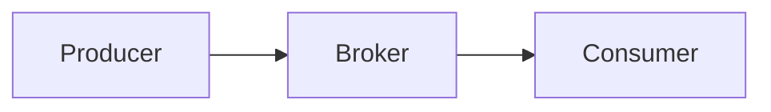
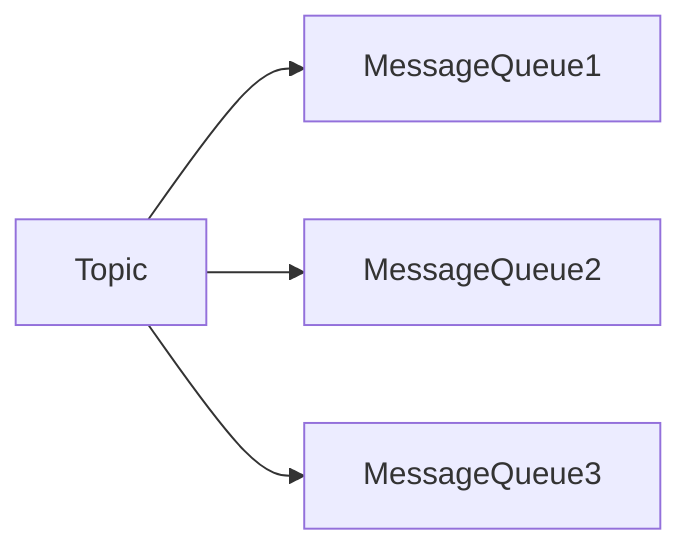
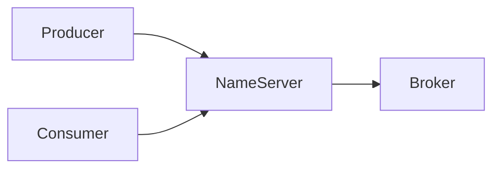

## 介绍

RocketMQ 是一款分布式消息中间件，广泛应用于大规模分布式系统中。它提供了高吞吐量、低延迟的消息传递能力，并支持事务消息、顺序消息等功能。为了更好地理解 RocketMQ 的工作原理，我们需要先了解一些核心概念和术语。

本文将逐一解释 RocketMQ 中的关键名词，并通过实际案例帮助你更好地理解这些概念。

---

## 核心概念

### 1. Producer（生产者）

**Producer** 是消息的发送者，负责将消息发送到 RocketMQ 的 Broker。Producer 可以是任何应用程序或服务，只要它能够与 RocketMQ 的 Broker 进行通信。

```java
// 示例：创建一个简单的 Producer
DefaultMQProducer producer = new DefaultMQProducer("ProducerGroupName");
producer.start();
Message msg = new Message("TopicTest", "TagA", "Hello RocketMQ".getBytes());
SendResult sendResult = producer.send(msg);
producer.shutdown();
```

:::tip
Producer 可以发送同步消息、异步消息和单向消息。同步消息会等待 Broker 的响应，异步消息则通过回调函数处理响应，而单向消息则不关心响应。
:::

---

### 2. Consumer（消费者）

**Consumer** 是消息的接收者，负责从 Broker 订阅并消费消息。Consumer 可以是任何应用程序或服务，只要它能够与 RocketMQ 的 Broker 进行通信。

```java
// 示例：创建一个简单的 Consumer
DefaultMQPushConsumer consumer = new DefaultMQPushConsumer("ConsumerGroupName");
consumer.subscribe("TopicTest", "*");
consumer.registerMessageListener((MessageListenerConcurrently) (msgs, context) -> {
    System.out.printf("%s Receive New Messages: %s %n", Thread.currentThread().getName(), msgs);
    return ConsumeConcurrentlyStatus.CONSUME_SUCCESS;
});
consumer.start();
```

:::note
Consumer 有两种模式：Push 模式和 Pull 模式。Push 模式下，Broker 会主动将消息推送给 Consumer；Pull 模式下，Consumer 需要主动从 Broker 拉取消息。
:::

---

### 3. Broker（代理）

**Broker** 是 RocketMQ 的核心组件，负责存储和转发消息。Broker 接收来自 Producer 的消息，并将其存储在磁盘上，同时将消息推送给订阅了相关 Topic 的 Consumer。



:::caution
Broker 是 RocketMQ 的存储和转发中心，因此它的性能和稳定性对整个系统的可靠性至关重要。
:::

---

### 4. Topic（主题）

**Topic** 是消息的逻辑分类，Producer 将消息发送到特定的 Topic，Consumer 则订阅感兴趣的 Topic 来接收消息。Topic 是 RocketMQ 中消息分类的基本单位。

```java
// 示例：Producer 发送消息到 Topic
Message msg = new Message("TopicTest", "TagA", "Hello RocketMQ".getBytes());
SendResult sendResult = producer.send(msg);
```

:::tip
一个 Topic 可以被多个 Consumer Group 订阅，从而实现消息的广播或负载均衡。
:::

---

### 5. Message Queue（消息队列）

**Message Queue** 是 Topic 的分区，每个 Topic 可以被分成多个 Message Queue。Message Queue 是 RocketMQ 实现消息顺序性和负载均衡的基础。



:::note
每个 Message Queue 只能被一个 Consumer 消费，但一个 Consumer 可以消费多个 Message Queue。
:::

---

### 6. Tag（标签）

**Tag** 是消息的二级分类，用于进一步细化 Topic 中的消息。Producer 可以为消息设置 Tag，Consumer 则可以订阅特定的 Tag 来过滤消息。

```java
// 示例：Producer 发送带有 Tag 的消息
Message msg = new Message("TopicTest", "TagA", "Hello RocketMQ".getBytes());
SendResult sendResult = producer.send(msg);
```

:::tip
使用 Tag 可以有效地减少 Consumer 处理不相关消息的开销。
:::

---

### 7. Consumer Group（消费者组）

**Consumer Group** 是一组具有相同消费逻辑的 Consumer。RocketMQ 通过 Consumer Group 来实现消息的负载均衡和广播。

```java
// 示例：创建一个 Consumer Group
DefaultMQPushConsumer consumer = new DefaultMQPushConsumer("ConsumerGroupName");
```

:::caution
同一个 Consumer Group 中的 Consumer 会共享 Topic 的 Message Queue，从而实现负载均衡。
:::

---

### 8. NameServer（名称服务器）

**NameServer** 是 RocketMQ 的轻量级服务发现组件，负责管理 Broker 的路由信息。Producer 和 Consumer 通过 NameServer 来获取 Broker 的地址信息。



:::note
NameServer 是无状态的，因此可以轻松地进行横向扩展。
:::

---

## 实际案例

假设我们有一个电商系统，需要处理订单的创建和支付。我们可以使用 RocketMQ 来实现订单消息的异步处理。

1. **Producer**：订单服务在创建订单时，将订单消息发送到 `OrderTopic`。
2. **Consumer**：支付服务订阅 `OrderTopic`，并处理订单支付逻辑。

```java
// 订单服务发送订单消息
Message msg = new Message("OrderTopic", "CreateOrder", orderInfo.getBytes());
SendResult sendResult = producer.send(msg);

// 支付服务消费订单消息
consumer.subscribe("OrderTopic", "CreateOrder");
consumer.registerMessageListener((MessageListenerConcurrently) (msgs, context) -> {
    // 处理支付逻辑
    return ConsumeConcurrentlyStatus.CONSUME_SUCCESS;
});
```

---

## 总结

通过本文，我们详细介绍了 RocketMQ 中的核心概念和术语，包括 Producer、Consumer、Broker、Topic、Message Queue、Tag、Consumer Group 和 NameServer。这些概念是理解 RocketMQ 工作原理的基础。

在实际应用中，RocketMQ 可以帮助我们实现高可靠、高性能的消息传递，适用于各种分布式场景。

---

## 附加资源

- [RocketMQ 官方文档](https://rocketmq.apache.org/docs/)
- [RocketMQ GitHub 仓库](https://github.com/apache/rocketmq)

## 练习

1. 尝试创建一个简单的 Producer 和 Consumer，发送和接收消息。
2. 修改 Consumer 的 Tag 过滤条件，观察消息的过滤效果。
3. 研究 RocketMQ 的事务消息机制，并尝试实现一个事务消息的示例。