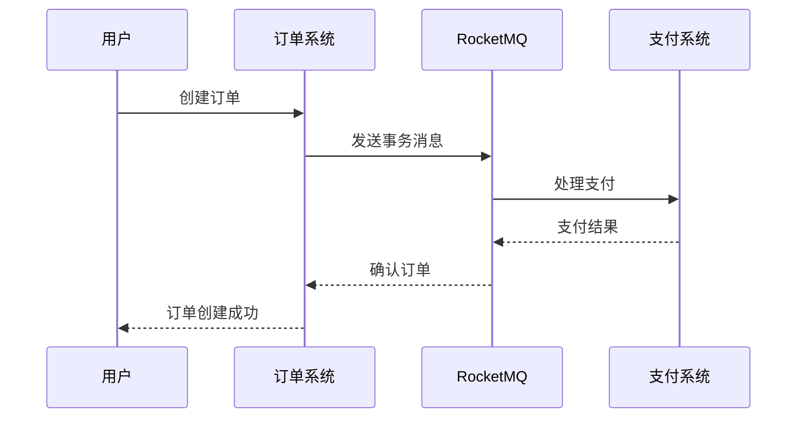

## 介绍

RocketMQ 是一款分布式消息中间件，广泛应用于大规模分布式系统中。随着版本的迭代，RocketMQ 不断引入新特性，优化性能，并增强其功能。本文将带你了解 RocketMQ 的主要版本特性，帮助你更好地理解其演进过程和应用场景。

## RocketMQ 版本演进

RocketMQ 的版本演进可以分为几个重要阶段，每个阶段都引入了关键特性。以下是 RocketMQ 主要版本的特性概述：

### 1. RocketMQ 3.x 版本

RocketMQ 3.x 是 RocketMQ 的早期版本，主要特点是：

- **消息存储**：基于文件系统的消息存储，支持高吞吐量的消息写入和读取。
- **消息过滤**：支持基于 Tag 的消息过滤，允许消费者只订阅感兴趣的消息。
- **事务消息**：支持分布式事务消息，确保消息的最终一致性。

:::note
RocketMQ 3.x 版本虽然功能较为基础，但已经能够满足大部分分布式系统的需求。
:::

### 2. RocketMQ 4.x 版本

RocketMQ 4.x 是 RocketMQ 的重大升级版本，引入了许多新特性：

- **消息轨迹**：支持消息的发送、存储和消费的完整轨迹追踪，方便问题排查。
- **消息延迟**：支持消息的延迟投递，允许消息在指定时间后投递给消费者。
- **消息重试**：支持消息的自动重试机制，确保消息的可靠投递。

```java
// 示例：发送延迟消息
DefaultMQProducer producer = new DefaultMQProducer("example_group");
producer.start();
Message msg = new Message("TopicTest", "TagA", "Hello RocketMQ".getBytes());
msg.setDelayTimeLevel(3); // 设置延迟级别
SendResult sendResult = producer.send(msg);
producer.shutdown();
```

:::tip
RocketMQ 4.x 版本的消息延迟功能非常适合定时任务和延时通知场景。
:::

### 3. RocketMQ 5.x 版本

RocketMQ 5.x 是 RocketMQ 的最新版本，进一步增强了其功能和性能：

- **多语言支持**：支持 Java、C++、Python 等多种编程语言的客户端。
- **消息压缩**：支持消息的压缩传输，减少网络带宽的消耗。
- **消息批量处理**：支持批量发送和消费消息，提高消息处理的效率。

```python
# 示例：使用 Python 客户端发送消息
from rocketmq.client import Producer, Message

producer = Producer('example_group')
producer.start()
msg = Message('TopicTest')
msg.set_body('Hello RocketMQ'.encode('utf-8'))
producer.send_sync(msg)
producer.shutdown()
```

:::caution
在使用多语言客户端时，务必确保客户端版本与 RocketMQ 服务端版本兼容。
:::

## 实际案例

### 案例 1：电商订单系统

在电商订单系统中，RocketMQ 可以用于处理订单的创建、支付和发货等流程。通过使用 RocketMQ 的事务消息，可以确保订单的创建和支付操作的原子性，避免数据不一致的问题。



### 案例 2：日志收集系统

在日志收集系统中，RocketMQ 可以用于收集和传输日志数据。通过使用 RocketMQ 的消息压缩功能，可以减少日志数据的传输带宽，提高系统的整体性能。

```java
// 示例：发送压缩消息
DefaultMQProducer producer = new DefaultMQProducer("log_group");
producer.start();
Message msg = new Message("LogTopic", "TagA", compress(logData)); // compress 为压缩函数
SendResult sendResult = producer.send(msg);
producer.shutdown();
```

## 总结

RocketMQ 的版本演进反映了其在性能和功能上的不断优化。从 3.x 的基础功能到 5.x 的多语言支持和消息压缩，RocketMQ 已经成为一款功能强大、性能优异的分布式消息中间件。通过本文的学习，你应该对 RocketMQ 的主要版本特性有了初步的了解。

## 附加资源

- [RocketMQ 官方文档](https://rocketmq.apache.org/docs/)
- [RocketMQ GitHub 仓库](https://github.com/apache/rocketmq)
- [RocketMQ 实战教程](https://rocketmq.apache.org/docs/quick-start/)

## 练习

1. 尝试使用 RocketMQ 的 Java 客户端发送一条延迟消息，并观察消息的投递时间。
2. 使用 RocketMQ 的 Python 客户端实现一个简单的消息生产者，并发送一条消息到指定的 Topic。
3. 阅读 RocketMQ 的官方文档，了解其事务消息的实现原理，并尝试在项目中应用。

:::warning
在练习过程中，务必注意 RocketMQ 的版本兼容性，避免因版本不一致导致的问题。
:::