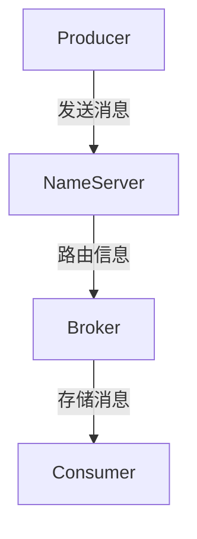

# RocketMQ 架构概览

RocketMQ 是一款高性能、高吞吐量的分布式消息中间件，广泛应用于大规模分布式系统中。它由阿里巴巴开源，旨在解决大规模分布式系统中的消息通信问题。本文将带你了解 RocketMQ 的核心架构，帮助你快速掌握其基本概念和工作原理。

## 什么是RocketMQ？

RocketMQ 是一个分布式消息中间件，主要用于异步通信、应用解耦、流量削峰等场景。它支持高吞吐量、低延迟的消息传递，并且具备高可用性和可扩展性。RocketMQ 的核心设计目标是确保消息的可靠传递，同时提供高性能的消息处理能力。

## RocketMQ 的核心组件

RocketMQ 的架构主要由以下几个核心组件组成：

1. **NameServer**：NameServer 是 RocketMQ 的轻量级服务发现组件，负责管理 Broker 的元数据信息。它不存储消息数据，仅提供 Broker 的路由信息。
2. **Broker**：Broker 是 RocketMQ 的核心组件，负责消息的存储和转发。每个 Broker 可以管理多个 Topic，并且支持主从复制以实现高可用性。
3. **Producer**：Producer 是消息的生产者，负责将消息发送到 Broker。
4. **Consumer**：Consumer 是消息的消费者，负责从 Broker 订阅并消费消息。

:::note
NameServer 是 RocketMQ 的轻量级服务发现组件，它不存储消息数据，仅提供 Broker 的路由信息。
:::

## RocketMQ 的工作原理

RocketMQ 的工作流程可以分为以下几个步骤：

1. **启动 NameServer**：NameServer 启动后，Broker 会向其注册自己的元数据信息。
2. **Producer 发送消息**：Producer 通过 NameServer 获取 Broker 的路由信息，然后将消息发送到指定的 Broker。
3. **Broker 存储消息**：Broker 接收到消息后，将其存储在本地磁盘中，并根据 Topic 和 Queue 进行分区存储。
4. **Consumer 消费消息**：Consumer 通过 NameServer 获取 Broker 的路由信息，然后从 Broker 订阅并消费消息。



:::tip
RocketMQ 的消息存储采用顺序写磁盘的方式，这种方式可以极大地提高消息的写入性能。
:::

## 实际应用场景

RocketMQ 在实际应用中有多种使用场景，以下是几个典型的例子：

1. **异步通信**：在分布式系统中，不同服务之间可以通过 RocketMQ 进行异步通信，从而降低系统耦合度。
2. **流量削峰**：在高并发场景下，RocketMQ 可以作为缓冲层，将突发的流量平滑处理，避免系统过载。
3. **日志收集**：RocketMQ 可以用于收集和传输日志数据，便于后续的分析和处理。

### 代码示例

以下是一个简单的 RocketMQ Producer 和 Consumer 的代码示例：

```java
// Producer 示例
public class ProducerExample {
    public static void main(String[] args) throws Exception {
        DefaultMQProducer producer = new DefaultMQProducer("ProducerGroup");
        producer.setNamesrvAddr("localhost:9876");
        producer.start();

        Message msg = new Message("TopicTest", "TagA", "Hello RocketMQ".getBytes());
        SendResult sendResult = producer.send(msg);
        System.out.println("消息发送成功: " + sendResult);

        producer.shutdown();
    }
}

// Consumer 示例
public class ConsumerExample {
    public static void main(String[] args) throws Exception {
        DefaultMQPushConsumer consumer = new DefaultMQPushConsumer("ConsumerGroup");
        consumer.setNamesrvAddr("localhost:9876");
        consumer.subscribe("TopicTest", "*");

        consumer.registerMessageListener((MessageListenerConcurrently) (msgs, context) -> {
            for (MessageExt msg : msgs) {
                System.out.println("收到消息: " + new String(msg.getBody()));
            }
            return ConsumeConcurrentlyStatus.CONSUME_SUCCESS;
        });

        consumer.start();
        System.out.println("Consumer 启动成功");
    }
}
```

:::caution
在实际生产环境中，Producer 和 Consumer 的配置需要根据具体需求进行调整，例如设置合适的线程数、消息重试策略等。
:::

## 总结

RocketMQ 是一款功能强大的分布式消息中间件，其核心架构包括 NameServer、Broker、Producer 和 Consumer。通过本文的介绍，你应该对 RocketMQ 的基本架构和工作原理有了初步的了解。在实际应用中，RocketMQ 可以用于异步通信、流量削峰、日志收集等多种场景。

## 附加资源

- [RocketMQ 官方文档](https://rocketmq.apache.org/docs/)
- [RocketMQ GitHub 仓库](https://github.com/apache/rocketmq)
- [RocketMQ 实战教程](https://www.rocketmq.io/)

## 练习

1. 尝试在本机部署一个 RocketMQ 集群，并运行上述代码示例。
2. 修改 Producer 和 Consumer 的代码，尝试发送和接收不同类型的消息（例如 JSON 格式的消息）。
3. 研究 RocketMQ 的消息存储机制，了解其如何保证消息的可靠性和高性能。

通过以上练习，你将更深入地理解 RocketMQ 的工作原理和应用场景。