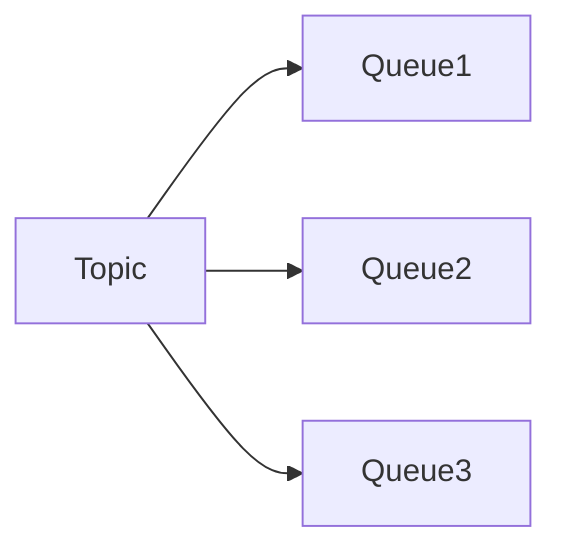

# RocketMQ 核心概念

RocketMQ 是一款分布式消息中间件，广泛应用于大规模分布式系统中。它提供了高吞吐量、低延迟、高可靠性的消息传递服务。为了更好地理解 RocketMQ 的工作原理，我们需要先掌握其核心概念。

## 1. 消息（Message）

消息是 RocketMQ 中最基本的数据单元。每条消息都包含以下内容：

- **Topic**：消息的主题，用于分类消息。
- **Tags**：消息的标签，用于进一步细分消息。
- **Keys**：消息的唯一标识符，通常用于消息的查询和去重。
- **Body**：消息的实际内容，通常是二进制数据。

```java
Message msg = new Message("TopicTest", "TagA", "Key123", "Hello RocketMQ".getBytes());
```

## 2. 主题（Topic）

主题是消息的逻辑分类，生产者将消息发送到特定的主题，消费者从主题中订阅消息。一个主题可以包含多个队列（Queue），用于实现消息的并行处理。

:::tip
主题是 RocketMQ 中消息分类的基本单位，建议根据业务需求合理设计主题。
:::

## 3. 队列（Queue）

队列是主题的物理分区，每个主题可以包含多个队列。队列的作用是实现消息的并行处理，提高系统的吞吐量。RocketMQ 中的队列是顺序存储的，确保消息的顺序性。



## 4. 生产者（Producer）

生产者是消息的发送者，负责将消息发送到指定的主题。生产者可以是应用程序、服务或系统组件。

```java
DefaultMQProducer producer = new DefaultMQProducer("ProducerGroupName");
producer.start();
producer.send(msg);
producer.shutdown();
```

## 5. 消费者（Consumer）

消费者是消息的接收者，负责从指定的主题中订阅并消费消息。消费者可以是应用程序、服务或系统组件。

```java
DefaultMQPushConsumer consumer = new DefaultMQPushConsumer("ConsumerGroupName");
consumer.subscribe("TopicTest", "*");
consumer.registerMessageListener((MessageListenerConcurrently) (msgs, context) -> {
    for (MessageExt msg : msgs) {
        System.out.println(new String(msg.getBody()));
    }
    return ConsumeConcurrentlyStatus.CONSUME_SUCCESS;
});
consumer.start();
```

## 6. 消息队列（Message Queue）

消息队列是 RocketMQ 中消息存储和传输的基本单位。每个队列都是顺序存储的，确保消息的顺序性。队列的数量决定了消息的并行处理能力。

:::caution
队列的数量不宜过多或过少，过多会增加系统的复杂性，过少会影响系统的吞吐量。
:::

## 7. 消费者组（Consumer Group）

消费者组是一组消费者的集合，它们共同消费同一个主题的消息。RocketMQ 支持集群消费和广播消费两种模式：

- **集群消费**：同一个消费者组中的消费者共同消费消息，每条消息只会被一个消费者消费。
- **广播消费**：同一个消费者组中的每个消费者都会消费所有的消息。

```java
DefaultMQPushConsumer consumer = new DefaultMQPushConsumer("ConsumerGroupName");
consumer.setMessageModel(MessageModel.CLUSTERING); // 集群消费模式
```

## 8. 实际案例

假设我们有一个电商系统，需要处理订单创建、支付、发货等业务。我们可以为每个业务创建一个主题，例如 `OrderTopic`、`PaymentTopic`、`ShippingTopic`。生产者将订单消息发送到 `OrderTopic`，消费者从 `OrderTopic` 中订阅消息并处理订单。

```java
// 生产者发送订单消息
Message orderMsg = new Message("OrderTopic", "CreateOrder", "Order123", "Order Details".getBytes());
producer.send(orderMsg);

// 消费者处理订单消息
consumer.subscribe("OrderTopic", "CreateOrder");
consumer.registerMessageListener((MessageListenerConcurrently) (msgs, context) -> {
    for (MessageExt msg : msgs) {
        System.out.println("Processing order: " + new String(msg.getBody()));
    }
    return ConsumeConcurrentlyStatus.CONSUME_SUCCESS;
});
```

## 9. 总结

RocketMQ 的核心概念包括消息、主题、队列、生产者、消费者、消息队列和消费者组。理解这些概念是掌握 RocketMQ 的基础。通过合理设计主题和队列，可以提高系统的吞吐量和可靠性。

## 10. 附加资源

- [RocketMQ 官方文档](https://rocketmq.apache.org/docs/)
- [RocketMQ GitHub 仓库](https://github.com/apache/rocketmq)
- [RocketMQ 实战教程](https://www.rocketmq.io/)

## 11. 练习

1. 创建一个 RocketMQ 生产者，向主题 `TestTopic` 发送 10 条消息。
2. 创建一个 RocketMQ 消费者，从主题 `TestTopic` 订阅消息并打印出来。
3. 修改消费者组为广播模式，观察消息的消费行为。

通过以上练习，你将更好地理解 RocketMQ 的核心概念和工作原理。