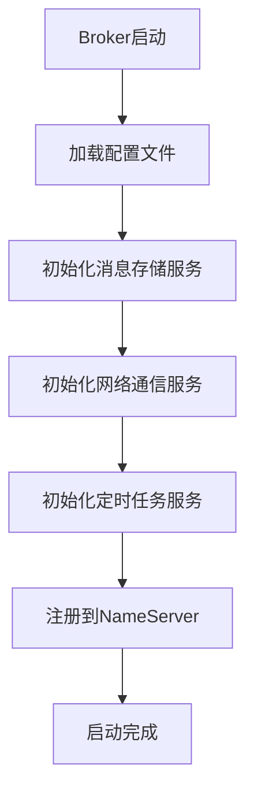
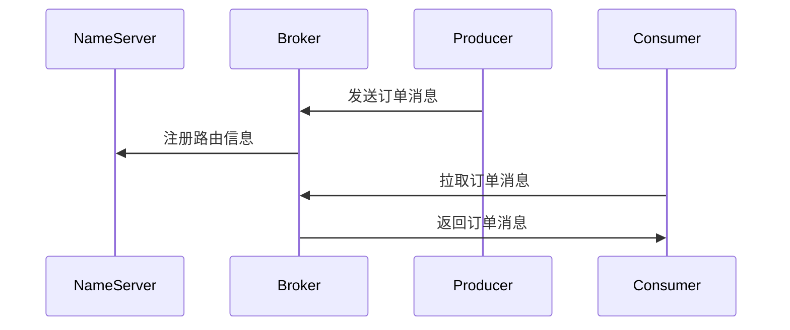

# RocketMQ 启动流程

RocketMQ 是一个分布式消息中间件，广泛应用于大规模分布式系统中。了解 RocketMQ 的启动流程是掌握其工作原理的第一步。本文将逐步讲解 RocketMQ 的启动流程，并通过实际案例帮助你更好地理解。

## 1. 什么是 RocketMQ 启动流程？

RocketMQ 的启动流程是指从启动 RocketMQ 服务到其完全运行并准备好接收和处理消息的整个过程。这个过程包括配置加载、组件初始化、网络通信建立等关键步骤。

## 2. RocketMQ 启动流程的步骤

### 2.1 配置加载

RocketMQ 启动时首先会加载配置文件。配置文件通常包括 `broker.conf` 和 `namesrv.conf`，分别用于配置 Broker 和 NameServer。

```bash
# broker.conf 示例
brokerClusterName = DefaultCluster
brokerName = broker-a
brokerId = 0
deleteWhen = 04
fileReservedTime = 48
brokerRole = ASYNC_MASTER
flushDiskType = ASYNC_FLUSH
```

:::note
配置文件中的参数可以根据实际需求进行调整，例如 `brokerRole` 可以设置为 `SYNC_MASTER` 或 `ASYNC_MASTER`。
:::

### 2.2 NameServer 启动

NameServer 是 RocketMQ 的注册中心，负责管理 Broker 的路由信息。启动 NameServer 时，它会加载配置文件并初始化相关组件。

```bash
# 启动 NameServer
nohup sh bin/mqnamesrv &
```

:::tip
NameServer 启动后，可以通过 `jps` 命令查看进程是否正常运行。
:::

### 2.3 Broker 启动

Broker 是 RocketMQ 的消息存储和转发中心。启动 Broker 时，它会连接到 NameServer 并注册自己的路由信息。

```bash
# 启动 Broker
nohup sh bin/mqbroker -n localhost:9876 &
```

:::caution
Broker 启动时需要指定 NameServer 的地址，否则无法正常注册。
:::

### 2.4 组件初始化

在 Broker 启动过程中，会初始化多个核心组件，包括：

- **消息存储服务**：负责消息的存储和检索。
- **网络通信服务**：负责与 Producer 和 Consumer 的通信。
- **定时任务服务**：负责处理定时任务，如消息清理。



### 2.5 网络通信建立

Broker 启动后，会与 NameServer 建立长连接，并定期发送心跳包以保持连接。同时，Broker 也会监听来自 Producer 和 Consumer 的连接请求。

```bash
# 查看 Broker 与 NameServer 的连接状态
netstat -anp | grep 9876
```

:::warning
如果 Broker 无法与 NameServer 建立连接，可能会导致消息无法正常路由。
:::

## 3. 实际案例

假设我们有一个电商系统，需要使用 RocketMQ 来处理订单消息。以下是 RocketMQ 启动流程在该场景中的应用：

1. **启动 NameServer**：首先启动 NameServer，作为消息路由的注册中心。
2. **启动 Broker**：然后启动 Broker，负责存储和转发订单消息。
3. **Producer 发送消息**：订单系统作为 Producer，将订单消息发送到 Broker。
4. **Consumer 消费消息**：库存系统作为 Consumer，从 Broker 拉取订单消息并进行处理。



## 4. 总结

RocketMQ 的启动流程包括配置加载、NameServer 启动、Broker 启动、组件初始化和网络通信建立等步骤。理解这些步骤有助于更好地掌握 RocketMQ 的工作原理，并在实际应用中灵活配置和使用。

## 5. 附加资源与练习

- **练习**：尝试在自己的环境中启动 RocketMQ，并观察启动日志。
- **资源**：阅读 RocketMQ 官方文档，了解更多高级配置和优化技巧。

:::tip
如果你在启动过程中遇到问题，可以参考 RocketMQ 的官方文档或社区论坛寻求帮助。
:::