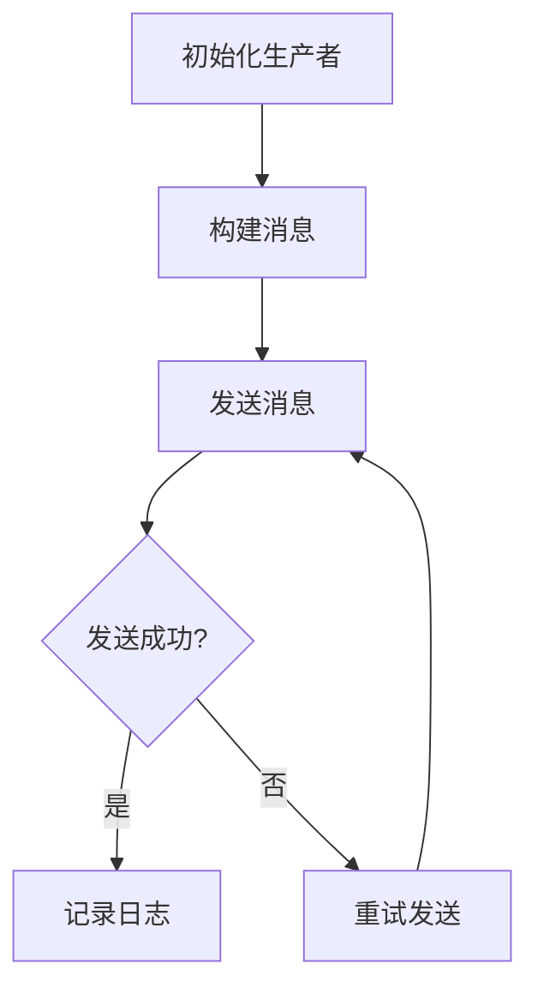

# RocketMQ 生产者概述

RocketMQ 是一个分布式消息中间件，广泛应用于大规模分布式系统中。作为 RocketMQ 的核心组件之一，**生产者（Producer）** 负责将消息发送到消息队列中。本文将详细介绍 RocketMQ 生产者的基本概念、工作原理、使用场景以及如何通过代码示例实现消息发送。

## 什么是 RocketMQ 生产者？

RocketMQ 生产者是消息的发送方，负责将业务数据封装成消息并发送到 RocketMQ 的 Broker（消息代理）中。生产者可以是任何需要发送消息的应用程序或服务。通过 RocketMQ 生产者，开发者可以实现异步通信、解耦系统、流量削峰等功能。

### 生产者的核心功能

1. **消息发送**：将消息发送到指定的 Topic（主题）。
2. **消息路由**：根据 Topic 和 Tag（标签）将消息路由到合适的队列。
3. **消息重试**：在消息发送失败时，自动重试发送。
4. **事务消息**：支持分布式事务，确保消息的最终一致性。

---

## RocketMQ 生产者工作原理

RocketMQ 生产者通过以下步骤将消息发送到 Broker：

1. **初始化生产者**：创建并配置生产者实例。
2. **构建消息**：将业务数据封装成消息对象。
3. **发送消息**：调用发送方法将消息发送到 Broker。
4. **处理发送结果**：根据发送结果决定是否重试或记录日志。



---

## 代码示例：发送消息

以下是一个简单的 Java 示例，展示如何使用 RocketMQ 生产者发送消息。

```java
import org.apache.rocketmq.client.producer.DefaultMQProducer;
import org.apache.rocketmq.client.producer.SendResult;
import org.apache.rocketmq.common.message.Message;

public class RocketMQProducerExample {
    public static void main(String[] args) throws Exception {
        // 1. 初始化生产者
        DefaultMQProducer producer = new DefaultMQProducer("ProducerGroupName");
        producer.setNamesrvAddr("localhost:9876"); // 设置 NameServer 地址
        producer.start();

        // 2. 构建消息
        Message message = new Message("TestTopic", "TagA", "Hello RocketMQ".getBytes());

        // 3. 发送消息
        SendResult sendResult = producer.send(message);

        // 4. 处理发送结果
        System.out.println("消息发送结果: " + sendResult);

        // 关闭生产者
        producer.shutdown();
    }
}
```

### 代码说明

1. **初始化生产者**：通过 `DefaultMQProducer` 创建一个生产者实例，并设置 NameServer 地址。
2. **构建消息**：使用 `Message` 类封装消息内容，指定 Topic 和 Tag。
3. **发送消息**：调用 `send` 方法发送消息，并获取发送结果。
4. **处理发送结果**：打印发送结果，确认消息是否成功发送。

---

## 实际应用场景

RocketMQ 生产者在以下场景中非常有用：

1. **异步通信**：在微服务架构中，服务之间通过消息队列进行异步通信，减少系统耦合。
2. **流量削峰**：在高并发场景下，通过消息队列缓冲请求，避免系统过载。
3. **分布式事务**：通过 RocketMQ 的事务消息机制，确保分布式系统中的数据一致性。
4. **日志收集**：将系统日志发送到消息队列，便于后续分析和处理。

:::tip
在实际生产环境中，建议对生产者进行性能优化，例如批量发送消息、设置合理的重试策略等。
:::

---

## 总结

RocketMQ 生产者是消息发送的核心组件，负责将业务数据封装成消息并发送到 Broker。通过本文的学习，您应该掌握了 RocketMQ 生产者的基本概念、工作原理以及如何使用代码实现消息发送。接下来，您可以尝试在实际项目中应用 RocketMQ 生产者，并探索更多高级功能，如事务消息、延迟消息等。

---

## 附加资源与练习

1. **官方文档**：阅读 [RocketMQ 官方文档](https://rocketmq.apache.org/docs/) 了解更多高级功能。
2. **练习**：尝试实现一个 RocketMQ 生产者，发送不同类型的消息（如延迟消息、顺序消息）。
3. **扩展阅读**：学习 RocketMQ 消费者的工作原理，实现完整的消息发送与消费流程。

:::caution
在开发过程中，请确保正确配置 NameServer 地址和生产者组名称，以避免消息发送失败。
:::