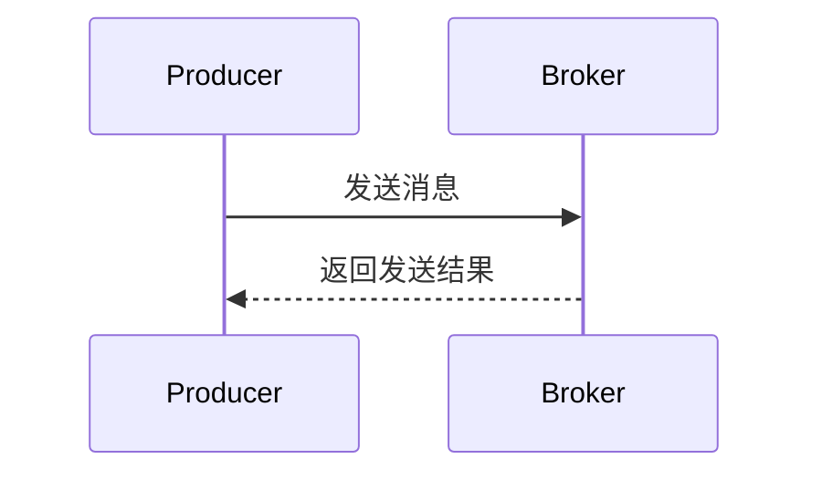

# RocketMQ 同步发送

RocketMQ 是一个分布式消息中间件，广泛应用于大规模分布式系统中。在 RocketMQ 中，消息的发送方式主要分为三种：同步发送、异步发送和单向发送。本文将重点介绍 **同步发送**，这是 RocketMQ 中最常用的消息发送方式之一。

## 什么是同步发送？

同步发送是指生产者发送消息后，会等待 Broker（消息服务器）返回发送结果，然后再继续执行后续代码。这种方式确保了消息的可靠性，因为生产者可以立即知道消息是否成功发送到 Broker。

:::note
同步发送适用于对消息可靠性要求较高的场景，例如金融交易、订单处理等。
:::

## 同步发送的工作原理

在同步发送模式下，生产者将消息发送到 Broker 后，会阻塞当前线程，直到收到 Broker 的响应。如果发送成功，生产者会继续执行后续逻辑；如果发送失败，生产者可以根据返回的错误信息进行重试或处理异常。



## 如何使用同步发送？

下面是一个使用 RocketMQ 同步发送消息的简单示例。我们将使用 Java 语言和 RocketMQ 的官方客户端库。

### 1. 引入依赖

首先，确保你的项目中已经引入了 RocketMQ 的客户端依赖。如果你使用的是 Maven，可以在 `pom.xml` 中添加以下依赖：

```xml
<dependency>
    <groupId>org.apache.rocketmq</groupId>
    <artifactId>rocketmq-client</artifactId>
    <version>4.9.4</version>
</dependency>
```

### 2. 创建生产者

接下来，我们需要创建一个生产者实例，并配置 NameServer 地址。

```java
import org.apache.rocketmq.client.producer.DefaultMQProducer;
import org.apache.rocketmq.common.message.Message;
import org.apache.rocketmq.remoting.common.RemotingHelper;

public class SyncProducer {
    public static void main(String[] args) throws Exception {
        // 实例化一个生产者，指定生产者组名称
        DefaultMQProducer producer = new DefaultMQProducer("please_rename_unique_group_name");
        // 设置 NameServer 地址
        producer.setNamesrvAddr("localhost:9876");
        // 启动生产者
        producer.start();

        for (int i = 0; i < 10; i++) {
            // 创建消息，指定 Topic、Tag 和消息体
            Message msg = new Message("TopicTest", "TagA", ("Hello RocketMQ " + i).getBytes(RemotingHelper.DEFAULT_CHARSET));
            // 发送消息并获取发送结果
            SendResult sendResult = producer.send(msg);
            System.out.printf("%s%n", sendResult);
        }

        // 关闭生产者
        producer.shutdown();
    }
}
```

### 3. 运行代码

运行上述代码后，你将看到类似以下的输出：

```
SendResult [sendStatus=SEND_OK, msgId=7F0000010A2C18B4AAC24A3E6F800000, offsetMsgId=7F00000100002A9F0000000000000000, messageQueue=MessageQueue [topic=TopicTest, brokerName=broker-a, queueId=0], queueOffset=0]
```

### 4. 代码解析

- **DefaultMQProducer**：这是 RocketMQ 的生产者类，用于发送消息。
- **setNamesrvAddr**：设置 NameServer 地址，NameServer 是 RocketMQ 的服务发现组件。
- **Message**：表示一条消息，包含 Topic、Tag 和消息体。
- **send**：同步发送消息，并返回发送结果。

:::tip
在实际生产环境中，建议将 NameServer 地址配置在配置文件中，而不是硬编码在代码中。
:::

## 实际应用场景

同步发送适用于以下场景：

1. **金融交易**：在金融交易中，每一笔交易都需要确保消息成功发送到 Broker，以便后续处理。
2. **订单处理**：在电商系统中，订单的创建、支付等操作需要保证消息的可靠性。
3. **日志记录**：在某些场景下，日志消息需要实时发送到日志系统，以便及时监控和分析。

## 总结

同步发送是 RocketMQ 中最常用的消息发送方式之一，它确保了消息的可靠性和实时性。通过本文的介绍和代码示例，你应该已经掌握了如何在 RocketMQ 中使用同步发送消息。

:::caution
同步发送会阻塞当前线程，因此在处理大量消息时，可能会影响系统的性能。如果对实时性要求不高，可以考虑使用异步发送。
:::

## 附加资源

- [RocketMQ 官方文档](https://rocketmq.apache.org/docs/)
- [RocketMQ GitHub 仓库](https://github.com/apache/rocketmq)

## 练习

1. 修改上述代码，尝试发送不同类型的消息（例如更改 Topic 或 Tag）。
2. 在同步发送的基础上，添加异常处理逻辑，处理发送失败的情况。
3. 尝试将 NameServer 地址配置在配置文件中，而不是硬编码在代码中。

通过以上练习，你将更深入地理解 RocketMQ 的同步发送机制，并能够在实际项目中灵活应用。