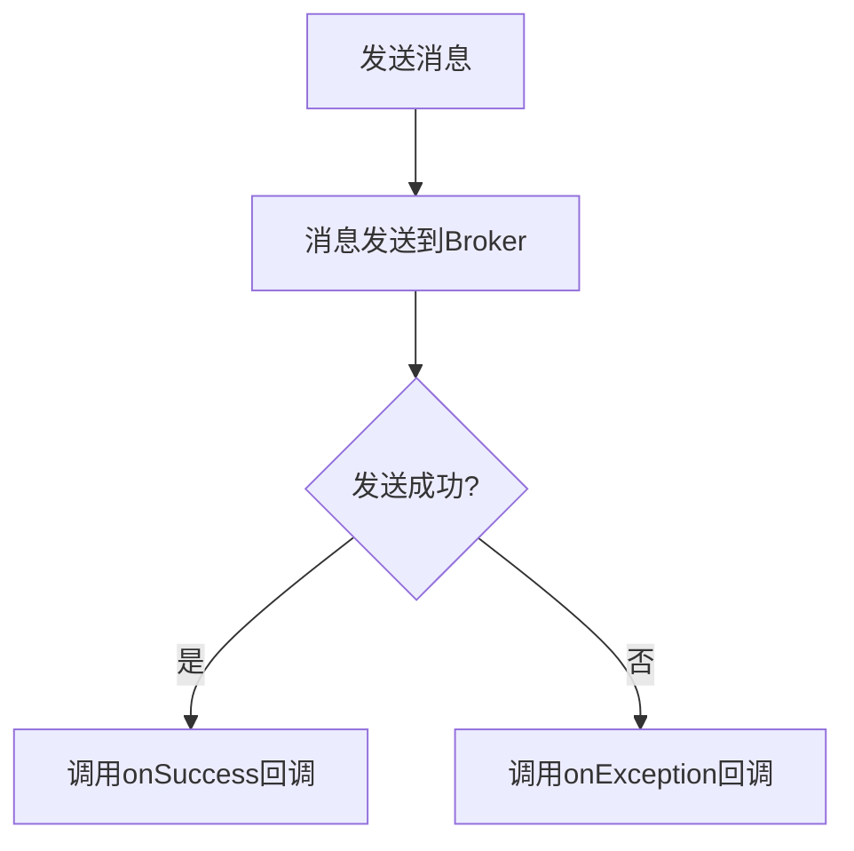

# RocketMQ 异步发送

在分布式消息系统中，消息的发送方式对系统的性能和可靠性有着重要影响。RocketMQ 提供了多种消息发送方式，其中**异步发送**是一种高效的方式，特别适用于对消息发送的实时性要求不高，但需要高吞吐量的场景。

## 什么是异步发送？

异步发送是指消息发送方在发送消息后，不会立即等待消息的发送结果，而是通过回调函数来处理发送结果。这种方式可以避免阻塞主线程，从而提高系统的并发能力和吞吐量。

与同步发送相比，异步发送的主要优势在于：
- **非阻塞**：发送消息后，程序可以继续执行其他任务，而不需要等待消息发送完成。
- **高吞吐量**：由于不需要等待发送结果，系统可以同时处理更多的消息发送请求。

## 异步发送的工作原理

在 RocketMQ 中，异步发送的核心是通过 `SendCallback` 接口来处理消息发送的结果。当消息发送成功或失败时，RocketMQ 会调用相应的回调方法来通知发送方。



## 如何使用异步发送？

下面是一个使用 RocketMQ 异步发送消息的示例代码：

```java
import org.apache.rocketmq.client.producer.DefaultMQProducer;
import org.apache.rocketmq.client.producer.SendCallback;
import org.apache.rocketmq.client.producer.SendResult;
import org.apache.rocketmq.common.message.Message;
import org.apache.rocketmq.remoting.common.RemotingHelper;

public class AsyncProducer {
    public static void main(String[] args) throws Exception {
        // 实例化一个生产者，并指定生产者组
        DefaultMQProducer producer = new DefaultMQProducer("AsyncProducerGroup");
        // 设置NameServer地址
        producer.setNamesrvAddr("localhost:9876");
        // 启动生产者
        producer.start();

        // 创建消息实例，指定Topic、Tag和消息体
        Message msg = new Message("TopicTest", "TagA", "Hello RocketMQ".getBytes(RemotingHelper.DEFAULT_CHARSET));

        // 异步发送消息，并指定回调函数
        producer.send(msg, new SendCallback() {
            @Override
            public void onSuccess(SendResult sendResult) {
                System.out.println("消息发送成功: " + sendResult);
            }

            @Override
            public void onException(Throwable e) {
                System.out.println("消息发送失败: " + e.getMessage());
            }
        });

        // 由于是异步发送，主线程可以继续执行其他任务
        System.out.println("主线程继续执行...");

        // 关闭生产者
        producer.shutdown();
    }
}
```

### 代码解释

1. **生产者初始化**：首先创建一个 `DefaultMQProducer` 实例，并设置 NameServer 地址。
2. **消息创建**：创建一个 `Message` 实例，指定消息的 Topic、Tag 和消息体。
3. **异步发送**：调用 `send` 方法发送消息，并传入一个 `SendCallback` 实例来处理发送结果。
4. **回调处理**：在 `onSuccess` 方法中处理发送成功的逻辑，在 `onException` 方法中处理发送失败的逻辑。
5. **主线程继续执行**：由于是异步发送，主线程不会阻塞，可以继续执行其他任务。

## 实际应用场景

异步发送适用于以下场景：
- **高并发系统**：在需要处理大量消息的系统中，异步发送可以显著提高系统的吞吐量。
- **非实时性要求**：如果消息的发送结果不需要立即处理，异步发送是一个很好的选择。
- **分布式任务处理**：在分布式任务处理系统中，异步发送可以避免任务处理过程中的阻塞。

:::tip
在实际应用中，建议根据业务需求选择合适的发送方式。如果对消息的可靠性要求较高，可以考虑使用同步发送或事务消息。
:::

## 总结

RocketMQ 的异步发送机制为高并发、高吞吐量的消息处理提供了强大的支持。通过异步发送，可以避免消息发送过程中的阻塞，提高系统的性能和响应速度。在实际应用中，合理使用异步发送可以显著提升系统的整体效率。

## 附加资源

- [RocketMQ 官方文档](https://rocketmq.apache.org/docs/)
- [RocketMQ GitHub 仓库](https://github.com/apache/rocketmq)

## 练习

1. 修改上述代码，尝试发送多条消息，并观察回调函数的执行顺序。
2. 在 `onException` 方法中添加重试机制，当消息发送失败时，尝试重新发送消息。
3. 结合 RocketMQ 的事务消息机制，实现一个带有事务保证的异步发送示例。
