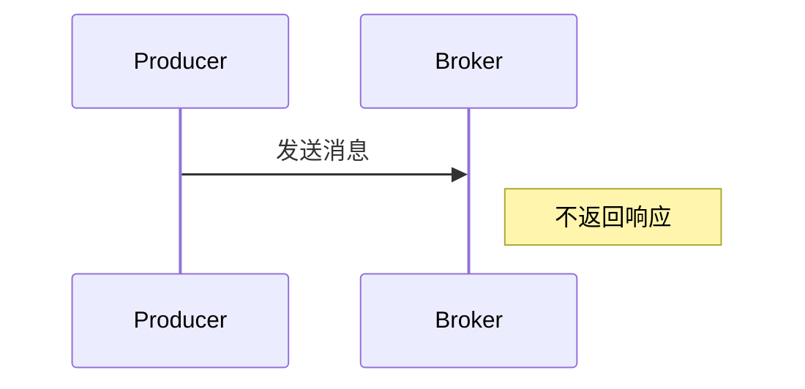

# RocketMQ 单向发送

RocketMQ 是一个分布式消息中间件，广泛应用于大规模分布式系统中。在 RocketMQ 中，消息的发送模式主要分为三种：同步发送、异步发送和单向发送。本文将重点介绍 **单向发送** 模式，帮助初学者理解其工作原理、适用场景以及如何在实际项目中使用。

## 什么是单向发送？

单向发送（One-way Send）是 RocketMQ 提供的一种消息发送模式。与同步发送和异步发送不同，单向发送不会等待消息的发送结果。生产者将消息发送到 Broker 后，不会收到任何响应，也不会关心消息是否成功到达 Broker。这种模式的特点是 **低延迟、高吞吐量**，适用于对消息可靠性要求不高的场景。

:::note
单向发送适用于那些不需要确认消息是否成功发送的场景，例如日志收集、监控数据上报等。
:::

## 单向发送的工作原理

在单向发送模式下，生产者将消息发送到 Broker 后，不会等待 Broker 的响应。这意味着生产者无法知道消息是否成功到达 Broker，也无法处理发送失败的情况。单向发送的流程如下：



从图中可以看出，生产者发送消息后，Broker 不会返回任何响应。这种模式的优势在于减少了网络通信的开销，从而提高了消息发送的效率。

## 单向发送的代码示例

下面是一个使用 RocketMQ 进行单向发送的 Java 示例代码：

```java
import org.apache.rocketmq.client.producer.DefaultMQProducer;
import org.apache.rocketmq.common.message.Message;

public class OnewayProducer {
    public static void main(String[] args) throws Exception {
        // 实例化一个生产者，指定生产者组名称
        DefaultMQProducer producer = new DefaultMQProducer("oneway_producer_group");
        // 设置NameServer地址
        producer.setNamesrvAddr("localhost:9876");
        // 启动生产者
        producer.start();

        // 创建消息实例，指定Topic、Tag和消息体
        Message msg = new Message("TopicTest", "TagA", "Hello RocketMQ Oneway".getBytes());

        // 发送单向消息
        producer.sendOneway(msg);

        System.out.println("单向消息发送成功");

        // 关闭生产者
        producer.shutdown();
    }
}
```

### 代码解析

1. **DefaultMQProducer**：这是 RocketMQ 提供的默认生产者类，用于发送消息。
2. **setNamesrvAddr**：设置 NameServer 的地址，NameServer 是 RocketMQ 的服务发现组件。
3. **sendOneway**：这是单向发送的核心方法，发送消息后不会等待响应。
4. **shutdown**：关闭生产者实例，释放资源。

:::tip
在实际项目中，单向发送通常用于那些不需要确认消息是否成功发送的场景，例如日志收集、监控数据上报等。
:::

## 单向发送的适用场景

单向发送适用于以下场景：

1. **日志收集**：在日志收集系统中，日志消息的丢失通常不会对系统产生重大影响，因此可以使用单向发送来提高日志收集的效率。
2. **监控数据上报**：监控系统通常需要上报大量的监控数据，这些数据的丢失通常不会影响系统的正常运行，因此可以使用单向发送来减少网络开销。
3. **实时性要求不高的场景**：如果业务场景对消息的实时性要求不高，且可以容忍一定的消息丢失，那么单向发送是一个不错的选择。

## 单向发送的优缺点

### 优点

1. **低延迟**：由于不需要等待 Broker 的响应，单向发送的延迟非常低。
2. **高吞吐量**：单向发送减少了网络通信的开销，因此可以支持更高的消息发送速率。

### 缺点

1. **不可靠**：单向发送无法保证消息是否成功到达 Broker，因此不适合对消息可靠性要求较高的场景。
2. **无法处理发送失败**：由于没有响应，生产者无法知道消息是否发送成功，也无法处理发送失败的情况。

## 实际案例：日志收集系统

假设我们正在开发一个日志收集系统，该系统需要将应用程序的日志消息发送到 RocketMQ 中进行集中存储和分析。由于日志消息的丢失通常不会对系统产生重大影响，因此我们可以使用单向发送来提高日志收集的效率。

```java
import org.apache.rocketmq.client.producer.DefaultMQProducer;
import org.apache.rocketmq.common.message.Message;

public class LogCollector {
    public static void main(String[] args) throws Exception {
        DefaultMQProducer producer = new DefaultMQProducer("log_producer_group");
        producer.setNamesrvAddr("localhost:9876");
        producer.start();

        // 模拟日志消息
        String logMessage = "2023-10-01 12:00:00 INFO [main] Application started successfully";
        Message msg = new Message("LogTopic", "LogTag", logMessage.getBytes());

        // 使用单向发送发送日志消息
        producer.sendOneway(msg);

        System.out.println("日志消息发送成功");

        producer.shutdown();
    }
}
```

在这个案例中，我们使用单向发送将日志消息发送到 RocketMQ 中。由于日志消息的丢失通常不会对系统产生重大影响，因此单向发送是一个合适的选择。

## 总结

单向发送是 RocketMQ 提供的一种高效的消息发送模式，适用于那些不需要确认消息是否成功发送的场景。它的优点是低延迟和高吞吐量，但缺点是消息的可靠性较低。在实际项目中，单向发送通常用于日志收集、监控数据上报等场景。

## 附加资源与练习

1. **练习**：尝试在本地搭建一个 RocketMQ 环境，并使用单向发送模式发送消息。观察消息的发送过程，并思考单向发送的优缺点。
2. **进一步学习**：了解 RocketMQ 的同步发送和异步发送模式，比较它们与单向发送的区别和适用场景。

:::caution
在实际生产环境中，使用单向发送时需要谨慎，确保业务场景能够容忍消息的丢失。
:::