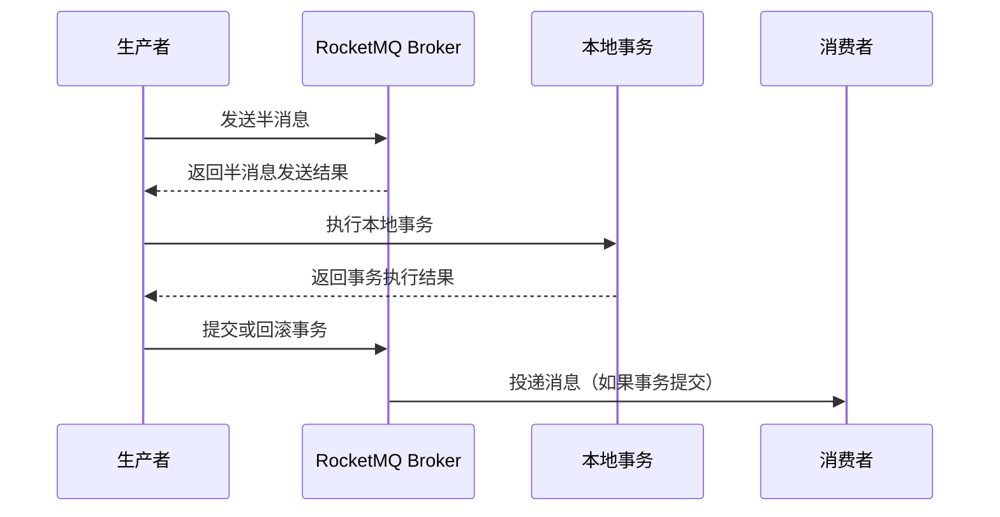

# RocketMQ 事务消息

RocketMQ事务消息是RocketMQ提供的一种消息发送机制，用于确保消息发送与本地事务的一致性。它允许开发者在发送消息的同时执行本地事务，并根据事务的执行结果来决定消息是否最终投递给消费者。这种机制在分布式系统中尤为重要，因为它能够有效避免因网络抖动或系统故障导致的数据不一致问题。

## 什么是事务消息？

事务消息的核心思想是“半消息”（Half Message）。半消息是指消息已经发送到RocketMQ Broker，但暂时不会投递给消费者。只有当本地事务执行成功并提交后，消息才会被标记为可投递状态。如果本地事务执行失败，消息将被丢弃或进入死信队列。

### 事务消息的工作流程



1. **发送半消息**：生产者发送一条半消息到RocketMQ Broker，此时消息对消费者不可见。
2. **执行本地事务**：生产者在本地执行事务操作，例如更新数据库。
3. **提交或回滚事务**：根据本地事务的执行结果，生产者向Broker发送提交或回滚请求。
4. **消息投递**：如果事务提交，消息将被标记为可投递状态，消费者可以消费该消息；如果事务回滚，消息将被丢弃或进入死信队列。

## 代码示例

以下是一个简单的RocketMQ事务消息发送的代码示例：

```java
import org.apache.rocketmq.client.producer.LocalTransactionState;
import org.apache.rocketmq.client.producer.TransactionListener;
import org.apache.rocketmq.client.producer.TransactionMQProducer;
import org.apache.rocketmq.common.message.Message;
import org.apache.rocketmq.common.message.MessageExt;

public class TransactionProducer {
    public static void main(String[] args) throws Exception {
        // 创建事务消息生产者
        TransactionMQProducer producer = new TransactionMQProducer("transaction_producer_group");
        producer.setNamesrvAddr("localhost:9876");

        // 设置事务监听器
        producer.setTransactionListener(new TransactionListener() {
            @Override
            public LocalTransactionState executeLocalTransaction(Message msg, Object arg) {
                // 执行本地事务
                try {
                    // 模拟本地事务操作
                    System.out.println("Executing local transaction...");
                    // 假设事务执行成功
                    return LocalTransactionState.COMMIT_MESSAGE;
                } catch (Exception e) {
                    // 事务执行失败
                    return LocalTransactionState.ROLLBACK_MESSAGE;
                }
            }

            @Override
            public LocalTransactionState checkLocalTransaction(MessageExt msg) {
                // 检查本地事务状态
                return LocalTransactionState.COMMIT_MESSAGE;
            }
        });

        // 启动生产者
        producer.start();

        // 创建消息
        Message msg = new Message("transaction_topic", "transaction_tag", "Hello RocketMQ Transaction".getBytes());

        // 发送事务消息
        producer.sendMessageInTransaction(msg, null);

        // 关闭生产者
        producer.shutdown();
    }
}
```

### 代码解释

1. **TransactionMQProducer**：用于发送事务消息的生产者。
2. **TransactionListener**：事务监听器，用于执行本地事务和检查事务状态。
3. **executeLocalTransaction**：执行本地事务的方法，返回事务执行结果（提交或回滚）。
4. **checkLocalTransaction**：检查本地事务状态的方法，通常在Broker未收到事务提交或回滚请求时调用。

## 实际应用场景

### 电商订单系统

在电商系统中，用户下单后需要同时完成订单创建和库存扣减两个操作。这两个操作通常分布在不同的服务中，使用事务消息可以确保订单创建和库存扣减的一致性。

1. **发送半消息**：订单服务发送一条半消息到RocketMQ Broker，表示订单创建成功。
2. **执行本地事务**：库存服务执行库存扣减操作。
3. **提交或回滚事务**：如果库存扣减成功，提交事务，订单消息将被投递给消费者；如果库存扣减失败，回滚事务，订单消息将被丢弃。

### 金融转账系统

在金融系统中，转账操作需要确保资金从转出账户扣除并成功转入目标账户。使用事务消息可以确保转账操作的原子性。

1. **发送半消息**：转账服务发送一条半消息到RocketMQ Broker，表示转账请求已发出。
2. **执行本地事务**：执行资金扣除和转入操作。
3. **提交或回滚事务**：如果转账成功，提交事务，转账消息将被投递给消费者；如果转账失败，回滚事务，转账消息将被丢弃。

## 总结

RocketMQ事务消息是一种强大的机制，能够确保消息发送与本地事务的一致性。通过半消息和事务监听器的配合，开发者可以轻松实现分布式事务的可靠处理。在实际应用中，事务消息广泛应用于电商、金融等需要强一致性的场景。

:::tip
**提示**：在使用RocketMQ事务消息时，务必确保本地事务的幂等性，以避免因网络抖动或系统故障导致的重复提交问题。
:::

## 附加资源

- [RocketMQ官方文档](https://rocketmq.apache.org/docs/)
- [RocketMQ事务消息源码解析](https://github.com/apache/rocketmq)

## 练习

1. 尝试在本地环境中搭建RocketMQ，并运行上述代码示例。
2. 修改代码，模拟本地事务失败的情况，观察消息的处理结果。
3. 设计一个实际应用场景，使用RocketMQ事务消息解决分布式事务问题。

通过以上内容，你应该已经掌握了RocketMQ事务消息的基本概念和使用方法。继续深入学习RocketMQ的其他特性，将有助于你在分布式系统中构建更加可靠的应用。