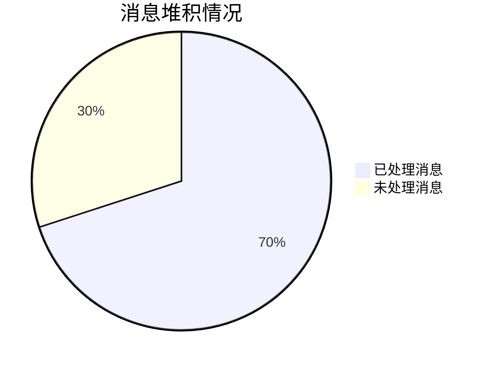
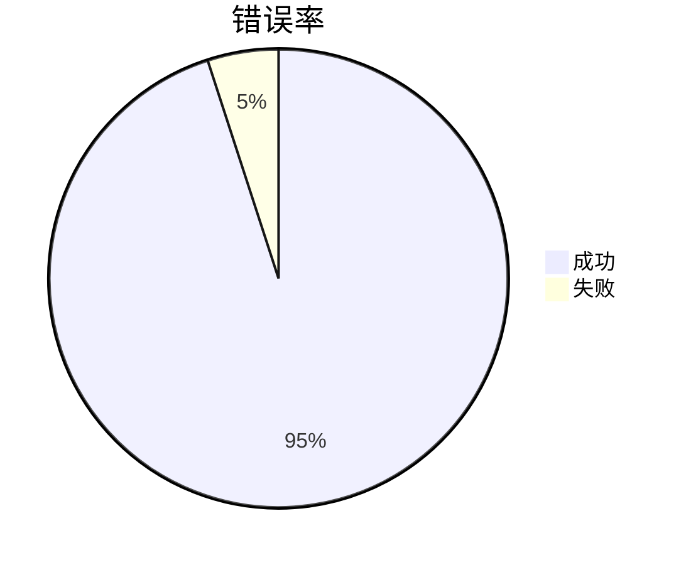

# RocketMQ 监控指标

RocketMQ 是一个分布式消息中间件，广泛应用于大规模分布式系统中。为了确保其高效运行，监控 RocketMQ 的关键指标至关重要。本文将详细介绍 RocketMQ 的监控指标，帮助你理解如何通过这些指标来监控和优化 RocketMQ 的性能。

## 1. 什么是 RocketMQ 监控指标？

RocketMQ 监控指标是指用于衡量 RocketMQ 集群健康状况和性能的一系列数据点。这些指标可以帮助你了解系统的运行状态，及时发现潜在问题，并进行优化。

## 2. 关键监控指标

### 2.1 消息堆积（Message Backlog）

消息堆积是指消费者未能及时处理的消息数量。过多的消息堆积可能导致系统延迟增加，甚至引发消息丢失。



:::note
**注意**：消息堆积过多时，可能需要增加消费者数量或优化消费者处理逻辑。
:::

### 2.2 消息吞吐量（Message Throughput）

消息吞吐量是指单位时间内处理的消息数量。高吞吐量通常意味着系统处理能力强，但也可能带来更高的资源消耗。

```mermaid
bar
    title 消息吞吐量（条/秒）
    "生产者" : 500
    "消费者" : 450
```

:::tip
**提示**：监控消息吞吐量可以帮助你评估系统的处理能力，并根据需要进行扩展。
:::

### 2.3 延迟时间（Latency）

延迟时间是指消息从生产者发送到消费者接收所花费的时间。低延迟是高性能系统的关键指标之一。

```mermaid
line
    title 延迟时间（毫秒）
    "平均延迟" : 50
    "最大延迟" : 200
```

:::caution
**警告**：高延迟可能表明系统存在瓶颈，需要进一步排查和优化。
:::

### 2.4 错误率（Error Rate）

错误率是指消息处理过程中发生错误的比率。高错误率可能表明系统存在严重问题，需要立即处理。



:::warning
**警告**：错误率过高时，应立即检查系统日志，找出问题根源。
:::

## 3. 实际案例

### 3.1 案例：消息堆积问题

某电商平台在促销活动期间，发现消息堆积量急剧增加，导致订单处理延迟。通过监控消息堆积指标，团队迅速增加了消费者数量，并优化了消费者处理逻辑，最终解决了问题。

### 3.2 案例：高延迟问题

某金融系统在交易高峰期，发现消息延迟时间显著增加。通过监控延迟时间指标，团队发现网络带宽不足是主要原因，随后进行了网络扩容，显著降低了延迟。

## 4. 总结

RocketMQ 监控指标是确保系统高效运行的关键。通过监控消息堆积、消息吞吐量、延迟时间和错误率等指标，你可以及时发现并解决潜在问题，优化系统性能。

## 5. 附加资源与练习

- **资源**：
  - [RocketMQ 官方文档](https://rocketmq.apache.org/docs/)
  - [RocketMQ 监控工具推荐](https://github.com/apache/rocketmq-exporter)

- **练习**：
  - 在你的 RocketMQ 集群中，设置监控指标并观察其变化。
  - 尝试通过增加消费者数量来减少消息堆积，并观察系统性能的变化。

通过本文的学习，你应该已经掌握了 RocketMQ 监控指标的基本概念和应用方法。继续实践和探索，你将能够更好地管理和优化你的 RocketMQ 系统。