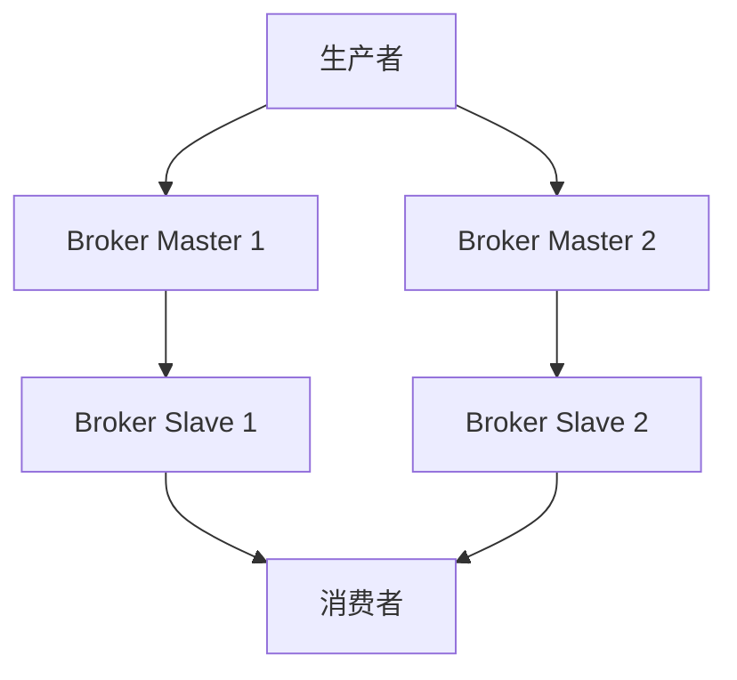

# RocketMQ 常见问题

RocketMQ 是一款高性能、高吞吐量的分布式消息中间件，广泛应用于大规模分布式系统中。然而，在实际使用过程中，开发者可能会遇到一些常见问题。本文将逐一介绍这些问题，并提供相应的解决方案。

## 1. 消息堆积

### 问题描述
消息堆积是指消费者处理消息的速度跟不上生产者发送消息的速度，导致消息在队列中积压。这种情况可能会导致系统延迟增加，甚至影响系统的稳定性。

### 解决方案
- **增加消费者数量**：通过增加消费者实例来提升消息处理能力。
- **优化消费者逻辑**：检查消费者的处理逻辑，确保其高效运行。
- **调整消费线程数**：增加消费者的线程数，以提升并发处理能力。

```java
// 示例：增加消费者线程数
DefaultMQPushConsumer consumer = new DefaultMQPushConsumer("consumer_group");
consumer.setConsumeThreadMin(20);
consumer.setConsumeThreadMax(50);
```

## 2. 消息丢失

### 问题描述
消息丢失是指在消息传递过程中，由于某些原因导致消息未能被消费者成功接收和处理。

### 解决方案
- **开启消息持久化**：确保消息在发送和存储过程中被持久化。
- **使用事务消息**：对于关键业务消息，使用RocketMQ的事务消息机制来保证消息的可靠传递。
- **监控和告警**：设置监控和告警机制，及时发现和处理消息丢失问题。

```java
// 示例：发送事务消息
TransactionMQProducer producer = new TransactionMQProducer("producer_group");
producer.setNamesrvAddr("localhost:9876");
producer.start();

Message msg = new Message("TopicTest", "TagA", "KEY", "Hello RocketMQ".getBytes());
SendResult sendResult = producer.sendMessageInTransaction(msg, null);
```

## 3. 消费延迟

### 问题描述
消费延迟是指消息从生产到被消费者处理的时间过长，影响系统的实时性。

### 解决方案
- **优化网络配置**：确保生产者和消费者之间的网络延迟最小。
- **调整消费策略**：使用批量消费或并行消费来提升消费速度。
- **监控消费进度**：通过监控消费进度，及时发现和处理延迟问题。

```java
// 示例：批量消费
consumer.setConsumeMessageBatchMaxSize(32);
```

## 4. 重复消费

### 问题描述
重复消费是指同一条消息被消费者多次处理，可能导致业务逻辑错误。

### 解决方案
- **幂等性设计**：确保消费者的处理逻辑是幂等的，即使消息被多次消费也不会影响业务结果。
- **使用消息去重机制**：通过消息的唯一ID或业务唯一标识来去重。

```java
// 示例：幂等性处理
public void handleMessage(MessageExt message) {
    String msgId = message.getMsgId();
    if (isProcessed(msgId)) {
        return; // 已处理过，直接返回
    }
    // 处理消息
    processMessage(message);
    markAsProcessed(msgId);
}
```

## 5. 集群故障

### 问题描述
集群故障是指RocketMQ集群中的某个或多个节点出现故障，导致消息无法正常发送或消费。

### 解决方案
- **高可用部署**：部署多副本、多主多从的集群架构，确保集群的高可用性。
- **自动故障转移**：配置自动故障转移机制，确保在节点故障时能够快速切换到备用节点。
- **定期备份和恢复**：定期备份集群数据，并制定恢复计划，以应对可能的灾难性故障。



## 总结

本文介绍了RocketMQ中常见的几类问题及其解决方案，包括消息堆积、消息丢失、消费延迟、重复消费和集群故障。通过理解这些问题并采取相应的措施，可以有效地提升RocketMQ的稳定性和性能。

## 附加资源

- [RocketMQ官方文档](https://rocketmq.apache.org/docs/)
- [RocketMQ GitHub仓库](https://github.com/apache/rocketmq)
- [RocketMQ实战指南](https://rocketmq.apache.org/docs/quick-start/)

## 练习

1. 尝试在你的本地环境中部署一个RocketMQ集群，并模拟消息堆积的场景，观察并记录系统的表现。
2. 编写一个简单的RocketMQ消费者程序，实现幂等性处理逻辑，确保消息不会被重复消费。
3. 研究RocketMQ的事务消息机制，并编写一个示例程序来演示其工作原理。

通过以上练习，你将更深入地理解RocketMQ的常见问题及其解决方案。