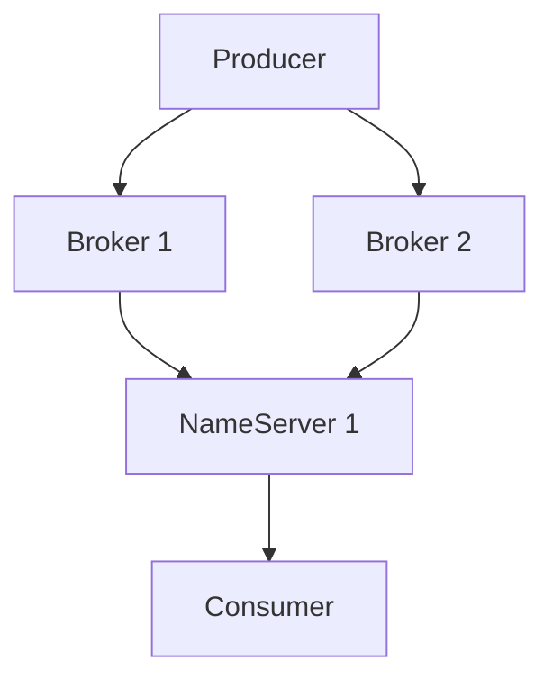

# RocketMQ 资源规划

RocketMQ 是一款高性能、高可用的分布式消息中间件，广泛应用于大规模分布式系统中。为了确保 RocketMQ 集群的稳定运行，合理的资源规划是至关重要的。本文将详细介绍如何为 RocketMQ 集群进行资源规划，包括硬件资源、网络配置、存储规划等方面的内容。

## 1. 什么是RocketMQ资源规划？

RocketMQ 资源规划是指在部署 RocketMQ 集群之前，根据业务需求和预期负载，合理分配硬件资源、网络带宽、存储空间等，以确保系统的高可用性和高性能。资源规划的目标是避免资源浪费，同时确保系统能够应对高峰期的消息流量。

:::note
资源规划不仅仅是硬件资源的分配，还包括对网络、存储、以及系统架构的全面考虑。
:::

## 2. 硬件资源规划

### 2.1 CPU 和内存

RocketMQ 的 Broker 和 NameServer 是核心组件，它们的性能直接影响到消息的吞吐量和延迟。因此，CPU 和内存的规划至关重要。

- **Broker**：Broker 负责消息的存储和转发，通常需要较高的 CPU 和内存资源。建议为每个 Broker 节点分配至少 4 核 CPU 和 8GB 内存。
- **NameServer**：NameServer 负责管理 Broker 的路由信息，资源需求相对较低。建议为每个 NameServer 节点分配 2 核 CPU 和 4GB 内存。

:::tip
如果业务场景中消息量较大，建议适当增加 Broker 的 CPU 和内存资源，以提高消息处理能力。
:::

### 2.2 磁盘存储

RocketMQ 的消息存储依赖于磁盘，因此磁盘的性能和容量规划非常重要。

- **磁盘类型**：建议使用 SSD 磁盘，以提高消息的读写性能。
- **磁盘容量**：根据业务的消息量和消息保留策略，合理规划磁盘容量。例如，如果每天产生 100GB 的消息，并且需要保留 7 天的消息，则至少需要 700GB 的磁盘空间。

:::caution
磁盘容量不足可能导致消息丢失，因此务必根据业务需求进行合理规划。
:::

## 3. 网络规划

### 3.1 带宽需求

RocketMQ 集群中的 Broker 和 NameServer 之间需要频繁通信，因此网络带宽的规划非常重要。

- **Broker 与 NameServer**：建议 Broker 和 NameServer 之间的网络带宽至少为 1Gbps。
- **Broker 与 Producer/Consumer**：根据业务的消息吞吐量，合理规划 Producer 和 Consumer 与 Broker 之间的网络带宽。

:::warning
网络带宽不足可能导致消息延迟或丢失，因此务必确保网络带宽能够满足业务需求。
:::

### 3.2 网络拓扑

为了确保 RocketMQ 集群的高可用性，建议将 Broker 和 NameServer 部署在不同的可用区或数据中心，以避免单点故障。



:::note
通过合理的网络拓扑设计，可以提高 RocketMQ 集群的容错能力和可用性。
:::

## 4. 存储规划

### 4.1 消息存储

RocketMQ 的消息存储分为两部分：CommitLog 和 ConsumeQueue。

- **CommitLog**：存储所有的消息内容，按顺序写入磁盘。
- **ConsumeQueue**：存储消息的索引，方便消费者快速定位消息。

:::tip
为了提高消息的读写性能，建议将 CommitLog 和 ConsumeQueue 存储在不同的磁盘上。
:::

### 4.2 消息保留策略

RocketMQ 支持多种消息保留策略，包括按时间保留和按大小保留。根据业务需求，合理设置消息保留策略，以避免磁盘空间被快速耗尽。

```bash
# 设置消息保留时间为 7 天
brokerClusterName = DefaultCluster
brokerName = broker-a
brokerId = 0
fileReservedTime = 7
```

:::caution
消息保留策略设置不当可能导致磁盘空间不足，因此务必根据业务需求进行合理设置。
:::

## 5. 实际案例

### 5.1 电商平台消息系统

假设某电商平台每天产生 1TB 的消息，并且需要保留 3 天的消息。为了确保系统的高可用性和高性能，资源规划如下：

- **硬件资源**：每个 Broker 节点分配 8 核 CPU 和 16GB 内存，NameServer 节点分配 4 核 CPU 和 8GB 内存。
- **磁盘存储**：每个 Broker 节点配置 4TB SSD 磁盘，用于存储消息。
- **网络带宽**：Broker 和 NameServer 之间的网络带宽为 10Gbps，Producer 和 Consumer 与 Broker 之间的网络带宽为 1Gbps。

:::note
通过合理的资源规划，电商平台的消息系统能够稳定运行，并应对高峰期的消息流量。
:::

## 6. 总结

RocketMQ 资源规划是确保系统高可用性和高性能的关键步骤。通过合理的硬件资源、网络配置和存储规划，可以有效避免资源浪费，并确保系统能够应对高峰期的消息流量。希望本文的内容能够帮助初学者更好地理解 RocketMQ 资源规划的重要性，并为实际应用提供参考。

## 7. 附加资源

- [RocketMQ 官方文档](https://rocketmq.apache.org/docs/)
- [RocketMQ 性能调优指南](https://rocketmq.apache.org/docs/performance-tuning/)

## 8. 练习

1. 假设你负责一个每天产生 500GB 消息的系统，请规划 RocketMQ 集群的硬件资源、磁盘存储和网络带宽。
2. 设计一个 RocketMQ 集群的网络拓扑图，确保系统的高可用性。

:::tip
通过实际练习，可以更好地掌握 RocketMQ 资源规划的技巧。
:::