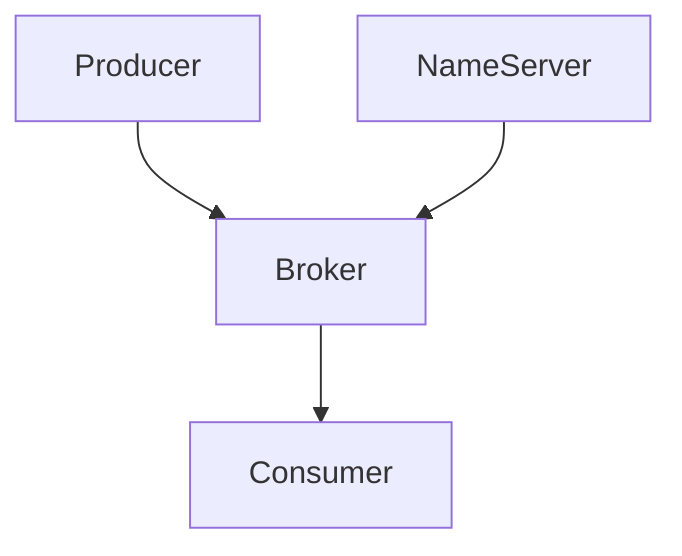

## 什么是RocketMQ生态系统？

RocketMQ是一个分布式消息中间件，最初由阿里巴巴开发并开源。它被设计用于处理高吞吐量、低延迟的消息传递场景，广泛应用于电商、金融、物流等领域。RocketMQ生态系统不仅包括核心的消息队列服务，还涵盖了与之相关的工具、插件和扩展，形成了一个完整的解决方案。

## RocketMQ 的核心组件

RocketMQ生态系统主要由以下几个核心组件构成：

1. **NameServer**：负责管理Broker的元数据，提供路由信息。
2. **Broker**：消息存储和转发的核心组件，负责接收、存储和分发消息。
3. **Producer**：消息生产者，负责发送消息到Broker。
4. **Consumer**：消息消费者，负责从Broker订阅并消费消息。



## RocketMQ 的架构

RocketMQ的架构设计使其能够高效地处理大规模消息流。以下是其架构的主要特点：

- **分布式设计**：RocketMQ采用分布式架构，支持水平扩展。
- **高可用性**：通过主从复制和故障转移机制，确保系统的高可用性。
- **消息顺序性**：支持顺序消息，确保消息按照发送顺序被消费。

## 实际应用场景

### 电商订单处理

在电商平台中，RocketMQ可以用于处理订单消息。例如，当用户下单时，订单信息会被发送到RocketMQ，然后由不同的服务（如库存管理、支付服务）订阅并处理这些消息。

```java
// 生产者示例
DefaultMQProducer producer = new DefaultMQProducer("order_producer_group");
producer.start();
Message msg = new Message("order_topic", "order_tag", "order_id_123".getBytes());
SendResult sendResult = producer.send(msg);
producer.shutdown();

// 消费者示例
DefaultMQPushConsumer consumer = new DefaultMQPushConsumer("order_consumer_group");
consumer.subscribe("order_topic", "*");
consumer.registerMessageListener((MessageListenerConcurrently) (msgs, context) -> {
    for (MessageExt msg : msgs) {
        System.out.println("Received message: " + new String(msg.getBody()));
    }
    return ConsumeConcurrentlyStatus.CONSUME_SUCCESS;
});
consumer.start();
```

### 金融交易通知

在金融领域，RocketMQ可以用于发送交易通知。例如，当一笔交易完成后，系统会通过RocketMQ发送通知给用户。

```java
// 生产者示例
DefaultMQProducer producer = new DefaultMQProducer("transaction_producer_group");
producer.start();
Message msg = new Message("transaction_topic", "notification_tag", "transaction_id_456".getBytes());
SendResult sendResult = producer.send(msg);
producer.shutdown();

// 消费者示例
DefaultMQPushConsumer consumer = new DefaultMQPushConsumer("transaction_consumer_group");
consumer.subscribe("transaction_topic", "*");
consumer.registerMessageListener((MessageListenerConcurrently) (msgs, context) -> {
    for (MessageExt msg : msgs) {
        System.out.println("Received notification: " + new String(msg.getBody()));
    }
    return ConsumeConcurrentlyStatus.CONSUME_SUCCESS;
});
consumer.start();
```

## 总结

RocketMQ生态系统提供了一个强大而灵活的消息传递解决方案，适用于各种高并发、高可靠性的场景。通过理解其核心组件和架构，初学者可以更好地利用RocketMQ构建高效的消息处理系统。

## 附加资源

- [RocketMQ官方文档](https://rocketmq.apache.org/docs/)
- [RocketMQ GitHub仓库](https://github.com/apache/rocketmq)
- [RocketMQ实战教程](https://www.example.com/rocketmq-tutorial)

## 练习

1. 尝试在本地搭建一个RocketMQ环境，并编写一个简单的生产者和消费者程序。
2. 研究RocketMQ的顺序消息机制，并尝试实现一个顺序消息的生产者和消费者。
3. 探索RocketMQ的高可用性机制，了解如何配置主从复制和故障转移。

:::tip
建议初学者在掌握基础概念后，逐步深入RocketMQ的高级特性，如事务消息、延迟消息等。
:::