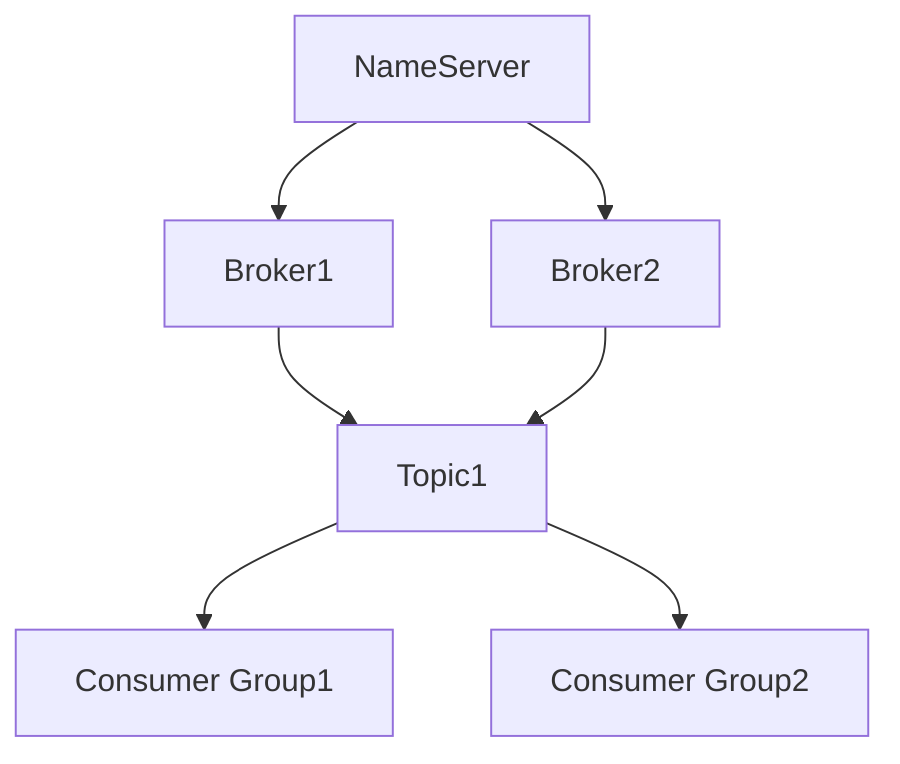

# RocketMQ Dashboard

RocketMQ Dashboard 是 Apache RocketMQ 生态系统中的一个重要组件，它为开发者和运维人员提供了一个直观的图形化界面，用于监控和管理 RocketMQ 集群。通过 RocketMQ Dashboard，用户可以轻松查看集群状态、消息队列、消费者组、生产者组等信息，从而更好地管理和优化消息系统。

## 什么是 RocketMQ Dashboard？

RocketMQ Dashboard 是一个基于 Web 的管理工具，旨在简化 RocketMQ 集群的监控和管理任务。它提供了丰富的功能，包括：

- **集群概览**：查看集群的整体状态，包括 Broker、NameServer 的运行情况。
- **消息队列监控**：实时监控消息队列的消费情况、积压情况等。
- **消费者组管理**：查看消费者组的消费进度、延迟情况等。
- **生产者组管理**：查看生产者组的消息发送情况。
- **消息轨迹**：追踪消息的发送、存储和消费过程。

## 安装与配置

要使用 RocketMQ Dashboard，首先需要将其部署到你的环境中。以下是安装步骤：

1. **下载 RocketMQ Dashboard**：
   你可以从 [RocketMQ 官方 GitHub 仓库](https://github.com/apache/rocketmq-dashboard) 下载最新的 RocketMQ Dashboard 版本。

2. **配置 RocketMQ Dashboard**：
   下载完成后，解压文件并编辑 `application.properties` 文件，配置 RocketMQ 集群的 NameServer 地址：

   ```properties
   rocketmq.config.namesrvAddr=127.0.0.1:9876
   ```

3. **启动 RocketMQ Dashboard**：
   在解压后的目录中，运行以下命令启动 RocketMQ Dashboard：

   ```bash
   java -jar rocketmq-dashboard.jar
   ```

4. **访问 Dashboard**：
   启动成功后，打开浏览器并访问 `http://localhost:8080`，你将看到 RocketMQ Dashboard 的登录界面。

## 使用 RocketMQ Dashboard

### 1. 集群概览

登录后，首先看到的是集群概览页面。这里展示了 RocketMQ 集群的整体状态，包括 Broker 和 NameServer 的运行情况。



### 2. 消息队列监控

在消息队列监控页面，你可以查看每个 Topic 的消息积压情况、消费进度等信息。这对于排查消息积压问题非常有帮助。

:::tip
如果你发现某个 Topic 的消息积压严重，可以考虑增加消费者实例或优化消费逻辑。
:::

### 3. 消费者组管理

消费者组管理页面展示了每个消费者组的消费进度、延迟情况等。你可以通过该页面快速定位消费延迟的问题。

### 4. 生产者组管理

生产者组管理页面展示了每个生产者组的消息发送情况。你可以通过该页面监控消息的发送速率和成功率。

### 5. 消息轨迹

消息轨迹功能允许你追踪消息的整个生命周期，从发送到存储再到消费。这对于排查消息丢失或重复消费问题非常有帮助。

## 实际应用场景

### 场景 1：消息积压排查

假设你发现某个 Topic 的消息积压严重，可以通过 RocketMQ Dashboard 查看该 Topic 的消费进度和消费者组的消费情况。如果发现某个消费者组的消费速度较慢，可以考虑增加消费者实例或优化消费逻辑。

### 场景 2：消息丢失排查

如果你发现某些消息丢失，可以通过消息轨迹功能追踪消息的整个生命周期，查看消息是否成功发送到 Broker，是否被消费者成功消费。

## 总结

RocketMQ Dashboard 是 RocketMQ 生态系统中一个非常强大的工具，它提供了丰富的功能，帮助开发者和运维人员更好地监控和管理 RocketMQ 集群。通过 RocketMQ Dashboard，你可以轻松查看集群状态、消息队列、消费者组、生产者组等信息，从而更好地优化和管理你的消息系统。

## 附加资源

- [RocketMQ 官方文档](https://rocketmq.apache.org/docs/)
- [RocketMQ Dashboard GitHub 仓库](https://github.com/apache/rocketmq-dashboard)

## 练习

1. 尝试在你的本地环境中部署 RocketMQ Dashboard，并查看集群概览页面。
2. 使用消息轨迹功能追踪一条消息的整个生命周期。
3. 模拟一个消息积压的场景，并通过 RocketMQ Dashboard 进行排查和优化。