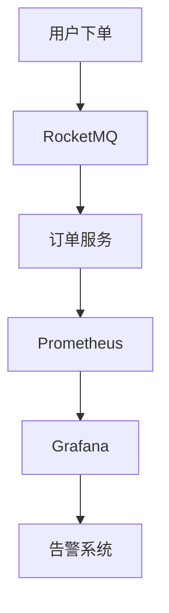

# RocketMQ 与Prometheus集成

在现代分布式系统中，消息队列（如RocketMQ）是处理异步通信和解耦服务的关键组件。为了确保系统的稳定性和性能，监控消息队列的健康状况至关重要。Prometheus 是一个开源的监控和告警工具，广泛用于收集和存储时间序列数据。本文将介绍如何将 RocketMQ 与 Prometheus 集成，以便实时监控 RocketMQ 的运行状态。

## 什么是RocketMQ与Prometheus集成？

RocketMQ 是一个分布式消息中间件，而 Prometheus 是一个监控和告警系统。通过将 RocketMQ 与 Prometheus 集成，我们可以收集 RocketMQ 的运行指标（如消息吞吐量、延迟、消费者偏移量等），并将这些指标存储在 Prometheus 中。然后，我们可以使用 Prometheus 的查询语言（PromQL）来分析这些数据，并通过 Grafana 等工具进行可视化展示。

## 为什么需要集成？

- **实时监控**：通过集成，我们可以实时监控 RocketMQ 的运行状态，及时发现潜在问题。
- **性能优化**：通过分析指标数据，我们可以优化 RocketMQ 的配置，提高系统性能。
- **告警机制**：Prometheus 支持基于指标的告警规则，当 RocketMQ 出现异常时，可以及时通知运维人员。

## 如何集成RocketMQ与Prometheus？

### 1. 安装和配置Prometheus

首先，我们需要在服务器上安装 Prometheus。你可以从 [Prometheus 官方网站](https://prometheus.io/download/) 下载最新版本。

```bash
wget https://github.com/prometheus/prometheus/releases/download/v2.30.3/prometheus-2.30.3.linux-amd64.tar.gz
tar -xzf prometheus-2.30.3.linux-amd64.tar.gz
cd prometheus-2.30.3.linux-amd64
```

接下来，编辑 `prometheus.yml` 配置文件，添加 RocketMQ 的监控目标：

```yaml
scrape_configs:
  - job_name: 'rocketmq'
    static_configs:
      - targets: ['localhost:5557']  # RocketMQ Exporter 的地址
```

### 2. 安装RocketMQ Exporter

RocketMQ Exporter 是一个用于将 RocketMQ 的指标暴露给 Prometheus 的工具。你可以从 [RocketMQ Exporter GitHub 仓库](https://github.com/apache/rocketmq-exporter) 下载并安装它。

```bash
git clone https://github.com/apache/rocketmq-exporter.git
cd rocketmq-exporter
mvn clean package
java -jar target/rocketmq-exporter-0.0.1-SNAPSHOT.jar
```

启动 RocketMQ Exporter 后，它将在 `localhost:5557` 上暴露 RocketMQ 的指标。

### 3. 配置RocketMQ

确保 RocketMQ 的 `broker.conf` 配置文件中启用了指标收集功能：

```properties
brokerClusterName = DefaultCluster
brokerName = broker-a
brokerId = 0
metricsEnable = true
```

### 4. 启动Prometheus

启动 Prometheus 服务：

```bash
./prometheus --config.file=prometheus.yml
```

### 5. 验证集成

打开 Prometheus 的 Web UI（通常位于 `http://localhost:9090`），在查询框中输入 `rocketmq_broker_tps`，查看 RocketMQ 的消息吞吐量指标。

## 实际案例

假设我们有一个电商系统，使用 RocketMQ 处理订单消息。通过集成 Prometheus，我们可以监控订单消息的处理速度，并在处理速度下降时触发告警。



在这个案例中，Prometheus 收集 RocketMQ 的指标，Grafana 用于可视化展示，告警系统在消息处理速度下降时通知运维人员。

## 总结

通过将 RocketMQ 与 Prometheus 集成，我们可以实时监控 RocketMQ 的运行状态，及时发现并解决问题。本文介绍了如何安装和配置 Prometheus、RocketMQ Exporter，以及如何验证集成。希望这些内容能帮助你更好地理解和使用 RocketMQ 与 Prometheus 的集成。

## 附加资源

- [Prometheus 官方文档](https://prometheus.io/docs/)
- [RocketMQ Exporter GitHub 仓库](https://github.com/apache/rocketmq-exporter)
- [Grafana 官方文档](https://grafana.com/docs/)

## 练习

1. 尝试在你的本地环境中安装并配置 Prometheus 和 RocketMQ Exporter。
2. 使用 Prometheus 查询 RocketMQ 的指标，并在 Grafana 中创建仪表盘。
3. 设置一个告警规则，当 RocketMQ 的消息处理速度低于某个阈值时触发告警。
