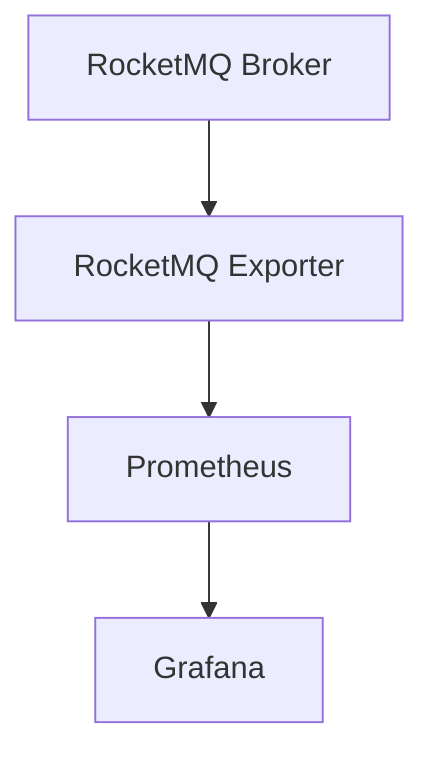

# RocketMQ Exporter

RocketMQ Exporter 是一个用于将 RocketMQ 的监控指标导出到 Prometheus 的工具。它允许开发者和运维人员通过 Prometheus 收集和分析 RocketMQ 集群的性能数据，从而更好地监控和管理消息队列系统。

## 什么是 RocketMQ Exporter？

RocketMQ Exporter 是一个开源工具，专门为 RocketMQ 设计，用于将 RocketMQ 的运行时指标（如消息堆积、消费速率、生产速率等）导出到 Prometheus。Prometheus 是一个流行的开源监控系统，支持多维数据模型和强大的查询语言（PromQL），能够帮助用户实时监控和分析系统性能。

通过 RocketMQ Exporter，你可以轻松地将 RocketMQ 的监控数据集成到现有的 Prometheus 监控体系中，从而实现对 RocketMQ 集群的全面监控。

## 为什么需要 RocketMQ Exporter？

在分布式系统中，消息队列（如 RocketMQ）扮演着至关重要的角色。为了确保系统的稳定性和高性能，监控 RocketMQ 的运行状态是必不可少的。RocketMQ Exporter 提供了一种简单的方式，将 RocketMQ 的监控指标导出到 Prometheus，使得用户可以：

- 实时监控 RocketMQ 集群的健康状态。
- 通过 Grafana 等可视化工具展示监控数据。
- 设置告警规则，及时发现和解决问题。

## 如何安装和配置 RocketMQ Exporter？

### 1. 下载 RocketMQ Exporter

首先，你需要从 RocketMQ Exporter 的 GitHub 仓库下载最新的二进制文件。你可以使用以下命令：

```bash
wget https://github.com/apache/rocketmq-exporter/releases/download/v1.0.0/rocketmq-exporter-1.0.0-bin.tar.gz
tar -zxvf rocketmq-exporter-1.0.0-bin.tar.gz
cd rocketmq-exporter-1.0.0
```

### 2. 配置 RocketMQ Exporter

RocketMQ Exporter 的配置文件通常为 `application.yml`，你可以在其中指定 RocketMQ 集群的地址、端口等信息。以下是一个简单的配置示例：

```yaml
rocketmq:
  namesrvAddr: "127.0.0.1:9876"
  clusterName: "DefaultCluster"
```

### 3. 启动 RocketMQ Exporter

配置完成后，你可以通过以下命令启动 RocketMQ Exporter：

```bash
./bin/rocketmq-exporter
```

默认情况下，RocketMQ Exporter 会监听 `5557` 端口，你可以通过 `http://localhost:5557/metrics` 访问导出的指标。

## 如何将 RocketMQ Exporter 与 Prometheus 集成？

### 1. 配置 Prometheus

在 Prometheus 的配置文件 `prometheus.yml` 中，添加 RocketMQ Exporter 的监控目标：

```yaml
scrape_configs:
  - job_name: 'rocketmq'
    static_configs:
      - targets: ['localhost:5557']
```

### 2. 启动 Prometheus

启动 Prometheus 后，它将自动从 RocketMQ Exporter 中抓取指标数据。你可以通过 Prometheus 的 Web UI 查看这些指标。

## 实际应用场景

### 场景 1：监控消息堆积

假设你有一个 RocketMQ 集群，负责处理订单消息。通过 RocketMQ Exporter，你可以监控每个 Topic 的消息堆积情况，及时发现和处理消息积压问题。



在 Grafana 中，你可以创建一个仪表盘，展示每个 Topic 的消息堆积情况，并设置告警规则，当消息堆积超过一定阈值时触发告警。

### 场景 2：分析消费速率

通过 RocketMQ Exporter，你可以监控消费者的消费速率，分析消费者的性能瓶颈。例如，你可以通过 PromQL 查询某个 Consumer Group 的消费速率：

```promql
rate(rocketmq_consumer_offset[1m])
```

## 总结

RocketMQ Exporter 是一个强大的工具，能够帮助你将 RocketMQ 的监控指标导出到 Prometheus，从而实现对 RocketMQ 集群的全面监控。通过本文的介绍，你应该已经了解了 RocketMQ Exporter 的基本概念、安装配置方法以及实际应用场景。

## 附加资源

- [RocketMQ Exporter GitHub 仓库](https://github.com/apache/rocketmq-exporter)
- [Prometheus 官方文档](https://prometheus.io/docs/)
- [Grafana 官方文档](https://grafana.com/docs/)

## 练习

1. 尝试在你的本地环境中安装和配置 RocketMQ Exporter，并将其与 Prometheus 集成。
2. 使用 PromQL 查询 RocketMQ 的消费速率，并在 Grafana 中创建一个仪表盘展示该指标。
3. 设置一个告警规则，当某个 Topic 的消息堆积超过 1000 条时触发告警。

通过以上练习，你将更深入地理解 RocketMQ Exporter 的使用方法，并掌握如何在实际项目中应用它。