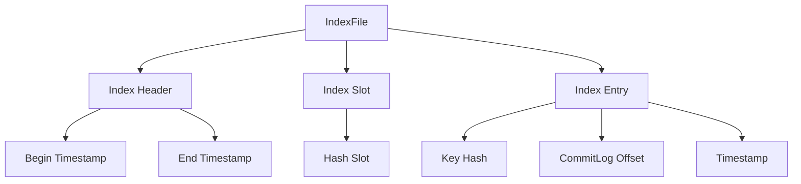

# RocketMQ 索引管理源码

RocketMQ 是一个分布式消息中间件，广泛应用于大规模分布式系统中。为了实现高效的消息存储与检索，RocketMQ 引入了索引管理机制。本文将深入分析 RocketMQ 索引管理的源码实现，帮助初学者理解其核心原理。

## 索引管理的概念

在 RocketMQ 中，索引管理主要用于加速消息的检索。当消息被存储到 CommitLog 中时，RocketMQ 会为每条消息生成一个索引条目，并将其存储在 IndexFile 中。通过索引，RocketMQ 可以快速定位到消息在 CommitLog 中的位置，从而实现高效的消息检索。

## 索引文件的结构

RocketMQ 的索引文件（IndexFile）是一个固定大小的文件，通常为 400MB。每个索引文件由多个索引条目组成，每个索引条目包含以下信息：

- **Key Hash**: 消息的 Key 的哈希值，用于快速查找。
- **CommitLog Offset**: 消息在 CommitLog 中的偏移量。
- **Timestamp**: 消息的时间戳。



## 索引管理的实现

### 1. 索引文件的创建

当 RocketMQ 启动时，会创建一个新的索引文件。索引文件的创建过程主要包括初始化索引头和索引槽。

```java
public class IndexFile {
    private final MappedFile mappedFile;
    private final IndexHeader indexHeader;
    private final IndexSlot[] indexSlots;

    public IndexFile(String fileName, int fileSize) {
        this.mappedFile = new MappedFile(fileName, fileSize);
        this.indexHeader = new IndexHeader();
        this.indexSlots = new IndexSlot[fileSize / IndexSlot.SIZE];
    }
}
```

### 2. 索引条目的插入

当消息被存储到 CommitLog 中时，RocketMQ 会为该消息生成一个索引条目，并将其插入到索引文件中。

```java
public void putKey(String key, long commitLogOffset, long timestamp) {
    int keyHash = key.hashCode();
    int slotPos = keyHash % indexSlots.length;
    IndexSlot slot = indexSlots[slotPos];
    if (slot == null) {
        slot = new IndexSlot();
        indexSlots[slotPos] = slot;
    }
    slot.addEntry(new IndexEntry(keyHash, commitLogOffset, timestamp));
}
```

### 3. 索引的查询

通过索引文件，RocketMQ 可以快速定位到消息在 CommitLog 中的位置。查询过程主要包括计算 Key 的哈希值，找到对应的索引槽，然后遍历索引槽中的条目，找到匹配的索引条目。

```java
public long findOffsetByKey(String key) {
    int keyHash = key.hashCode();
    int slotPos = keyHash % indexSlots.length;
    IndexSlot slot = indexSlots[slotPos];
    if (slot != null) {
        for (IndexEntry entry : slot.getEntries()) {
            if (entry.getKeyHash() == keyHash) {
                return entry.getCommitLogOffset();
            }
        }
    }
    return -1;
}
```

## 实际应用场景

假设我们有一个订单系统，订单消息通过 RocketMQ 进行传递。当我们需要查询某个订单的状态时，可以通过订单号（Key）快速定位到消息在 CommitLog 中的位置，从而获取订单的详细信息。

```java
String orderId = "ORDER123456";
long offset = indexFile.findOffsetByKey(orderId);
if (offset != -1) {
    Message message = commitLog.getMessage(offset);
    System.out.println("Order Status: " + message.getBody());
}
```

## 总结

RocketMQ 的索引管理机制通过将消息的 Key 与 CommitLog 中的偏移量进行映射，实现了高效的消息检索。索引文件的结构设计合理，能够支持大规模的消息存储与检索需求。通过本文的源码分析，初学者可以更好地理解 RocketMQ 索引管理的实现原理。

## 附加资源与练习

- **练习**: 尝试在本地环境中搭建 RocketMQ，并编写代码实现消息的存储与检索。
- **资源**: 参考 RocketMQ 官方文档，了解更多关于索引管理的细节。

:::tip
建议初学者在阅读源码时，结合调试工具逐步跟踪代码的执行流程，以加深对索引管理机制的理解。
:::