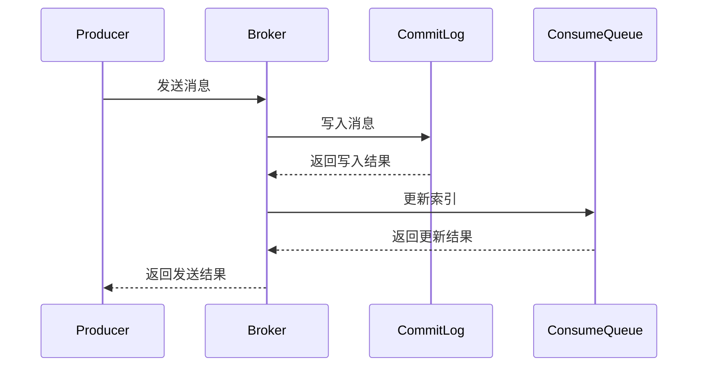
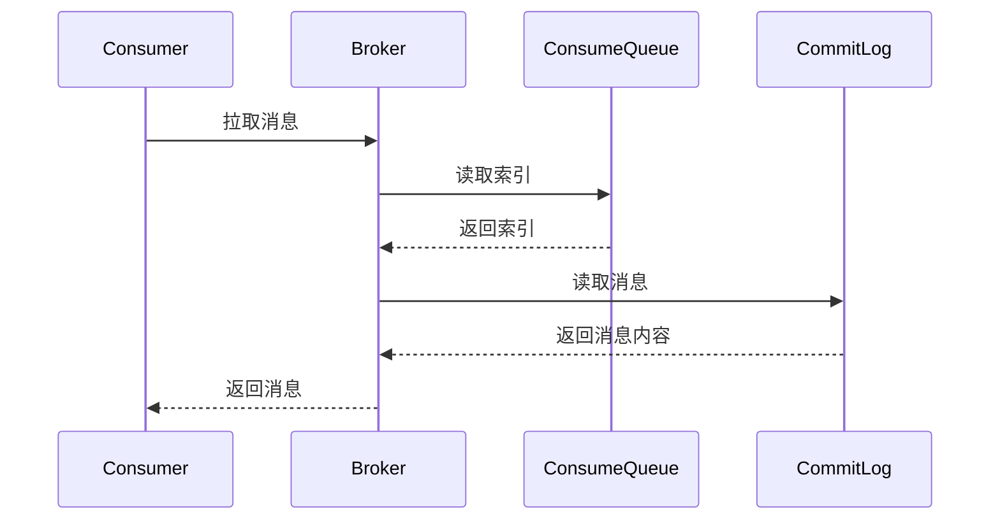

# RocketMQ 消息存储源码分析

RocketMQ 是一个分布式消息中间件，广泛应用于大规模分布式系统中。消息存储是 RocketMQ 的核心模块之一，负责将生产者发送的消息持久化到磁盘，并在消费者需要时进行读取。本文将逐步分析 RocketMQ 消息存储的源码，帮助初学者理解其实现原理。

## 1. 消息存储概述

在 RocketMQ 中，消息存储的核心模块是 `CommitLog` 和 `ConsumeQueue`。`CommitLog` 是消息的物理存储文件，所有消息都会顺序写入到 `CommitLog` 中。而 `ConsumeQueue` 则是逻辑队列，用于记录消息在 `CommitLog` 中的位置，方便消费者快速定位和读取消息。

### 1.1 CommitLog

`CommitLog` 是 RocketMQ 消息存储的核心文件，所有消息都会顺序写入到 `CommitLog` 中。`CommitLog` 的设计目标是保证消息的高效写入和读取。

```java
public class CommitLog {
    // CommitLog 的核心写入方法
    public PutMessageResult putMessage(final MessageExtBrokerInner msg) {
        // 将消息写入到 CommitLog 文件中
        // ...
    }
}
```

### 1.2 ConsumeQueue

`ConsumeQueue` 是 RocketMQ 的逻辑队列，用于记录消息在 `CommitLog` 中的位置。每个主题（Topic）和队列（Queue）都会对应一个 `ConsumeQueue` 文件。

```java
public class ConsumeQueue {
    // ConsumeQueue 的核心读取方法
    public SelectMappedBufferResult getIndexBuffer(final long startIndex) {
        // 从 ConsumeQueue 中读取消息的索引
        // ...
    }
}
```

## 2. 消息存储流程

### 2.1 消息写入流程

当生产者发送消息时，RocketMQ 会将消息写入到 `CommitLog` 中，并更新 `ConsumeQueue` 的索引。



### 2.2 消息读取流程

当消费者拉取消息时，RocketMQ 会从 `ConsumeQueue` 中读取消息的索引，然后根据索引从 `CommitLog` 中读取消息内容。



## 3. 源码分析

### 3.1 CommitLog 源码分析

`CommitLog` 的核心方法是 `putMessage`，负责将消息写入到 `CommitLog` 文件中。以下是 `putMessage` 方法的简化实现：

```java
public PutMessageResult putMessage(final MessageExtBrokerInner msg) {
    // 1. 获取可写的 MappedFile
    MappedFile mappedFile = this.mappedFileQueue.getLastMappedFile();
    
    // 2. 将消息写入到 MappedFile 中
    AppendMessageResult result = mappedFile.appendMessage(msg);
    
    // 3. 返回写入结果
    return new PutMessageResult(PutMessageStatus.PUT_OK, result);
}
```

### 3.2 ConsumeQueue 源码分析

`ConsumeQueue` 的核心方法是 `getIndexBuffer`，负责从 `ConsumeQueue` 中读取消息的索引。以下是 `getIndexBuffer` 方法的简化实现：

```java
public SelectMappedBufferResult getIndexBuffer(final long startIndex) {
    // 1. 计算消息在 ConsumeQueue 文件中的偏移量
    long offset = startIndex * CQ_STORE_UNIT_SIZE;
    
    // 2. 从 MappedFile 中读取索引
    return this.mappedFileQueue.getData(offset, CQ_STORE_UNIT_SIZE);
}
```

## 4. 实际案例

假设我们有一个订单系统，生产者将订单消息发送到 RocketMQ，消费者从 RocketMQ 中拉取订单消息进行处理。

### 4.1 生产者发送消息

```java
// 创建消息
Message msg = new Message("OrderTopic", "OrderTag", "OrderId123", "OrderContent".getBytes());

// 发送消息
SendResult sendResult = producer.send(msg);
System.out.println("消息发送结果: " + sendResult);
```

### 4.2 消费者拉取消息

```java
// 订阅主题
consumer.subscribe("OrderTopic", "*");

// 拉取消息
List<MessageExt> msgs = consumer.poll(1000);
for (MessageExt msg : msgs) {
    System.out.println("收到消息: " + new String(msg.getBody()));
}
```

## 5. 总结

本文详细分析了 RocketMQ 消息存储的核心源码，包括 `CommitLog` 和 `ConsumeQueue` 的实现原理。通过源码分析，我们了解了消息的写入和读取流程，并通过实际案例展示了 RocketMQ 在订单系统中的应用。

## 6. 附加资源与练习

- **附加资源**:
  - [RocketMQ 官方文档](https://rocketmq.apache.org/docs/)
  - [RocketMQ GitHub 仓库](https://github.com/apache/rocketmq)

- **练习**:
  1. 尝试在本地搭建 RocketMQ 环境，并运行生产者与消费者示例代码。
  2. 修改 `CommitLog` 和 `ConsumeQueue` 的源码，观察消息存储的变化。

:::tip
建议初学者在阅读源码时，结合 RocketMQ 的官方文档和示例代码，逐步深入理解消息存储的实现细节。
:::