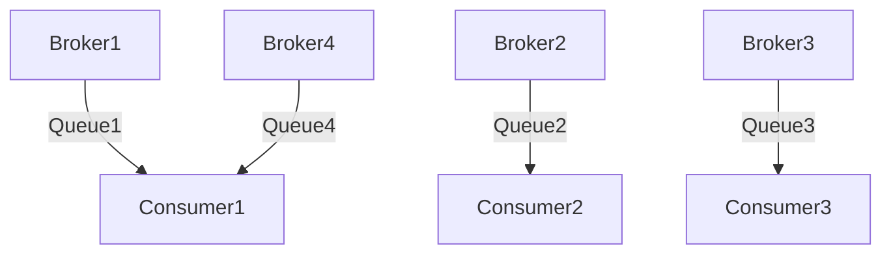

## 介绍

RocketMQ 是一个分布式消息中间件，广泛应用于大规模分布式系统中。负载均衡是 RocketMQ 中一个非常重要的机制，它确保了消息的生产和消费能够在多个 Broker 和 Consumer 之间均匀分布，从而提高系统的吞吐量和稳定性。

在本篇文章中，我们将深入分析 RocketMQ 负载均衡的源码实现，帮助初学者理解其工作原理，并通过实际案例展示其应用场景。

## 负载均衡的基本概念

在 RocketMQ 中，负载均衡主要涉及两个方面：

1. **Producer 负载均衡**：Producer 在发送消息时，需要选择一个合适的 Broker 来发送消息。RocketMQ 通过 `TopicPublishInfo` 类来管理 Broker 的选择逻辑。
2. **Consumer 负载均衡**：Consumer 在消费消息时，需要从多个 Broker 中分配消息队列。RocketMQ 通过 `RebalanceImpl` 类来实现 Consumer 的负载均衡。

## Producer 负载均衡源码分析

### TopicPublishInfo 类

`TopicPublishInfo` 类是 Producer 负载均衡的核心类之一。它负责管理一个 Topic 下的所有 Broker 信息，并根据负载均衡策略选择一个合适的 Broker 来发送消息。

```java
public class TopicPublishInfo {
    private List<MessageQueue> messageQueueList;
    private volatile ThreadLocalIndex sendWhichQueue = new ThreadLocalIndex();

    public MessageQueue selectOneMessageQueue() {
        int index = this.sendWhichQueue.getAndIncrement();
        int pos = Math.abs(index % this.messageQueueList.size());
        return this.messageQueueList.get(pos);
    }
}
```

在上面的代码中，`selectOneMessageQueue` 方法通过轮询的方式选择一个消息队列。`sendWhichQueue` 是一个线程局部变量，用于记录当前线程选择的消息队列索引。

### 负载均衡策略

RocketMQ 提供了多种负载均衡策略，默认使用的是轮询策略。开发者可以通过实现 `MessageQueueSelector` 接口来自定义负载均衡策略。

```java
public interface MessageQueueSelector {
    MessageQueue select(final List<MessageQueue> mqs, final Message msg, final Object arg);
}
```

## Consumer 负载均衡源码分析

### RebalanceImpl 类

`RebalanceImpl` 类是 Consumer 负载均衡的核心类。它负责管理 Consumer 的消息队列分配逻辑。

```java
public abstract class RebalanceImpl {
    protected final ConcurrentMap<String/* topic */, Set<MessageQueue>> topicSubscribeInfoTable = new ConcurrentHashMap<>();
    protected final ConcurrentMap<String/* topic */, SubscriptionData> subscriptionInner = new ConcurrentHashMap<>();

    public void doRebalance() {
        // 负载均衡逻辑
    }
}
```

在 `doRebalance` 方法中，RocketMQ 会根据当前 Consumer 的订阅信息和 Broker 的状态，重新分配消息队列。

### 负载均衡策略

Consumer 的负载均衡策略主要有以下几种：

1. **平均分配**：将消息队列平均分配给所有 Consumer。
2. **一致性哈希**：通过哈希算法将消息队列分配给 Consumer。
3. **自定义分配**：开发者可以通过实现 `AllocateMessageQueueStrategy` 接口来自定义分配策略。

```java
public interface AllocateMessageQueueStrategy {
    List<MessageQueue> allocate(final String consumerGroup, final String currentCID, final List<MessageQueue> mqAll, final List<String> cidAll);
}
```

## 实际案例

假设我们有一个包含 4 个 Broker 和 3 个 Consumer 的 RocketMQ 集群。通过负载均衡机制，RocketMQ 会将消息队列均匀分配给每个 Consumer，确保每个 Consumer 都能处理大致相同数量的消息。



在上面的图中，我们可以看到消息队列被均匀分配给了不同的 Consumer。

## 总结

RocketMQ 的负载均衡机制是其高可用性和高性能的重要保障。通过 Producer 和 Consumer 的负载均衡策略，RocketMQ 能够有效地分配消息队列，确保系统的稳定运行。

对于初学者来说，理解 RocketMQ 的负载均衡机制是掌握消息队列技术的重要一步。希望本文能够帮助你更好地理解 RocketMQ 的负载均衡源码。

## 附加资源

- [RocketMQ 官方文档](https://rocketmq.apache.org/docs/)
- [RocketMQ 源码解析](https://github.com/apache/rocketmq)

## 练习

1. 尝试实现一个自定义的 `MessageQueueSelector`，并在 Producer 中使用它。
2. 修改 `RebalanceImpl` 中的 `doRebalance` 方法，实现一个自定义的负载均衡策略。
