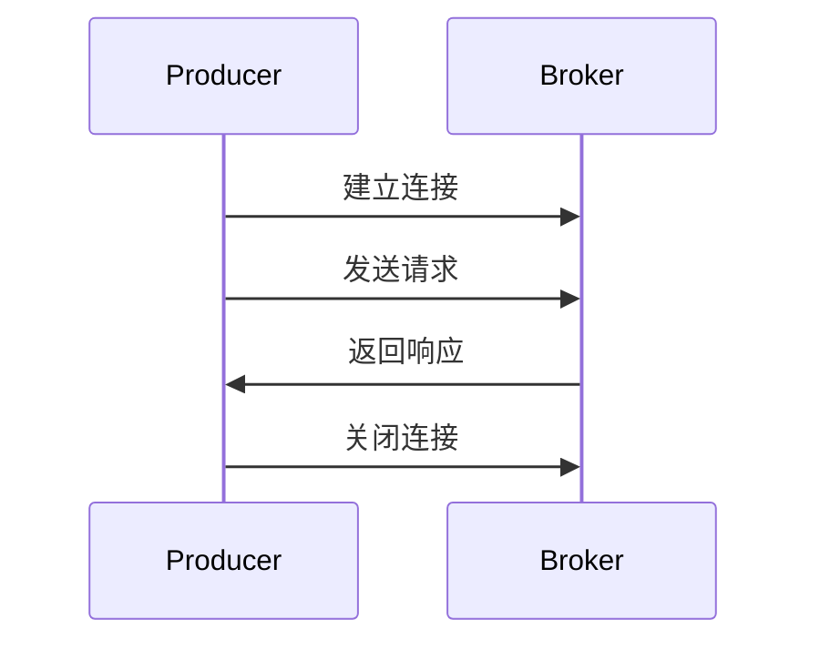

## 介绍

RocketMQ 是一个分布式消息中间件，其核心功能之一是高效的消息传递。为了实现这一目标，RocketMQ 依赖于强大的网络通信机制。本文将深入分析 RocketMQ 的网络通信源码，帮助初学者理解其底层实现。

### 什么是网络通信？

网络通信是指在不同计算机或设备之间传输数据的过程。在 RocketMQ 中，网络通信主要用于生产者、消费者和 Broker 之间的消息传递。RocketMQ 使用 Netty 作为其网络通信框架，Netty 是一个高性能的异步事件驱动的网络应用框架，适用于快速开发可维护的高性能协议服务器和客户端。

## RocketMQ 网络通信模型

RocketMQ 的网络通信模型基于客户端-服务器架构。生产者（Producer）和消费者（Consumer）是客户端，而 Broker 是服务器。客户端通过 TCP 连接与 Broker 进行通信，发送和接收消息。

### 通信协议

RocketMQ 使用自定义的二进制协议进行通信。该协议定义了消息的格式、命令类型以及错误处理机制。每个消息都包含一个头部（Header）和主体（Body），头部包含元数据，如消息类型、消息长度等，主体则包含实际的消息内容。

```java
// 示例：RocketMQ 消息头部结构
public class MessageHeader {
    private int code; // 命令类型
    private int version; // 协议版本
    private int opaque; // 请求标识
    private int flag; // 标志位
    private String remark; // 备注
}
```

### 通信流程

1. **建立连接**：客户端通过 TCP 连接到 Broker。
2. **发送请求**：客户端发送请求消息到 Broker。
3. **处理请求**：Broker 接收并处理请求，生成响应消息。
4. **返回响应**：Broker 将响应消息返回给客户端。
5. **关闭连接**：通信完成后，客户端可以选择关闭连接。



## 源码分析

### Netty 的使用

RocketMQ 使用 Netty 作为其网络通信框架。Netty 提供了高效的异步 I/O 操作，能够处理大量的并发连接。RocketMQ 的 `NettyRemotingClient` 和 `NettyRemotingServer` 类分别负责客户端和服务器的网络通信。

```java
// 示例：NettyRemotingClient 初始化
public class NettyRemotingClient extends NettyRemotingAbstract {
    private final Bootstrap bootstrap = new Bootstrap();
    private final EventLoopGroup eventLoopGroupWorker = new NioEventLoopGroup();

    public NettyRemotingClient(final NettyClientConfig nettyClientConfig) {
        this.nettyClientConfig = nettyClientConfig;
        this.bootstrap.group(this.eventLoopGroupWorker)
                      .channel(NioSocketChannel.class)
                      .option(ChannelOption.TCP_NODELAY, true)
                      .handler(new ChannelInitializer<SocketChannel>() {
                          @Override
                          public void initChannel(SocketChannel ch) throws Exception {
                              ch.pipeline().addLast(new NettyEncoder(),
                                                    new NettyDecoder(),
                                                    new NettyClientHandler());
                          }
                      });
    }
}
```

### 消息编解码

RocketMQ 使用自定义的编解码器 `NettyEncoder` 和 `NettyDecoder` 来处理消息的序列化和反序列化。`NettyEncoder` 负责将消息对象编码为字节流，`NettyDecoder` 则负责将字节流解码为消息对象。

```java
// 示例：NettyEncoder 编码过程
public class NettyEncoder extends MessageToByteEncoder<RemotingCommand> {
    @Override
    protected void encode(ChannelHandlerContext ctx, RemotingCommand remotingCommand, ByteBuf out) throws Exception {
        try {
            byte[] header = remotingCommand.encodeHeader();
            out.writeBytes(header);
            if (remotingCommand.getBody() != null) {
                out.writeBytes(remotingCommand.getBody());
            }
        } catch (Exception e) {
            log.error("encode exception, " + RemotingHelper.parseChannelRemoteAddr(ctx.channel()), e);
        }
    }
}
```

## 实际应用场景

### 消息发送

在 RocketMQ 中，生产者通过 `DefaultMQProducer` 类发送消息。发送消息的过程涉及网络通信，生产者将消息发送到 Broker，Broker 接收并存储消息。

```java
// 示例：生产者发送消息
DefaultMQProducer producer = new DefaultMQProducer("ProducerGroup");
producer.start();
Message msg = new Message("TopicTest", "TagA", "Hello RocketMQ".getBytes());
SendResult sendResult = producer.send(msg);
producer.shutdown();
```

### 消息消费

消费者通过 `DefaultMQPushConsumer` 类订阅消息。当 Broker 接收到新消息时，会通过网络将消息推送给消费者。

```java
// 示例：消费者订阅消息
DefaultMQPushConsumer consumer = new DefaultMQPushConsumer("ConsumerGroup");
consumer.subscribe("TopicTest", "*");
consumer.registerMessageListener(new MessageListenerConcurrently() {
    @Override
    public ConsumeConcurrentlyStatus consumeMessage(List<MessageExt> msgs, ConsumeConcurrentlyContext context) {
        System.out.printf("%s Receive New Messages: %s %n", Thread.currentThread().getName(), msgs);
        return ConsumeConcurrentlyStatus.CONSUME_SUCCESS;
    }
});
consumer.start();
```

## 总结

RocketMQ 的网络通信机制是其高效消息传递的核心。通过使用 Netty 框架和自定义的二进制协议，RocketMQ 能够实现高并发、低延迟的消息传递。本文详细介绍了 RocketMQ 的网络通信模型、源码实现以及实际应用场景，希望能够帮助初学者更好地理解 RocketMQ 的底层机制。

## 附加资源

- [RocketMQ 官方文档](https://rocketmq.apache.org/docs/)
- [Netty 官方文档](https://netty.io/wiki/)
- [RocketMQ 源码 GitHub 仓库](https://github.com/apache/rocketmq)

## 练习

1. 尝试在本地搭建 RocketMQ 环境，并使用 `DefaultMQProducer` 和 `DefaultMQPushConsumer` 实现消息的发送和接收。
2. 阅读 RocketMQ 源码中的 `NettyRemotingClient` 和 `NettyRemotingServer` 类，理解其网络通信的实现细节。
3. 修改 RocketMQ 的编解码器，尝试自定义消息格式并测试其效果。