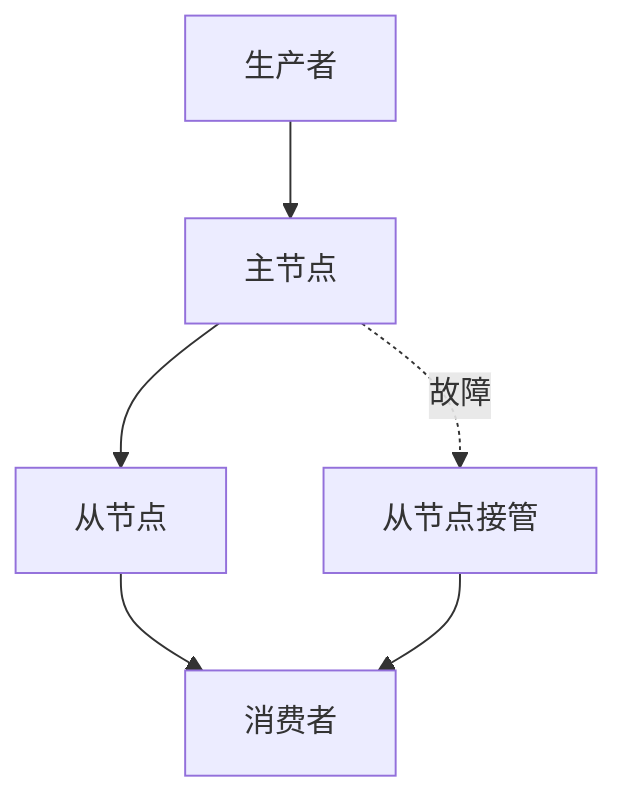

# RocketMQ 主从复制源码分析

RocketMQ 是一个分布式消息中间件，广泛应用于高并发、高可用的消息传递场景。为了保证数据的高可用性和容错性，RocketMQ 提供了主从复制的机制。本文将深入分析 RocketMQ 主从复制的源码实现，帮助初学者理解其工作原理。

## 什么是主从复制？

主从复制（Master-Slave Replication）是一种常见的数据复制机制，主要用于提高系统的可用性和数据冗余。在 RocketMQ 中，主从复制指的是主节点（Master）将消息数据复制到从节点（Slave），以确保在主节点发生故障时，从节点可以接管服务，保证消息不丢失。

### 主从复制的基本流程

1. **主节点接收消息**：生产者将消息发送到主节点。
2. **主节点存储消息**：主节点将消息存储到本地磁盘。
3. **主节点复制消息**：主节点将消息复制到从节点。
4. **从节点确认接收**：从节点接收到消息后，向主节点发送确认。
5. **主节点确认提交**：主节点收到从节点的确认后，提交消息。

## RocketMQ 主从复制的源码分析

### 1. 主从复制的核心类

RocketMQ 的主从复制功能主要由以下几个核心类实现：

- `HAConnection`：负责主节点与从节点之间的连接管理。
- `HAService`：主从复制的服务类，负责启动和管理主从复制的相关线程。
- `HAClient`：从节点的客户端，负责与主节点建立连接并接收消息。

### 2. 主从复制的启动流程

在 RocketMQ 中，主从复制的启动流程如下：

```java
// HAService 启动主从复制服务
public void start() throws Exception {
    this.acceptSocketService.beginAccept();
    this.haClient.start();
}
```

- `acceptSocketService`：主节点启动一个服务线程，等待从节点连接。
- `haClient`：从节点启动一个客户端线程，主动连接主节点。

### 3. 主从复制的消息传输

主节点与从节点之间的消息传输是通过 `HAConnection` 类实现的。主节点会将消息写入到 `WriteSocketService`，从节点通过 `ReadSocketService` 读取消息。

```java
// HAConnection 中的消息传输
public void start() {
    this.writeSocketService.start();
    this.readSocketService.start();
}
```

- `writeSocketService`：主节点将消息写入到从节点的 Socket。
- `readSocketService`：从节点从 Socket 中读取消息。

### 4. 主从复制的确认机制

从节点在接收到消息后，会向主节点发送确认信息，主节点收到确认后才会提交消息。

```java
// HAConnection 中的确认机制
public void handleReadEvent() {
    // 从节点读取消息
    long readOffset = this.socketChannel.read(this.byteBufferRead);
    if (readOffset > 0) {
        // 向主节点发送确认
        this.socketChannel.write(this.byteBufferWrite);
    }
}
```

## 实际应用场景

### 场景：主节点故障切换

假设主节点由于硬件故障无法继续提供服务，此时从节点可以接管服务，保证消息的持续传递。通过主从复制机制，从节点已经存储了主节点的所有消息，因此可以无缝切换。



## 总结

RocketMQ 的主从复制机制通过主节点与从节点之间的消息复制和确认，保证了消息的高可用性和数据冗余。通过源码分析，我们可以清晰地看到主从复制的实现细节，包括连接管理、消息传输和确认机制。

### 附加资源

- [RocketMQ 官方文档](https://rocketmq.apache.org/docs/)
- [RocketMQ 源码仓库](https://github.com/apache/rocketmq)

### 练习

1. 尝试在本地搭建 RocketMQ 集群，配置主从复制，并模拟主节点故障，观察从节点的接管过程。
2. 阅读 `HAConnection` 类的源码，理解主从复制的详细实现。

:::tip
建议初学者在阅读源码时，结合 RocketMQ 的官方文档和源码注释，逐步理解每个类的功能和作用。
:::