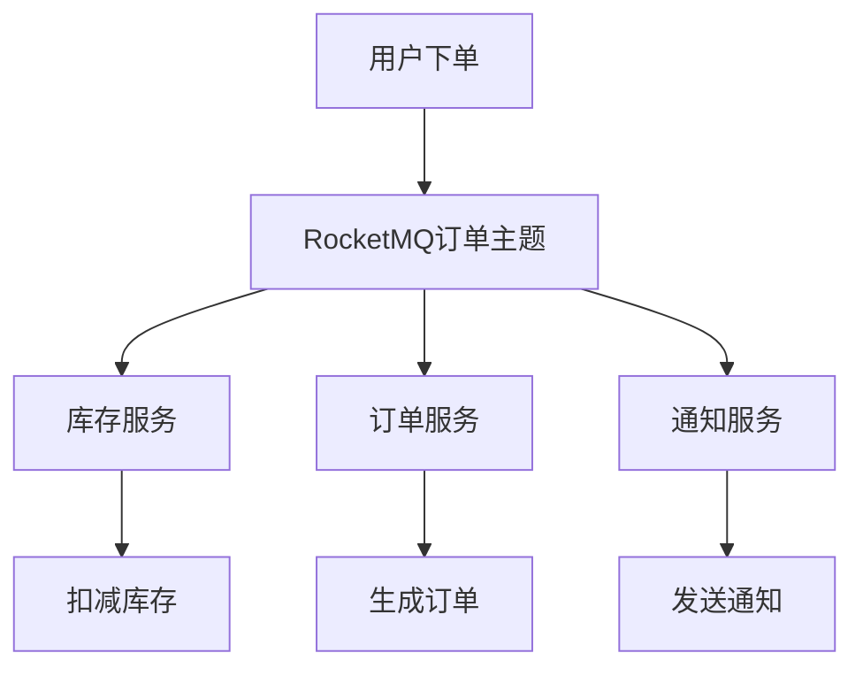

# RocketMQ 异步解耦案例

在现代分布式系统中，异步解耦是一种常见的设计模式，它能够有效提升系统的可扩展性和可靠性。RocketMQ作为一款高性能的消息中间件，广泛应用于异步解耦场景中。本文将带你了解RocketMQ的异步解耦概念，并通过一个实际案例展示其实现方式。

## 什么是异步解耦？

异步解耦是指通过消息队列将系统的不同模块解耦，使得模块之间的通信不再直接依赖，而是通过消息进行异步通信。这种方式可以降低模块之间的耦合度，提升系统的灵活性和可维护性。

### 异步解耦的优势
- **提高系统响应速度**：异步处理可以避免阻塞主线程，提升系统的响应速度。
- **增强系统可靠性**：消息队列可以保证消息的可靠传递，即使某个模块暂时不可用，消息也不会丢失。
- **提升系统扩展性**：通过解耦，可以更容易地对系统进行扩展和优化。

## RocketMQ 异步解耦案例

假设我们有一个电商系统，用户下单后需要执行以下操作：
1. 扣减库存
2. 生成订单
3. 发送通知

如果这些操作都是同步执行的，那么系统的响应时间会较长，且任何一个操作失败都会导致整个流程失败。通过RocketMQ的异步解耦，我们可以将这些操作解耦，提升系统的性能和可靠性。

### 案例实现

#### 1. 用户下单
当用户下单时，系统会将订单信息发送到RocketMQ的订单主题（Topic）中。

```java
// 用户下单代码示例
DefaultMQProducer producer = new DefaultMQProducer("order_producer_group");
producer.start();
Message msg = new Message("order_topic", "order_tag", orderInfo.getBytes());
SendResult sendResult = producer.send(msg);
producer.shutdown();
```

#### 2. 扣减库存
库存服务订阅订单主题，接收到订单消息后执行扣减库存操作。

```java
// 库存服务代码示例
DefaultMQPushConsumer consumer = new DefaultMQPushConsumer("inventory_consumer_group");
consumer.subscribe("order_topic", "*");
consumer.registerMessageListener((MessageListenerConcurrently) (msgs, context) -> {
    for (MessageExt msg : msgs) {
        String orderInfo = new String(msg.getBody());
        // 扣减库存逻辑
        reduceInventory(orderInfo);
    }
    return ConsumeConcurrentlyStatus.CONSUME_SUCCESS;
});
consumer.start();
```

#### 3. 生成订单
订单服务同样订阅订单主题，接收到订单消息后生成订单。

```java
// 订单服务代码示例
DefaultMQPushConsumer consumer = new DefaultMQPushConsumer("order_consumer_group");
consumer.subscribe("order_topic", "*");
consumer.registerMessageListener((MessageListenerConcurrently) (msgs, context) -> {
    for (MessageExt msg : msgs) {
        String orderInfo = new String(msg.getBody());
        // 生成订单逻辑
        createOrder(orderInfo);
    }
    return ConsumeConcurrentlyStatus.CONSUME_SUCCESS;
});
consumer.start();
```

#### 4. 发送通知
通知服务订阅订单主题，接收到订单消息后发送通知。

```java
// 通知服务代码示例
DefaultMQPushConsumer consumer = new DefaultMQPushConsumer("notification_consumer_group");
consumer.subscribe("order_topic", "*");
consumer.registerMessageListener((MessageListenerConcurrently) (msgs, context) -> {
    for (MessageExt msg : msgs) {
        String orderInfo = new String(msg.getBody());
        // 发送通知逻辑
        sendNotification(orderInfo);
    }
    return ConsumeConcurrentlyStatus.CONSUME_SUCCESS;
});
consumer.start();
```

### 流程图



## 总结

通过RocketMQ的异步解耦，我们可以将电商系统中的下单、扣减库存、生成订单和发送通知等操作解耦，提升系统的性能和可靠性。这种方式不仅适用于电商系统，还可以应用于其他需要异步处理的场景。

:::tip
在实际应用中，建议对消息的消费进行幂等处理，以避免重复消费带来的问题。
:::

## 附加资源

- [RocketMQ官方文档](https://rocketmq.apache.org/docs/)
- [RocketMQ GitHub仓库](https://github.com/apache/rocketmq)

## 练习

1. 尝试在本地搭建一个RocketMQ环境，并实现上述案例。
2. 思考如何优化消息的消费顺序和并发处理能力。