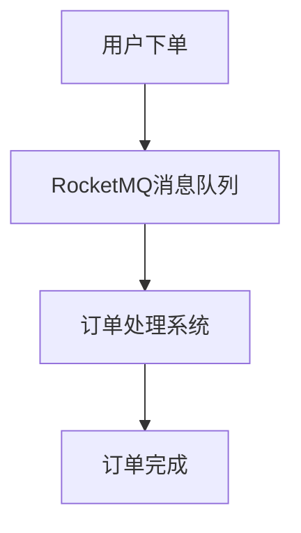

# RocketMQ 削峰填谷案例

## 什么是削峰填谷？

在分布式系统中，削峰填谷是一种常见的流量控制策略。它通过平滑处理突发的流量高峰，将高峰期的请求分散到低峰期处理，从而避免系统因瞬时高并发而崩溃。RocketMQ作为一款高性能的消息中间件，非常适合用于实现削峰填谷的场景。

## 为什么需要削峰填谷？

在高并发场景中，系统可能会遇到瞬时流量激增的情况。例如，电商平台在“双十一”期间，订单量可能会在短时间内激增。如果系统无法处理这些突发的请求，可能会导致服务崩溃或响应延迟。通过削峰填谷，我们可以将高峰期的请求暂时存储到消息队列中，然后在低峰期逐步处理，从而保证系统的稳定性。

## RocketMQ 如何实现削峰填谷？

RocketMQ通过消息队列的异步处理机制，能够有效地实现削峰填谷。具体步骤如下：

1. **消息生产**：在高峰期，生产者将请求封装成消息并发送到RocketMQ的队列中。
2. **消息存储**：RocketMQ将消息持久化存储，确保消息不会丢失。
3. **消息消费**：在低峰期，消费者从队列中拉取消息并进行处理。

通过这种方式，RocketMQ能够将高峰期的请求“削峰”，并在低峰期“填谷”，从而平滑处理流量波动。

## 代码示例

以下是一个简单的RocketMQ削峰填谷的代码示例：

### 生产者代码

```java
import org.apache.rocketmq.client.producer.DefaultMQProducer;
import org.apache.rocketmq.common.message.Message;

public class Producer {
    public static void main(String[] args) throws Exception {
        // 实例化一个生产者
        DefaultMQProducer producer = new DefaultMQProducer("producer_group");
        // 设置NameServer地址
        producer.setNamesrvAddr("localhost:9876");
        // 启动生产者
        producer.start();

        // 模拟高峰期发送消息
        for (int i = 0; i < 1000; i++) {
            Message msg = new Message("TopicTest", "TagA", ("Hello RocketMQ " + i).getBytes());
            // 发送消息
            producer.send(msg);
        }

        // 关闭生产者
        producer.shutdown();
    }
}
```

### 消费者代码

```java
import org.apache.rocketmq.client.consumer.DefaultMQPushConsumer;
import org.apache.rocketmq.client.consumer.listener.ConsumeConcurrentlyContext;
import org.apache.rocketmq.client.consumer.listener.ConsumeConcurrentlyStatus;
import org.apache.rocketmq.client.consumer.listener.MessageListenerConcurrently;
import org.apache.rocketmq.common.message.MessageExt;

import java.util.List;

public class Consumer {
    public static void main(String[] args) throws Exception {
        // 实例化一个消费者
        DefaultMQPushConsumer consumer = new DefaultMQPushConsumer("consumer_group");
        // 设置NameServer地址
        consumer.setNamesrvAddr("localhost:9876");
        // 订阅Topic和Tag
        consumer.subscribe("TopicTest", "TagA");

        // 注册消息监听器
        consumer.registerMessageListener(new MessageListenerConcurrently() {
            @Override
            public ConsumeConcurrentlyStatus consumeMessage(List<MessageExt> msgs, ConsumeConcurrentlyContext context) {
                for (MessageExt msg : msgs) {
                    System.out.println("Received message: " + new String(msg.getBody()));
                }
                return ConsumeConcurrentlyStatus.CONSUME_SUCCESS;
            }
        });

        // 启动消费者
        consumer.start();
        System.out.println("Consumer Started.");
    }
}
```

### 输入与输出

- **输入**：生产者发送1000条消息到RocketMQ队列中。
- **输出**：消费者在低峰期逐步处理这些消息，输出每条消息的内容。

## 实际案例：电商订单处理

假设我们有一个电商平台，每天在特定时间段（如上午10点）会有大量用户下单，导致订单系统面临瞬时高并发压力。通过使用RocketMQ，我们可以将订单请求放入消息队列中，然后在低峰期逐步处理这些订单。

### 流程图



在这个案例中，RocketMQ充当了“缓冲器”的角色，确保订单系统不会因为瞬时高并发而崩溃。

## 总结

通过RocketMQ实现削峰填谷，我们能够有效地应对高并发场景下的流量波动问题。RocketMQ的异步处理机制和消息持久化能力，使得它成为实现削峰填谷的理想选择。

## 附加资源与练习

- **资源**：
  - [RocketMQ官方文档](https://rocketmq.apache.org/docs/)
  - [RocketMQ GitHub仓库](https://github.com/apache/rocketmq)

- **练习**：
  1. 尝试修改生产者和消费者代码，模拟不同的流量场景。
  2. 研究RocketMQ的消息重试机制，了解如何处理消费失败的消息。

:::tip
在实际生产环境中，建议结合监控系统（如Prometheus）对RocketMQ的性能进行实时监控，以便及时发现并解决问题。
:::