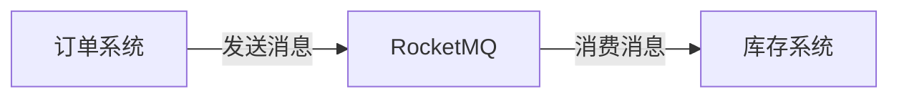

# RocketMQ 系统解耦案例

在现代分布式系统中，系统解耦是一个非常重要的设计原则。通过解耦，我们可以将复杂的系统拆分为多个独立的模块，每个模块只关注自己的核心功能，从而提高系统的可维护性和扩展性。RocketMQ作为一款高性能、高可用的分布式消息队列，非常适合用于实现系统解耦。

## 什么是系统解耦？

系统解耦是指将系统中相互依赖的模块通过某种机制（如消息队列）进行隔离，使得它们可以独立开发、部署和扩展。解耦后的系统模块之间通过消息进行通信，而不是直接调用对方的接口。这种方式可以降低模块之间的耦合度，提高系统的灵活性和可维护性。

## RocketMQ 在系统解耦中的作用

RocketMQ通过消息队列的方式，将消息的生产者和消费者解耦。生产者只需要将消息发送到RocketMQ，而不需要关心消息的消费者是谁。同样，消费者只需要从RocketMQ中获取消息，而不需要关心消息的生产者是谁。这种方式使得生产者和消费者可以独立开发和部署，从而实现系统解耦。

## 实际案例：订单系统与库存系统的解耦

假设我们有一个电商系统，其中包含订单系统和库存系统。订单系统负责处理用户的订单，而库存系统负责管理商品的库存。在传统的架构中，订单系统在处理订单时，需要直接调用库存系统的接口来扣减库存。这种方式存在以下问题：

1. **耦合度高**：订单系统和库存系统紧密耦合，任何一个系统的变更都可能影响到另一个系统。
2. **性能瓶颈**：如果库存系统的接口响应较慢，订单系统的性能也会受到影响。
3. **扩展性差**：如果需要增加新的系统（如物流系统），订单系统需要修改代码来调用新的系统接口。

为了解决这些问题，我们可以使用RocketMQ来实现订单系统和库存系统的解耦。

### 系统架构设计



在这个架构中，订单系统在处理订单时，只需要将订单信息发送到RocketMQ，而不需要直接调用库存系统的接口。库存系统从RocketMQ中获取订单信息，并进行库存扣减操作。

### 代码示例

#### 订单系统（生产者）

```java
import org.apache.rocketmq.client.producer.DefaultMQProducer;
import org.apache.rocketmq.common.message.Message;

public class OrderSystem {
    public static void main(String[] args) throws Exception {
        // 创建生产者实例
        DefaultMQProducer producer = new DefaultMQProducer("order_producer_group");
        // 设置NameServer地址
        producer.setNamesrvAddr("localhost:9876");
        // 启动生产者
        producer.start();

        // 创建消息
        String orderInfo = "{\"orderId\": \"12345\", \"productId\": \"67890\", \"quantity\": 2}";
        Message message = new Message("order_topic", "order_tag", orderInfo.getBytes());

        // 发送消息
        producer.send(message);

        // 关闭生产者
        producer.shutdown();
    }
}
```

#### 库存系统（消费者）

```java
import org.apache.rocketmq.client.consumer.DefaultMQPushConsumer;
import org.apache.rocketmq.client.consumer.listener.ConsumeConcurrentlyContext;
import org.apache.rocketmq.client.consumer.listener.ConsumeConcurrentlyStatus;
import org.apache.rocketmq.client.consumer.listener.MessageListenerConcurrently;
import org.apache.rocketmq.common.message.MessageExt;

import java.util.List;

public class InventorySystem {
    public static void main(String[] args) throws Exception {
        // 创建消费者实例
        DefaultMQPushConsumer consumer = new DefaultMQPushConsumer("inventory_consumer_group");
        // 设置NameServer地址
        consumer.setNamesrvAddr("localhost:9876");
        // 订阅主题
        consumer.subscribe("order_topic", "order_tag");

        // 注册消息监听器
        consumer.registerMessageListener(new MessageListenerConcurrently() {
            @Override
            public ConsumeConcurrentlyStatus consumeMessage(List<MessageExt> msgs, ConsumeConcurrentlyContext context) {
                for (MessageExt msg : msgs) {
                    String orderInfo = new String(msg.getBody());
                    System.out.println("Received order info: " + orderInfo);
                    // 处理库存扣减逻辑
                    // ...
                }
                return ConsumeConcurrentlyStatus.CONSUME_SUCCESS;
            }
        });

        // 启动消费者
        consumer.start();
    }
}
```

### 运行结果

当订单系统发送订单信息到RocketMQ后，库存系统会从RocketMQ中获取到该消息，并进行库存扣减操作。通过这种方式，订单系统和库存系统实现了完全的解耦。

## 总结

通过RocketMQ实现系统解耦，可以显著降低系统模块之间的耦合度，提高系统的可维护性和扩展性。在实际应用中，RocketMQ还可以用于其他场景，如异步处理、流量削峰等。

:::tip
**提示**：在实际生产环境中，建议对RocketMQ进行高可用配置，并监控消息的消费情况，以确保系统的稳定运行。
:::

## 附加资源

- [RocketMQ官方文档](https://rocketmq.apache.org/docs/)
- [RocketMQ GitHub仓库](https://github.com/apache/rocketmq)

## 练习

1. 尝试在本地的RocketMQ环境中运行上述代码，观察消息的生产和消费过程。
2. 修改代码，增加一个新的系统（如物流系统），并实现订单系统与物流系统的解耦。