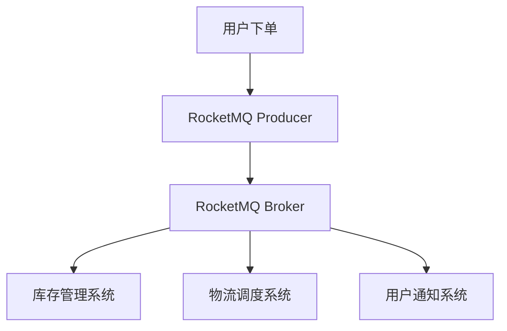

# RocketMQ 大数据处理案例

RocketMQ 是一款高性能、高吞吐量的分布式消息中间件，广泛应用于大数据处理场景。它能够处理海量数据，并确保数据的可靠传输和高效处理。本文将介绍 RocketMQ 在大数据处理中的典型应用场景，并通过实际案例展示其强大的数据处理能力。

## 什么是大数据处理？

大数据处理是指对海量数据进行收集、存储、处理和分析的过程。这些数据通常具有高吞吐量、高并发和低延迟的特点。RocketMQ 作为消息中间件，能够在大数据处理中扮演重要角色，帮助系统高效地传输和处理数据。

## RocketMQ 在大数据处理中的优势

1. **高吞吐量**：RocketMQ 能够处理每秒数百万条消息，非常适合大数据场景。
2. **低延迟**：RocketMQ 的延迟通常在毫秒级别，能够满足实时数据处理的需求。
3. **高可靠性**：RocketMQ 提供了消息持久化和消息重试机制，确保数据不会丢失。
4. **分布式架构**：RocketMQ 的分布式架构能够轻松扩展，适应不断增长的数据量。

## 实际案例：电商平台订单处理系统

假设我们有一个电商平台，每天需要处理数百万笔订单。订单数据需要实时传输到后端系统进行处理，例如库存管理、物流调度和用户通知等。RocketMQ 可以在这个场景中发挥重要作用。

### 系统架构



在这个架构中，用户下单后，订单数据会被发送到 RocketMQ Broker。RocketMQ Broker 将消息分发给不同的消费者，包括库存管理系统、物流调度系统和用户通知系统。

### 代码示例

以下是一个简单的 RocketMQ 生产者示例，用于发送订单消息：

```java
import org.apache.rocketmq.client.producer.DefaultMQProducer;
import org.apache.rocketmq.common.message.Message;

public class OrderProducer {
    public static void main(String[] args) throws Exception {
        // 实例化生产者
        DefaultMQProducer producer = new DefaultMQProducer("order_producer_group");
        // 设置NameServer地址
        producer.setNamesrvAddr("localhost:9876");
        // 启动生产者
        producer.start();

        // 创建订单消息
        Message msg = new Message("OrderTopic", "TagA", "OrderID12345", "{\"orderId\":\"12345\",\"productId\":\"67890\",\"quantity\":2}".getBytes());

        // 发送消息
        producer.send(msg);

        // 关闭生产者
        producer.shutdown();
    }
}
```

### 消费者示例

以下是一个简单的 RocketMQ 消费者示例，用于处理订单消息：

```java
import org.apache.rocketmq.client.consumer.DefaultMQPushConsumer;
import org.apache.rocketmq.client.consumer.listener.ConsumeConcurrentlyContext;
import org.apache.rocketmq.client.consumer.listener.ConsumeConcurrentlyStatus;
import org.apache.rocketmq.client.consumer.listener.MessageListenerConcurrently;
import org.apache.rocketmq.common.message.MessageExt;

import java.util.List;

public class OrderConsumer {
    public static void main(String[] args) throws Exception {
        // 实例化消费者
        DefaultMQPushConsumer consumer = new DefaultMQPushConsumer("order_consumer_group");
        // 设置NameServer地址
        consumer.setNamesrvAddr("localhost:9876");
        // 订阅Topic和Tag
        consumer.subscribe("OrderTopic", "TagA");

        // 注册消息监听器
        consumer.registerMessageListener(new MessageListenerConcurrently() {
            @Override
            public ConsumeConcurrentlyStatus consumeMessage(List<MessageExt> msgs, ConsumeConcurrentlyContext context) {
                for (MessageExt msg : msgs) {
                    System.out.println("Received order: " + new String(msg.getBody()));
                }
                return ConsumeConcurrentlyStatus.CONSUME_SUCCESS;
            }
        });

        // 启动消费者
        consumer.start();
    }
}
```

### 输入与输出

- **输入**：订单消息，例如 `{"orderId":"12345","productId":"67890","quantity":2}`
- **输出**：消费者接收到订单消息并进行处理，例如打印订单信息。

## 总结

RocketMQ 在大数据处理中表现出色，能够高效、可靠地处理海量数据。通过本文的案例，我们了解了 RocketMQ 在电商平台订单处理系统中的应用。RocketMQ 的高吞吐量、低延迟和高可靠性使其成为大数据处理的理想选择。

## 附加资源

- [RocketMQ 官方文档](https://rocketmq.apache.org/docs/)
- [RocketMQ GitHub 仓库](https://github.com/apache/rocketmq)

## 练习

1. 尝试修改生产者代码，发送不同类型的订单消息。
2. 扩展消费者代码，将订单消息存储到数据库中。
3. 研究 RocketMQ 的消息重试机制，并尝试在消费者中实现消息重试逻辑。

:::tip
在实际项目中，建议使用 RocketMQ 的集群模式以提高系统的可靠性和扩展性。
:::