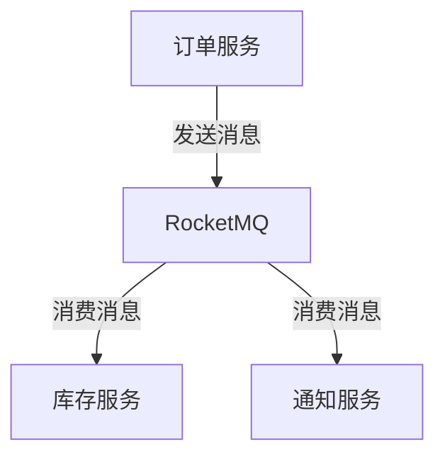

# RocketMQ 微服务集成案例

RocketMQ 是一款高性能、高可靠、分布式的消息中间件，广泛应用于微服务架构中，用于解耦服务、异步通信和流量削峰等场景。本文将结合一个实际案例，逐步讲解如何在微服务中集成 RocketMQ，并展示其在实际应用中的价值。

## 1. 什么是 RocketMQ？

RocketMQ 是阿里巴巴开源的一款分布式消息中间件，具有以下特点：
- **高性能**：支持高吞吐量和低延迟的消息传递。
- **高可靠**：支持消息持久化和事务消息，确保消息不丢失。
- **分布式**：支持集群部署，具备高可用性和扩展性。

在微服务架构中，RocketMQ 常用于以下场景：
- **服务解耦**：通过消息队列将服务间的直接调用解耦。
- **异步通信**：提高系统响应速度，减少同步调用的等待时间。
- **流量削峰**：通过消息队列缓冲请求，避免系统过载。

## 2. 微服务集成 RocketMQ 的案例

假设我们有一个电商系统，包含以下微服务：
- **订单服务**：负责创建订单。
- **库存服务**：负责扣减库存。
- **通知服务**：负责发送订单确认通知。

在传统同步调用模式下，订单服务需要依次调用库存服务和通知服务，这会导致系统耦合度高、响应时间长。通过 RocketMQ，我们可以将这些调用解耦，实现异步通信。

### 2.1 系统架构设计

以下是系统的架构设计图：



### 2.2 实现步骤

#### 步骤 1：安装 RocketMQ

首先，需要在本地或服务器上安装 RocketMQ。可以通过以下命令快速启动 RocketMQ：

```bash
# 下载 RocketMQ
wget https://archive.apache.org/dist/rocketmq/4.9.4/rocketmq-all-4.9.4-bin-release.zip

# 解压并启动
unzip rocketmq-all-4.9.4-bin-release.zip
cd rocketmq-all-4.9.4-bin-release
nohup sh bin/mqnamesrv &
nohup sh bin/mqbroker -n localhost:9876 &
```

#### 步骤 2：订单服务发送消息

订单服务在创建订单后，向 RocketMQ 发送一条消息，通知库存服务和通知服务处理后续逻辑。

以下是订单服务的代码示例（使用 Java 和 RocketMQ 客户端）：

```java
import org.apache.rocketmq.client.producer.DefaultMQProducer;
import org.apache.rocketmq.common.message.Message;

public class OrderService {
    public static void main(String[] args) throws Exception {
        // 创建生产者实例
        DefaultMQProducer producer = new DefaultMQProducer("order_producer_group");
        producer.setNamesrvAddr("localhost:9876");
        producer.start();

        // 创建订单
        String orderId = "ORDER_123456";
        String messageBody = "订单创建成功，订单ID：" + orderId;

        // 发送消息
        Message message = new Message("order_topic", "order_tag", messageBody.getBytes());
        producer.send(message);

        System.out.println("订单消息已发送：" + messageBody);

        // 关闭生产者
        producer.shutdown();
    }
}
```

#### 步骤 3：库存服务消费消息

库存服务从 RocketMQ 订阅消息，并处理库存扣减逻辑。

以下是库存服务的代码示例：

```java
import org.apache.rocketmq.client.consumer.DefaultMQPushConsumer;
import org.apache.rocketmq.client.consumer.listener.ConsumeConcurrentlyContext;
import org.apache.rocketmq.client.consumer.listener.ConsumeConcurrentlyStatus;
import org.apache.rocketmq.client.consumer.listener.MessageListenerConcurrently;
import org.apache.rocketmq.common.message.MessageExt;

import java.util.List;

public class InventoryService {
    public static void main(String[] args) throws Exception {
        // 创建消费者实例
        DefaultMQPushConsumer consumer = new DefaultMQPushConsumer("inventory_consumer_group");
        consumer.setNamesrvAddr("localhost:9876");
        consumer.subscribe("order_topic", "order_tag");

        // 注册消息监听器
        consumer.registerMessageListener(new MessageListenerConcurrently() {
            @Override
            public ConsumeConcurrentlyStatus consumeMessage(List<MessageExt> messages, ConsumeConcurrentlyContext context) {
                for (MessageExt message : messages) {
                    String messageBody = new String(message.getBody());
                    System.out.println("库存服务收到消息：" + messageBody);

                    // 处理库存扣减逻辑
                    System.out.println("库存扣减成功！");
                }
                return ConsumeConcurrentlyStatus.CONSUME_SUCCESS;
            }
        });

        // 启动消费者
        consumer.start();
        System.out.println("库存服务已启动，等待消息...");
    }
}
```

#### 步骤 4：通知服务消费消息

通知服务从 RocketMQ 订阅消息，并发送订单确认通知。

以下是通知服务的代码示例：

```java
import org.apache.rocketmq.client.consumer.DefaultMQPushConsumer;
import org.apache.rocketmq.client.consumer.listener.ConsumeConcurrentlyContext;
import org.apache.rocketmq.client.consumer.listener.ConsumeConcurrentlyStatus;
import org.apache.rocketmq.client.consumer.listener.MessageListenerConcurrently;
import org.apache.rocketmq.common.message.MessageExt;

import java.util.List;

public class NotificationService {
    public static void main(String[] args) throws Exception {
        // 创建消费者实例
        DefaultMQPushConsumer consumer = new DefaultMQPushConsumer("notification_consumer_group");
        consumer.setNamesrvAddr("localhost:9876");
        consumer.subscribe("order_topic", "order_tag");

        // 注册消息监听器
        consumer.registerMessageListener(new MessageListenerConcurrently() {
            @Override
            public ConsumeConcurrentlyStatus consumeMessage(List<MessageExt> messages, ConsumeConcurrentlyContext context) {
                for (MessageExt message : messages) {
                    String messageBody = new String(message.getBody());
                    System.out.println("通知服务收到消息：" + messageBody);

                    // 发送通知
                    System.out.println("已发送订单确认通知！");
                }
                return ConsumeConcurrentlyStatus.CONSUME_SUCCESS;
            }
        });

        // 启动消费者
        consumer.start();
        System.out.println("通知服务已启动，等待消息...");
    }
}
```

### 2.3 运行结果

启动订单服务、库存服务和通知服务后，订单服务会发送一条消息到 RocketMQ，库存服务和通知服务会分别消费该消息并执行相应的逻辑。

输出示例：

```
订单消息已发送：订单创建成功，订单ID：ORDER_123456
库存服务收到消息：订单创建成功，订单ID：ORDER_123456
库存扣减成功！
通知服务收到消息：订单创建成功，订单ID：ORDER_123456
已发送订单确认通知！
```

## 3. 总结

通过本案例，我们展示了如何在微服务架构中集成 RocketMQ，实现服务解耦和异步通信。RocketMQ 的高性能和高可靠性使其成为微服务架构中的重要组件。

:::tip 提示
在实际项目中，可以根据需求调整 RocketMQ 的配置，例如消息持久化策略、消费者负载均衡等。
:::

## 4. 附加资源与练习

- **官方文档**：[RocketMQ 官方文档](https://rocketmq.apache.org/docs/)
- **练习**：尝试在本案例的基础上，增加一个支付服务，并在支付成功后发送消息通知其他服务。

希望本文能帮助你更好地理解 RocketMQ 在微服务中的应用场景！如果有任何问题，欢迎在评论区留言讨论。