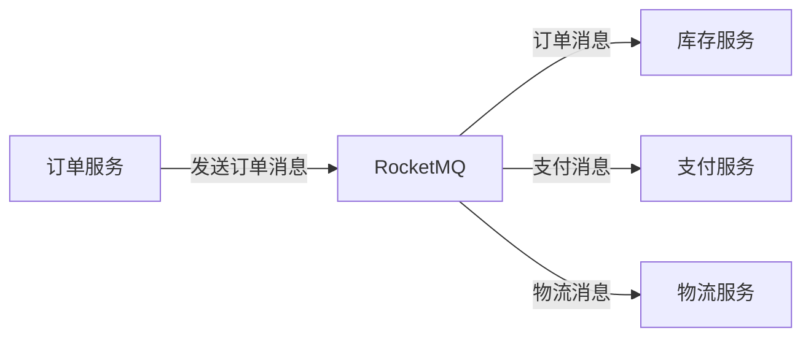

# RocketMQ 电商应用案例

RocketMQ 是一款高性能、高可用的分布式消息中间件，广泛应用于电商、金融、物流等领域。在电商场景中，RocketMQ 能够有效解决高并发、异步处理、系统解耦等问题。本文将结合一个电商应用案例，逐步讲解 RocketMQ 的使用场景和实现方法。

## 1. 电商场景中的消息队列需求

在电商系统中，用户下单后，系统需要处理多个任务，例如：

- 订单创建
- 库存扣减
- 支付处理
- 物流调度
- 通知用户

这些任务通常是异步处理的，并且需要保证高可靠性和高并发性。RocketMQ 作为消息中间件，能够将这些任务解耦，并通过消息队列的方式实现异步处理。

## 2. RocketMQ 在电商中的应用场景

### 2.1 订单创建与库存扣减

当用户下单时，订单服务会生成订单信息，并将订单消息发送到 RocketMQ 的订单主题（Topic）中。库存服务订阅该主题，接收到订单消息后，进行库存扣减操作。

```java
// 订单服务：发送订单消息
DefaultMQProducer producer = new DefaultMQProducer("order_producer_group");
producer.start();
Message msg = new Message("order_topic", "order_tag", "order_id_12345", "订单创建".getBytes());
SendResult sendResult = producer.send(msg);
producer.shutdown();
```

```java
// 库存服务：消费订单消息
DefaultMQPushConsumer consumer = new DefaultMQPushConsumer("inventory_consumer_group");
consumer.subscribe("order_topic", "*");
consumer.registerMessageListener((MessageListenerConcurrently) (msgs, context) -> {
    for (MessageExt msg : msgs) {
        // 处理库存扣减逻辑
        System.out.println("收到订单消息: " + new String(msg.getBody()));
    }
    return ConsumeConcurrentlyStatus.CONSUME_SUCCESS;
});
consumer.start();
```

### 2.2 支付处理与物流调度

支付服务和物流服务可以分别订阅支付主题和物流主题，处理相应的业务逻辑。通过 RocketMQ 的消息队列，系统能够实现异步处理，提高系统的响应速度和吞吐量。



### 2.3 通知用户

订单处理完成后，系统可以通过 RocketMQ 发送通知消息给用户。例如，发送短信或邮件通知用户订单状态。

```java
// 通知服务：消费通知消息
DefaultMQPushConsumer consumer = new DefaultMQPushConsumer("notification_consumer_group");
consumer.subscribe("notification_topic", "*");
consumer.registerMessageListener((MessageListenerConcurrently) (msgs, context) -> {
    for (MessageExt msg : msgs) {
        // 发送通知给用户
        System.out.println("发送通知: " + new String(msg.getBody()));
    }
    return ConsumeConcurrentlyStatus.CONSUME_SUCCESS;
});
consumer.start();
```

## 3. 实际案例：电商订单处理流程

假设我们有一个电商平台，用户下单后，系统需要完成以下步骤：

1. **订单创建**：订单服务生成订单信息，并发送订单消息到 RocketMQ。
2. **库存扣减**：库存服务消费订单消息，进行库存扣减。
3. **支付处理**：支付服务消费支付消息，处理支付逻辑。
4. **物流调度**：物流服务消费物流消息，调度物流。
5. **通知用户**：通知服务消费通知消息，发送订单状态通知给用户。

通过 RocketMQ，这些步骤可以异步处理，系统能够高效地处理大量订单。

## 4. 总结

RocketMQ 在电商场景中扮演着重要的角色，能够有效解决高并发、异步处理、系统解耦等问题。通过本文的案例，我们了解了 RocketMQ 在订单处理、库存扣减、支付处理、物流调度和用户通知等场景中的应用。

:::tip
在实际开发中，建议根据业务需求合理设计消息主题和消费者组，确保消息的可靠性和系统的可扩展性。
:::

## 5. 附加资源与练习

- **练习**：尝试在本地搭建 RocketMQ 环境，模拟电商订单处理流程。
- **资源**：参考 [RocketMQ 官方文档](https://rocketmq.apache.org/docs/) 了解更多高级特性和最佳实践。

通过本文的学习，你应该对 RocketMQ 在电商场景中的应用有了初步的了解。继续深入学习 RocketMQ 的其他特性，将有助于你在实际项目中更好地应用它。