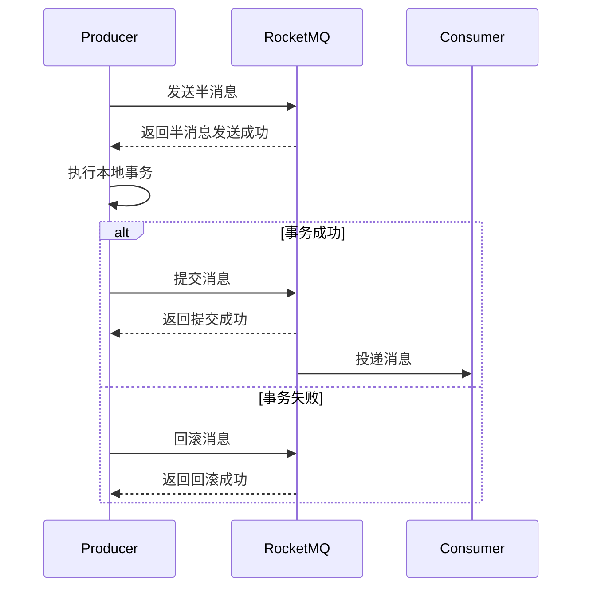

# RocketMQ 事务集成案例

## 介绍

RocketMQ是阿里巴巴开源的一款分布式消息中间件，广泛应用于高并发、高吞吐量的场景。事务消息是RocketMQ提供的一种特殊消息类型，用于确保消息发送与本地事务的一致性。本文将详细介绍RocketMQ事务消息的概念、实现原理以及如何在实际项目中集成事务消息。

## 什么是RocketMQ事务消息？

RocketMQ事务消息是一种特殊的消息类型，它允许消息发送与本地事务的原子性操作。具体来说，事务消息的发送分为两个阶段：

1. **预提交阶段**：发送半消息（Half Message）到RocketMQ，此时消息对消费者不可见。
2. **提交/回滚阶段**：根据本地事务的执行结果，决定是提交消息（使消息对消费者可见）还是回滚消息（删除消息）。

通过这种方式，RocketMQ确保了消息发送与本地事务的一致性。

## 事务消息的实现原理

RocketMQ事务消息的实现原理可以分为以下几个步骤：

1. **发送半消息**：生产者发送半消息到RocketMQ，此时消息对消费者不可见。
2. **执行本地事务**：生产者执行本地事务。
3. **提交/回滚消息**：根据本地事务的执行结果，生产者向RocketMQ发送提交或回滚请求。
4. **消息回查**：如果RocketMQ长时间未收到提交或回滚请求，会主动回查生产者的本地事务状态。



## 代码示例

以下是一个简单的RocketMQ事务消息的代码示例，展示了如何发送事务消息并处理本地事务。

```java
import org.apache.rocketmq.client.producer.LocalTransactionState;
import org.apache.rocketmq.client.producer.TransactionListener;
import org.apache.rocketmq.client.producer.TransactionMQProducer;
import org.apache.rocketmq.common.message.Message;
import org.apache.rocketmq.common.message.MessageExt;

public class TransactionProducer {
    public static void main(String[] args) throws Exception {
        // 创建事务消息生产者
        TransactionMQProducer producer = new TransactionMQProducer("transaction_producer_group");
        producer.setNamesrvAddr("localhost:9876");

        // 设置事务监听器
        producer.setTransactionListener(new TransactionListener() {
            @Override
            public LocalTransactionState executeLocalTransaction(Message msg, Object arg) {
                // 执行本地事务
                try {
                    // 模拟本地事务执行
                    System.out.println("Executing local transaction...");
                    // 假设本地事务执行成功
                    return LocalTransactionState.COMMIT_MESSAGE;
                } catch (Exception e) {
                    // 本地事务执行失败
                    return LocalTransactionState.ROLLBACK_MESSAGE;
                }
            }

            @Override
            public LocalTransactionState checkLocalTransaction(MessageExt msg) {
                // 消息回查
                return LocalTransactionState.COMMIT_MESSAGE;
            }
        });

        // 启动生产者
        producer.start();

        // 创建消息
        Message msg = new Message("transaction_topic", "transaction_tag", "transaction_key", "Hello RocketMQ Transaction Message".getBytes());

        // 发送事务消息
        producer.sendMessageInTransaction(msg, null);

        // 关闭生产者
        producer.shutdown();
    }
}
```

### 代码解释

1. **TransactionMQProducer**：事务消息生产者，用于发送事务消息。
2. **TransactionListener**：事务监听器，用于处理本地事务和消息回查。
3. **executeLocalTransaction**：执行本地事务的方法，返回事务状态（提交或回滚）。
4. **checkLocalTransaction**：消息回查方法，RocketMQ会定期调用此方法检查本地事务状态。

## 实际案例

假设我们有一个电商系统，用户在购买商品时需要扣减库存并发送订单消息。为了确保扣减库存和发送订单消息的一致性，我们可以使用RocketMQ事务消息。

1. **发送半消息**：发送订单消息到RocketMQ，此时消息对消费者不可见。
2. **执行本地事务**：扣减库存。
3. **提交/回滚消息**：根据扣减库存的结果，提交或回滚订单消息。

通过这种方式，我们确保了扣减库存和发送订单消息的原子性操作。

## 总结

RocketMQ事务消息是一种强大的工具，能够确保消息发送与本地事务的一致性。通过本文的介绍和代码示例，你应该已经掌握了RocketMQ事务消息的基本概念和使用方法。在实际项目中，事务消息可以广泛应用于需要保证数据一致性的场景。

## 附加资源

- [RocketMQ官方文档](https://rocketmq.apache.org/docs/)
- [RocketMQ GitHub仓库](https://github.com/apache/rocketmq)

## 练习

1. 尝试在本地环境中运行上述代码示例，观察事务消息的发送和消费过程。
2. 修改代码示例，模拟本地事务失败的情况，观察消息回滚的过程。
3. 在实际项目中，尝试使用RocketMQ事务消息解决一个数据一致性问题。

:::tip
在实际项目中，使用事务消息时需要注意消息回查的频率和超时时间，以避免对系统性能造成影响。
:::