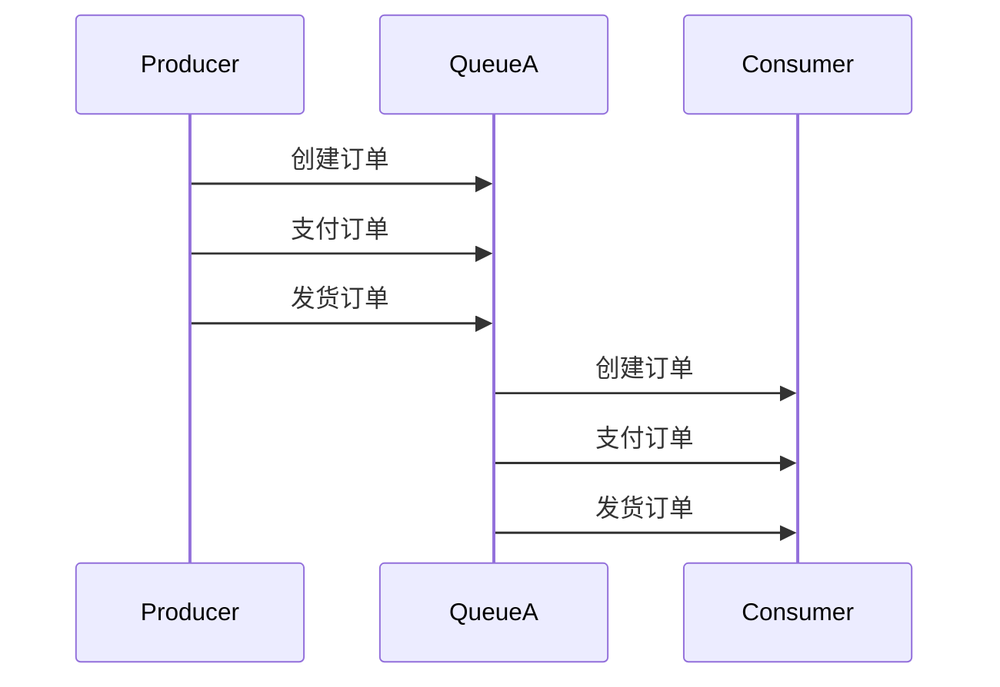

# RocketMQ 顺序处理案例

RocketMQ 是一个分布式消息中间件，广泛应用于异步通信、解耦系统、流量削峰等场景。其中，**顺序处理**是 RocketMQ 的一个重要特性，它确保消息按照发送的顺序被消费。本文将详细介绍 RocketMQ 的顺序处理机制，并通过实际案例帮助初学者理解其应用场景。

---

## 什么是顺序处理？

在分布式系统中，消息的顺序性是一个常见的需求。例如，在电商系统中，订单的创建、支付、发货等操作需要严格按照顺序执行。如果消息乱序，可能会导致业务逻辑错误。

RocketMQ 通过 **消息队列（MessageQueue）** 和 **消费者组（ConsumerGroup）** 的机制，支持顺序处理。具体来说：

1. **消息队列**：RocketMQ 将消息存储在多个队列中，每个队列内的消息是有序的。
2. **消费者组**：消费者组中的消费者会从指定的队列中拉取消息，确保同一队列的消息被顺序消费。

:::note
顺序处理的核心是确保同一队列的消息被同一个消费者顺序处理。如果消息被分散到多个队列，或者被多个消费者处理，顺序性就无法保证。
:::

---

## 顺序处理的实现

### 1. 生产者发送顺序消息

生产者需要将同一业务逻辑的消息发送到同一个队列中。RocketMQ 提供了 `MessageQueueSelector` 接口，允许开发者自定义消息的路由规则。

以下是一个发送顺序消息的示例：

```java
import org.apache.rocketmq.client.producer.DefaultMQProducer;
import org.apache.rocketmq.client.producer.MessageQueueSelector;
import org.apache.rocketmq.common.message.Message;
import org.apache.rocketmq.common.message.MessageQueue;

import java.util.List;

public class OrderedProducer {
    public static void main(String[] args) throws Exception {
        DefaultMQProducer producer = new DefaultMQProducer("OrderedProducerGroup");
        producer.start();

        for (int i = 0; i < 10; i++) {
            Message msg = new Message("OrderedTopic", "TagA", ("Hello RocketMQ " + i).getBytes());
            producer.send(msg, new MessageQueueSelector() {
                @Override
                public MessageQueue select(List<MessageQueue> mqs, Message msg, Object arg) {
                    // 根据业务逻辑选择队列
                    int queueId = (int) arg % mqs.size();
                    return mqs.get(queueId);
                }
            }, i); // i 作为参数传递给 select 方法
        }

        producer.shutdown();
    }
}
```

:::tip
在上面的代码中，`MessageQueueSelector` 根据传入的参数 `i` 选择队列，确保同一业务逻辑的消息发送到同一个队列。
:::

### 2. 消费者顺序消费

消费者需要以顺序模式消费消息。RocketMQ 提供了 `MessageListenerOrderly` 接口，确保同一队列的消息被顺序处理。

以下是一个顺序消费的示例：

```java
import org.apache.rocketmq.client.consumer.DefaultMQPushConsumer;
import org.apache.rocketmq.client.consumer.listener.ConsumeOrderlyContext;
import org.apache.rocketmq.client.consumer.listener.ConsumeOrderlyStatus;
import org.apache.rocketmq.client.consumer.listener.MessageListenerOrderly;
import org.apache.rocketmq.common.message.MessageExt;

import java.util.List;

public class OrderedConsumer {
    public static void main(String[] args) throws Exception {
        DefaultMQPushConsumer consumer = new DefaultMQPushConsumer("OrderedConsumerGroup");
        consumer.subscribe("OrderedTopic", "*");

        consumer.registerMessageListener(new MessageListenerOrderly() {
            @Override
            public ConsumeOrderlyStatus consumeMessage(List<MessageExt> msgs, ConsumeOrderlyContext context) {
                for (MessageExt msg : msgs) {
                    System.out.println("Received message: " + new String(msg.getBody()));
                }
                return ConsumeOrderlyStatus.SUCCESS;
            }
        });

        consumer.start();
        System.out.println("Consumer started.");
    }
}
```

:::caution
顺序消费模式下，消费者需要确保处理逻辑是幂等的，以避免消息重复消费导致的问题。
:::

---

## 实际应用场景

### 电商订单系统

在电商系统中，订单的状态流转（如创建、支付、发货）需要严格按照顺序执行。通过 RocketMQ 的顺序处理机制，可以确保订单状态的正确性。

例如：

1. **创建订单**：消息发送到队列 A。
2. **支付订单**：消息发送到队列 A。
3. **发货订单**：消息发送到队列 A。

消费者从队列 A 中顺序消费消息，确保订单状态的正确流转。



---

## 总结

RocketMQ 的顺序处理机制通过消息队列和消费者组的配合，确保消息的顺序消费。它在电商、金融等对顺序性要求较高的场景中具有重要应用。

:::warning
顺序处理虽然强大，但也增加了系统的复杂性。在实际应用中，需要根据业务需求权衡是否使用顺序处理。
:::

---

## 附加资源与练习

1. **练习**：尝试实现一个简单的订单系统，使用 RocketMQ 的顺序处理机制确保订单状态的正确流转。
2. **资源**：
   - [RocketMQ 官方文档](https://rocketmq.apache.org/docs/)
   - [RocketMQ GitHub 仓库](https://github.com/apache/rocketmq)

通过本文的学习，你应该已经掌握了 RocketMQ 顺序处理的基本概念和实现方法。继续实践和探索，你将能够更好地应用 RocketMQ 解决实际问题。