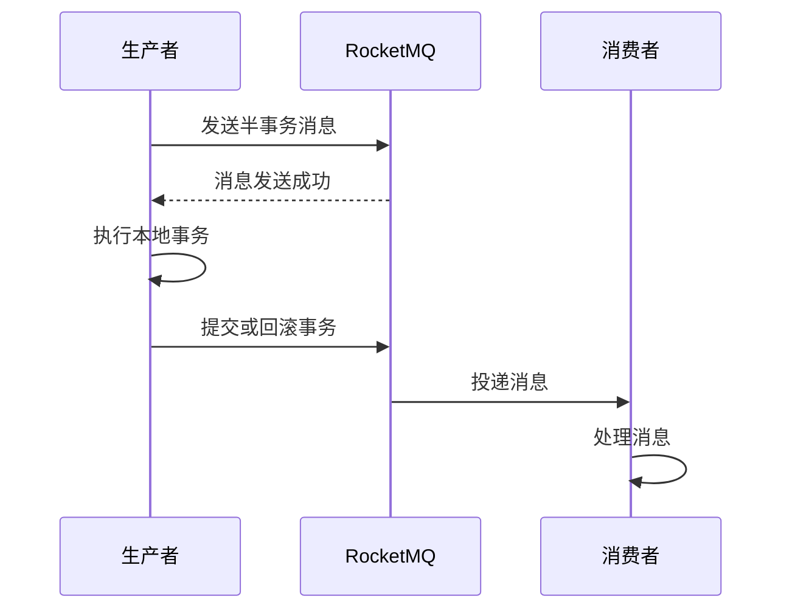

# RocketMQ 分布式事务案例

## 介绍

在分布式系统中，事务管理是一个复杂且关键的问题。传统的单机事务在分布式环境下无法直接应用，因为多个服务可能分布在不同的节点上，数据存储在不同的数据库中。RocketMQ作为一款高性能、高可用的分布式消息中间件，提供了分布式事务的解决方案，帮助开发者在分布式系统中实现事务的一致性。

本文将逐步讲解RocketMQ分布式事务的实现原理，并通过一个实际案例展示如何使用RocketMQ实现分布式事务。

## RocketMQ 分布式事务原理

RocketMQ的分布式事务解决方案基于**两阶段提交（2PC）**的思想。具体来说，RocketMQ通过以下步骤实现分布式事务：

1. **事务消息发送**：生产者发送一条半事务消息到RocketMQ，此时消息对消费者不可见。
2. **本地事务执行**：生产者执行本地事务，并根据事务执行结果决定提交或回滚消息。
3. **事务状态回查**：如果生产者未及时提交或回滚消息，RocketMQ会定期回查事务状态，确保事务的最终一致性。

:::tip
RocketMQ的分布式事务消息机制确保了即使在生产者宕机的情况下，事务消息也能最终被正确处理。
:::

## 实际案例：订单与库存系统

假设我们有一个电商系统，包含订单服务和库存服务。当用户下单时，订单服务需要创建订单，同时库存服务需要扣减库存。这两个操作需要在一个事务中完成，以确保数据的一致性。

### 1. 创建订单服务

首先，我们定义一个订单服务，负责创建订单并发送事务消息。

```java
public class OrderService {

    @Autowired
    private RocketMQTemplate rocketMQTemplate;

    public void createOrder(Order order) {
        // 发送半事务消息
        rocketMQTemplate.sendMessageInTransaction("order-topic", MessageBuilder.withPayload(order).build(), null);
    }

    @Transactional
    public void executeLocalTransaction(Message msg, Object arg) {
        // 执行本地事务：创建订单
        Order order = (Order) msg.getPayload();
        orderRepository.save(order);

        // 模拟本地事务执行成功
        if (order.getAmount() > 0) {
            // 提交事务
            rocketMQTemplate.send("order-topic", MessageBuilder.withPayload(order).build());
        } else {
            // 回滚事务
            throw new RuntimeException("订单金额不能为0");
        }
    }

    public RocketMQLocalTransactionState checkLocalTransaction(Message msg) {
        // 回查本地事务状态
        Order order = (Order) msg.getPayload();
        if (orderRepository.existsById(order.getId())) {
            return RocketMQLocalTransactionState.COMMIT;
        } else {
            return RocketMQLocalTransactionState.ROLLBACK;
        }
    }
}
```

### 2. 库存服务

库存服务监听订单消息，并在收到消息后扣减库存。

```java
@Service
@RocketMQMessageListener(topic = "order-topic", consumerGroup = "inventory-group")
public class InventoryService implements RocketMQListener<Order> {

    @Autowired
    private InventoryRepository inventoryRepository;

    @Override
    public void onMessage(Order order) {
        // 扣减库存
        inventoryRepository.decreaseStock(order.getProductId(), order.getQuantity());
    }
}
```

### 3. 事务流程图



## 总结

通过上述案例，我们可以看到RocketMQ如何通过事务消息机制实现分布式事务。RocketMQ的两阶段提交机制确保了即使在分布式环境下，事务也能保持一致性。

:::caution
在实际应用中，分布式事务的实现需要考虑更多的异常情况，如网络分区、服务宕机等。因此，建议在生产环境中对事务消息进行充分的测试和验证。
:::

## 附加资源

- [RocketMQ官方文档](https://rocketmq.apache.org/docs/)
- [分布式事务解决方案](https://en.wikipedia.org/wiki/Distributed_transaction)
- [Spring Cloud与RocketMQ集成](https://spring.io/projects/spring-cloud-stream)

## 练习

1. 尝试在本地环境中搭建RocketMQ，并实现上述订单与库存系统的分布式事务。
2. 修改订单服务，模拟本地事务失败的情况，观察RocketMQ如何处理事务回滚。
3. 扩展库存服务，增加库存不足时的回滚逻辑。

通过以上练习，你将更深入地理解RocketMQ在分布式事务中的应用。