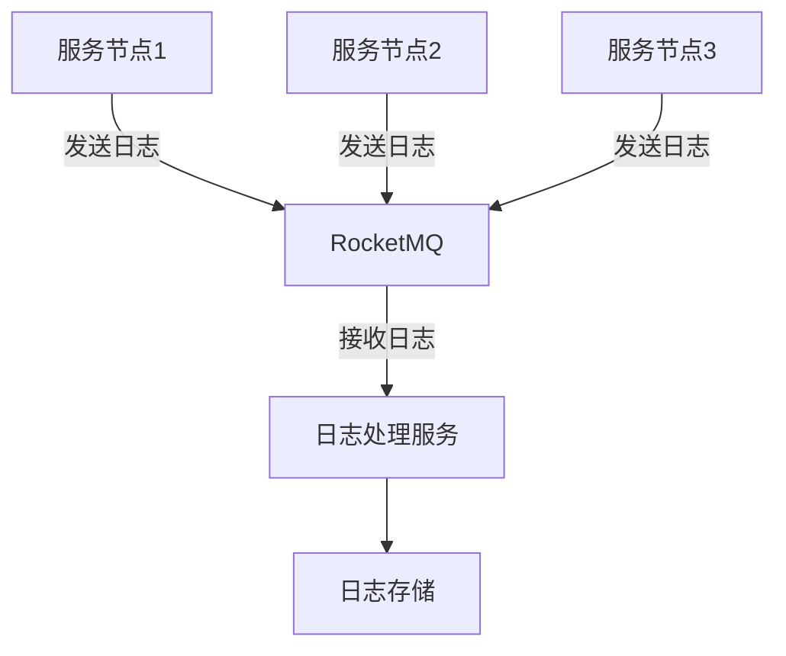

# RocketMQ 日志收集案例

在现代分布式系统中，日志收集是一个至关重要的环节。它帮助我们监控系统运行状态、排查问题以及进行数据分析。RocketMQ作为一款高性能、高可用的分布式消息中间件，非常适合用于日志收集场景。本文将详细介绍如何使用RocketMQ实现日志收集，并通过一个实际案例展示其应用。

## 什么是RocketMQ日志收集？

RocketMQ日志收集是指利用RocketMQ的消息传递机制，将分散在各个服务节点上的日志信息集中收集到一个或多个中心化的存储系统中。通过这种方式，我们可以方便地对日志进行统一管理和分析。

## 为什么选择RocketMQ进行日志收集？

RocketMQ具有以下优势，使其成为日志收集的理想选择：

1. **高吞吐量**：RocketMQ能够处理大量的消息，适合高并发的日志收集场景。
2. **低延迟**：RocketMQ的消息传递延迟非常低，确保日志能够及时被收集和处理。
3. **高可靠性**：RocketMQ提供了消息持久化和重试机制，确保日志不会丢失。
4. **分布式架构**：RocketMQ的分布式架构使其能够轻松扩展，适应不断增长的日志量。

## 实现步骤

### 1. 安装和配置RocketMQ

首先，我们需要在服务器上安装RocketMQ。可以通过以下命令下载并解压RocketMQ：

```bash
wget https://archive.apache.org/dist/rocketmq/4.9.4/rocketmq-all-4.9.4-bin-release.zip
unzip rocketmq-all-4.9.4-bin-release.zip
```

接下来，配置RocketMQ的NameServer和Broker。编辑`conf/broker.conf`文件，设置NameServer地址和Broker的相关参数：

```bash
namesrvAddr=127.0.0.1:9876
brokerClusterName=DefaultCluster
brokerName=broker-a
brokerId=0
```

### 2. 启动RocketMQ

启动NameServer和Broker：

```bash
nohup sh bin/mqnamesrv &
nohup sh bin/mqbroker -c conf/broker.conf &
```

### 3. 创建日志生产者

接下来，我们创建一个日志生产者，用于将日志消息发送到RocketMQ。以下是一个简单的Java示例：

```java
import org.apache.rocketmq.client.producer.DefaultMQProducer;
import org.apache.rocketmq.common.message.Message;

public class LogProducer {
    public static void main(String[] args) throws Exception {
        DefaultMQProducer producer = new DefaultMQProducer("log_producer_group");
        producer.setNamesrvAddr("127.0.0.1:9876");
        producer.start();

        for (int i = 0; i < 10; i++) {
            String logMessage = "Log message " + i;
            Message msg = new Message("LogTopic", "TagA", logMessage.getBytes());
            producer.send(msg);
            System.out.println("Sent log: " + logMessage);
        }

        producer.shutdown();
    }
}
```

### 4. 创建日志消费者

然后，我们创建一个日志消费者，用于从RocketMQ中接收日志消息并进行处理。以下是一个简单的Java示例：

```java
import org.apache.rocketmq.client.consumer.DefaultMQPushConsumer;
import org.apache.rocketmq.client.consumer.listener.ConsumeConcurrentlyContext;
import org.apache.rocketmq.client.consumer.listener.ConsumeConcurrentlyStatus;
import org.apache.rocketmq.client.consumer.listener.MessageListenerConcurrently;
import org.apache.rocketmq.common.message.MessageExt;

import java.util.List;

public class LogConsumer {
    public static void main(String[] args) throws Exception {
        DefaultMQPushConsumer consumer = new DefaultMQPushConsumer("log_consumer_group");
        consumer.setNamesrvAddr("127.0.0.1:9876");
        consumer.subscribe("LogTopic", "*");

        consumer.registerMessageListener(new MessageListenerConcurrently() {
            @Override
            public ConsumeConcurrentlyStatus consumeMessage(List<MessageExt> msgs, ConsumeConcurrentlyContext context) {
                for (MessageExt msg : msgs) {
                    System.out.println("Received log: " + new String(msg.getBody()));
                }
                return ConsumeConcurrentlyStatus.CONSUME_SUCCESS;
            }
        });

        consumer.start();
        System.out.println("Log consumer started.");
    }
}
```

### 5. 运行示例

分别运行日志生产者和消费者，你将看到日志消息被成功发送和接收。

## 实际应用场景

假设我们有一个分布式电商系统，每个服务节点都会生成大量的日志。为了集中管理和分析这些日志，我们可以使用RocketMQ进行日志收集。每个服务节点作为日志生产者，将日志发送到RocketMQ，然后由中心化的日志处理服务作为消费者，接收并存储这些日志。



## 总结

通过本文，我们学习了如何使用RocketMQ进行日志收集。RocketMQ的高吞吐量、低延迟和高可靠性使其成为日志收集的理想选择。我们还通过一个简单的Java示例展示了如何实现日志的生产和消费，并通过一个实际应用场景说明了其重要性。

## 附加资源

- [RocketMQ官方文档](https://rocketmq.apache.org/docs/)
- [RocketMQ GitHub仓库](https://github.com/apache/rocketmq)

## 练习

1. 尝试修改日志生产者和消费者代码，使其能够处理更复杂的日志格式。
2. 部署一个多节点的RocketMQ集群，并测试其在高并发场景下的性能。
3. 将收集到的日志存储到Elasticsearch中，并尝试使用Kibana进行可视化分析。

:::tip
在实际生产环境中，建议对RocketMQ进行更多的配置和优化，以确保其稳定性和性能。
:::