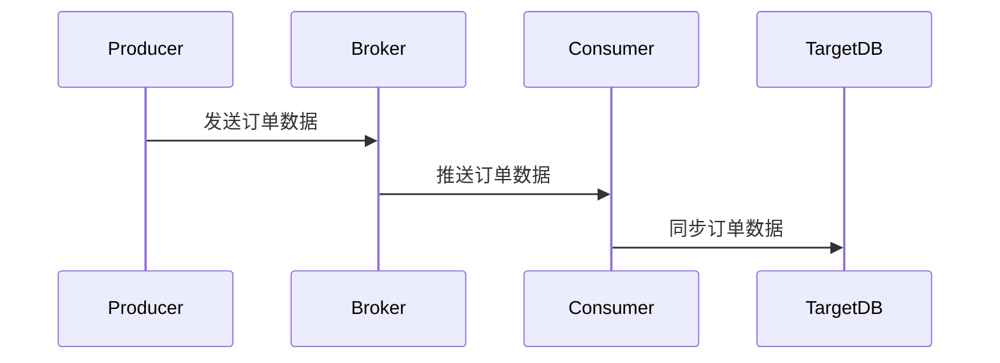

# RocketMQ 数据同步案例

RocketMQ 是一款高性能、高吞吐量的分布式消息中间件，广泛应用于异步通信、解耦系统、流量削峰等场景。本文将重点介绍 RocketMQ 在数据同步中的应用，并通过一个实际案例帮助初学者理解其工作原理。

## 什么是数据同步？

数据同步是指将数据从一个系统或数据库复制到另一个系统或数据库的过程。在分布式系统中，数据同步是确保数据一致性和可用性的关键步骤。RocketMQ 通过其强大的消息传递机制，能够高效地实现数据同步。

## RocketMQ 数据同步的基本原理

RocketMQ 的数据同步通常涉及以下几个步骤：

1. **生产者发送消息**：生产者将需要同步的数据封装成消息，并发送到 RocketMQ 的 Broker。
2. **Broker 存储消息**：Broker 接收到消息后，将其存储在消息队列中。
3. **消费者消费消息**：消费者从 Broker 中拉取消息，并将消息中的数据同步到目标系统或数据库。

## 实际案例：订单数据同步

假设我们有一个电商系统，订单数据存储在 MySQL 数据库中。为了确保订单数据的高可用性和实时性，我们需要将订单数据同步到另一个 MySQL 数据库（例如备份数据库）中。以下是使用 RocketMQ 实现订单数据同步的步骤。

### 1. 创建生产者

首先，我们需要创建一个生产者，用于将订单数据发送到 RocketMQ。

```java
import org.apache.rocketmq.client.producer.DefaultMQProducer;
import org.apache.rocketmq.common.message.Message;

public class OrderProducer {
    public static void main(String[] args) throws Exception {
        // 实例化生产者
        DefaultMQProducer producer = new DefaultMQProducer("order_producer_group");
        // 设置NameServer地址
        producer.setNamesrvAddr("localhost:9876");
        // 启动生产者
        producer.start();

        // 模拟订单数据
        String orderData = "{\"orderId\": 12345, \"amount\": 100.0, \"status\": \"PAID\"}";

        // 创建消息
        Message message = new Message("OrderTopic", "OrderTag", orderData.getBytes());

        // 发送消息
        producer.send(message);

        // 关闭生产者
        producer.shutdown();
    }
}
```

### 2. 创建消费者

接下来，我们需要创建一个消费者，用于从 RocketMQ 中拉取订单数据，并将其同步到目标数据库。

```java
import org.apache.rocketmq.client.consumer.DefaultMQPushConsumer;
import org.apache.rocketmq.client.consumer.listener.ConsumeConcurrentlyContext;
import org.apache.rocketmq.client.consumer.listener.ConsumeConcurrentlyStatus;
import org.apache.rocketmq.client.consumer.listener.MessageListenerConcurrently;
import org.apache.rocketmq.common.message.MessageExt;

import java.util.List;

public class OrderConsumer {
    public static void main(String[] args) throws Exception {
        // 实例化消费者
        DefaultMQPushConsumer consumer = new DefaultMQPushConsumer("order_consumer_group");
        // 设置NameServer地址
        consumer.setNamesrvAddr("localhost:9876");
        // 订阅主题和标签
        consumer.subscribe("OrderTopic", "OrderTag");

        // 注册消息监听器
        consumer.registerMessageListener(new MessageListenerConcurrently() {
            @Override
            public ConsumeConcurrentlyStatus consumeMessage(List<MessageExt> messages, ConsumeConcurrentlyContext context) {
                for (MessageExt message : messages) {
                    // 处理消息
                    String orderData = new String(message.getBody());
                    System.out.println("Received order data: " + orderData);

                    // 将订单数据同步到目标数据库
                    syncOrderDataToTargetDB(orderData);
                }
                return ConsumeConcurrentlyStatus.CONSUME_SUCCESS;
            }
        });

        // 启动消费者
        consumer.start();
    }

    private static void syncOrderDataToTargetDB(String orderData) {
        // 这里实现将订单数据同步到目标数据库的逻辑
        System.out.println("Syncing order data to target DB: " + orderData);
    }
}
```

### 3. 数据同步流程

以下是数据同步的流程图：



### 4. 运行结果

当生产者发送订单数据后，消费者会接收到消息，并将订单数据同步到目标数据库。以下是运行结果的示例：

```
Received order data: {"orderId": 12345, "amount": 100.0, "status": "PAID"}
Syncing order data to target DB: {"orderId": 12345, "amount": 100.0, "status": "PAID"}
```

## 总结

通过本文的案例，我们学习了如何使用 RocketMQ 实现数据同步。RocketMQ 的高性能和可靠性使其成为数据同步的理想选择。在实际应用中，您可以根据需求调整生产者和消费者的逻辑，以满足不同的业务场景。

:::tip
如果您想进一步学习 RocketMQ，可以参考官方文档或尝试实现更复杂的数据同步场景。
:::

## 附加资源

- [RocketMQ 官方文档](https://rocketmq.apache.org/docs/)
- [RocketMQ GitHub 仓库](https://github.com/apache/rocketmq)

## 练习

1. 修改生产者和消费者代码，使其能够处理多个订单数据的同步。
2. 尝试使用 RocketMQ 的延迟消息功能，实现订单数据的延迟同步。
3. 探索 RocketMQ 的事务消息机制，并尝试在数据同步中应用。