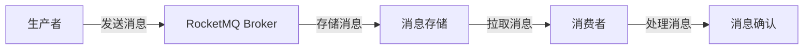

# RocketMQ 消息通知案例

## 介绍

RocketMQ 是一款分布式消息中间件，广泛应用于异步通信、解耦系统、流量削峰等场景。消息通知是 RocketMQ 的典型应用之一，它能够帮助系统在特定事件发生时，及时通知相关模块或服务进行处理。本文将详细介绍 RocketMQ 在消息通知中的应用，并通过实际案例帮助初学者理解其工作原理。

## 什么是消息通知？

消息通知是指当系统中发生某个事件时，通过消息队列将事件信息传递给其他模块或服务。这种方式可以实现系统之间的解耦，提高系统的可扩展性和可靠性。例如，当用户注册成功后，系统可以通过消息通知发送欢迎邮件或短信。

## RocketMQ 消息通知的基本流程

RocketMQ 的消息通知流程通常包括以下几个步骤：

1. **生产者发送消息**：生产者将事件信息封装成消息，并发送到 RocketMQ 的指定主题（Topic）。
2. **消息存储**：RocketMQ 将消息存储在 Broker 中，等待消费者消费。
3. **消费者消费消息**：消费者订阅主题，从 Broker 中拉取消息并进行处理。
4. **消息确认**：消费者处理完消息后，向 RocketMQ 发送确认信号，确保消息被成功消费。



## 实际案例：用户注册通知

假设我们有一个用户注册系统，当用户注册成功后，系统需要发送欢迎邮件和短信。我们可以使用 RocketMQ 来实现这一功能。

### 1. 生产者发送消息

首先，我们需要在用户注册成功后，发送一条消息到 RocketMQ 的 `user-register-topic` 主题。

```java
import org.apache.rocketmq.client.producer.DefaultMQProducer;
import org.apache.rocketmq.common.message.Message;

public class UserRegistrationProducer {
    public static void main(String[] args) throws Exception {
        // 实例化生产者
        DefaultMQProducer producer = new DefaultMQProducer("user-register-producer-group");
        producer.setNamesrvAddr("localhost:9876");
        producer.start();

        // 创建消息
        String userId = "12345";
        Message msg = new Message("user-register-topic", "TagA", userId.getBytes());

        // 发送消息
        producer.send(msg);
        System.out.println("消息发送成功: " + userId);

        // 关闭生产者
        producer.shutdown();
    }
}
```

### 2. 消费者消费消息

接下来，我们需要创建一个消费者来订阅 `user-register-topic` 主题，并处理用户注册事件。

```java
import org.apache.rocketmq.client.consumer.DefaultMQPushConsumer;
import org.apache.rocketmq.client.consumer.listener.ConsumeConcurrentlyContext;
import org.apache.rocketmq.client.consumer.listener.ConsumeConcurrentlyStatus;
import org.apache.rocketmq.client.consumer.listener.MessageListenerConcurrently;
import org.apache.rocketmq.common.message.MessageExt;

import java.util.List;

public class UserRegistrationConsumer {
    public static void main(String[] args) throws Exception {
        // 实例化消费者
        DefaultMQPushConsumer consumer = new DefaultMQPushConsumer("user-register-consumer-group");
        consumer.setNamesrvAddr("localhost:9876");

        // 订阅主题
        consumer.subscribe("user-register-topic", "*");

        // 注册消息监听器
        consumer.registerMessageListener(new MessageListenerConcurrently() {
            @Override
            public ConsumeConcurrentlyStatus consumeMessage(List<MessageExt> msgs, ConsumeConcurrentlyContext context) {
                for (MessageExt msg : msgs) {
                    String userId = new String(msg.getBody());
                    System.out.println("收到用户注册消息: " + userId);

                    // 发送欢迎邮件
                    sendWelcomeEmail(userId);

                    // 发送欢迎短信
                    sendWelcomeSMS(userId);
                }
                return ConsumeConcurrentlyStatus.CONSUME_SUCCESS;
            }
        });

        // 启动消费者
        consumer.start();
        System.out.println("消费者已启动");
    }

    private static void sendWelcomeEmail(String userId) {
        System.out.println("发送欢迎邮件给用户: " + userId);
    }

    private static void sendWelcomeSMS(String userId) {
        System.out.println("发送欢迎短信给用户: " + userId);
    }
}
```

### 3. 运行结果

当用户注册成功后，生产者会发送一条消息到 RocketMQ，消费者会接收到该消息并处理。以下是可能的输出：

```
消息发送成功: 12345
消费者已启动
收到用户注册消息: 12345
发送欢迎邮件给用户: 12345
发送欢迎短信给用户: 12345
```

## 总结

通过以上案例，我们可以看到 RocketMQ 在消息通知场景中的强大能力。它能够帮助系统在事件发生时，及时通知相关模块进行处理，从而实现系统之间的解耦和高可用性。

:::tip
在实际应用中，RocketMQ 还可以结合其他技术栈（如 Spring Boot、Kubernetes 等）来实现更复杂的消息通知系统。
:::

## 附加资源

- [RocketMQ 官方文档](https://rocketmq.apache.org/docs/)
- [RocketMQ GitHub 仓库](https://github.com/apache/rocketmq)

## 练习

1. 尝试修改上述代码，使其支持多个用户同时注册的场景。
2. 探索 RocketMQ 的其他特性，如消息过滤、延迟消息等，并尝试在案例中应用这些特性。