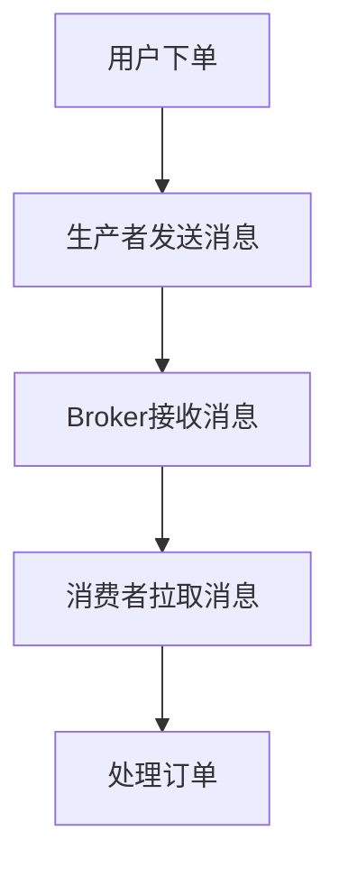

# RocketMQ 流量控制案例

RocketMQ 是一款高性能、高可用的分布式消息中间件，广泛应用于大规模分布式系统中。在高并发场景下，消息的生产和消费可能会对系统造成巨大的压力，因此流量控制（Flow Control）成为了一个重要的功能。本文将详细介绍 RocketMQ 的流量控制机制，并通过实际案例展示其应用场景。

## 什么是流量控制？

流量控制是指通过限制消息的生产或消费速率，防止系统因过载而崩溃。RocketMQ 提供了多种流量控制机制，包括生产者流量控制、消费者流量控制以及 Broker 端的流量控制。

### 生产者流量控制

生产者流量控制主要通过限制消息发送速率来实现。RocketMQ 提供了 `sendLatencyFaultEnable` 参数，用于在消息发送失败时自动降低发送速率。

```java
DefaultMQProducer producer = new DefaultMQProducer("ProducerGroupName");
producer.setSendLatencyFaultEnable(true);
producer.start();
```

### 消费者流量控制

消费者流量控制主要通过 `pullBatchSize` 和 `consumeMessageBatchMaxSize` 参数来限制每次拉取和消费的消息数量。

```java
DefaultMQPushConsumer consumer = new DefaultMQPushConsumer("ConsumerGroupName");
consumer.setPullBatchSize(32);
consumer.setConsumeMessageBatchMaxSize(10);
consumer.start();
```

### Broker 端流量控制

Broker 端的流量控制主要通过 `sendMessageThreadPoolQueueCapacity` 和 `pullMessageThreadPoolQueueCapacity` 参数来限制消息队列的长度。

```java
BrokerConfig brokerConfig = new BrokerConfig();
brokerConfig.setSendMessageThreadPoolQueueCapacity(10000);
brokerConfig.setPullMessageThreadPoolQueueCapacity(10000);
```

## 实际案例：电商秒杀系统

假设我们有一个电商秒杀系统，用户可以在特定时间内抢购限量商品。在秒杀活动开始后，系统会收到大量的下单请求，如果不进行流量控制，可能会导致系统崩溃。

### 场景分析

1. **生产者流量控制**：在秒杀活动开始时，大量用户同时下单，消息生产者需要限制发送速率，防止 Broker 过载。
2. **消费者流量控制**：消费者需要限制每次拉取和消费的消息数量，确保系统能够稳定处理订单。
3. **Broker 端流量控制**：Broker 需要限制消息队列的长度，防止消息积压。

### 代码示例

```java
// 生产者配置
DefaultMQProducer producer = new DefaultMQProducer("SecKillProducerGroup");
producer.setSendLatencyFaultEnable(true);
producer.start();

// 消费者配置
DefaultMQPushConsumer consumer = new DefaultMQPushConsumer("SecKillConsumerGroup");
consumer.setPullBatchSize(32);
consumer.setConsumeMessageBatchMaxSize(10);
consumer.start();
```

### 流程图



## 总结

RocketMQ 的流量控制机制在高并发场景下非常重要，能够有效防止系统过载。通过合理配置生产者、消费者和 Broker 端的流量控制参数，可以确保系统在高负载下依然稳定运行。

## 附加资源

- [RocketMQ 官方文档](https://rocketmq.apache.org/docs/)
- [RocketMQ 流量控制配置指南](https://rocketmq.apache.org/docs/flow-control/)

## 练习

1. 尝试在自己的项目中配置 RocketMQ 的流量控制参数，观察系统在高并发场景下的表现。
2. 阅读 RocketMQ 官方文档，了解更多关于流量控制的配置选项和使用场景。
